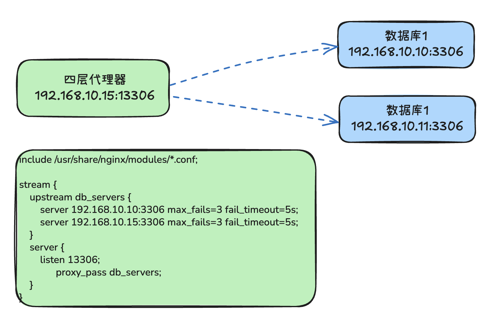
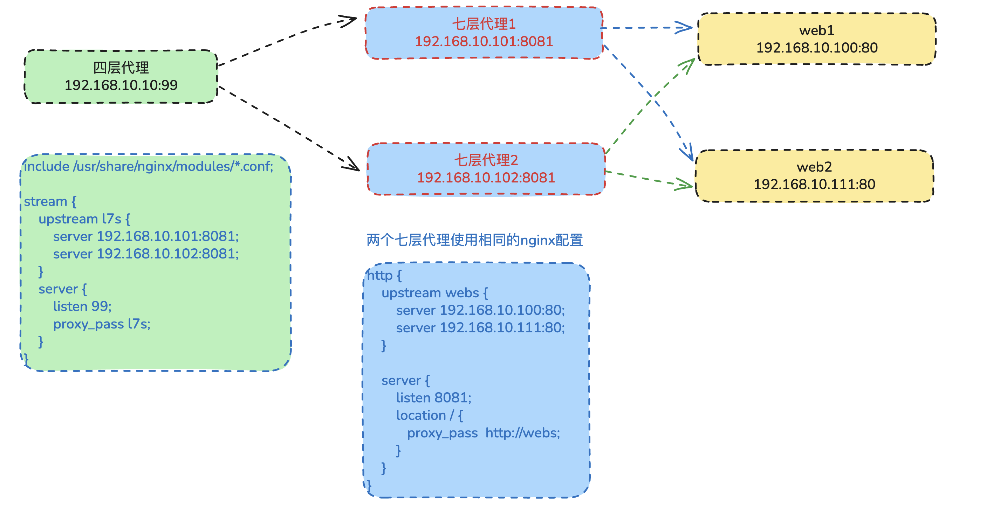

# nginx负载代理配置

## 七层负载均衡配置

配置包括在顶级的 http 内部。解析 http 协议，搭配 location 匹配 url 路径。

~~~bash
http {
    upstream testserver {   
      ip_hash; # 负载均衡算法，后续会详细介绍，不写默认rr轮询
      server 192.168.1.5:8080;
      server 192.168.1.6:8080;
    }
 
    server {
        listen 8080
        location / {
           proxy_pass  http://testserver;
        } 
    }
}
~~~

## 四层负载均衡配置

配置包括在顶级的 stream 内部。基于 IP + PORT 做转发，比如代理 mysql redis等服务就使用四层负载代理。

~~~bash
stream {
    upstream my_servers {
        least_conn;
        # 5s内出现3次错误，该服务器将被熔断5s
        server <IP_SERVER_1>:3306 max_fails=3 fail_timeout=5s;
        server <IP_SERVER_2>:3306 max_fails=3 fail_timeout=5s;
        server <IP_SERVER_3>:3306 max_fails=3 fail_timeout=5s;
    }
    server {
        listen 3306;
        proxy_connect_timeout 5s; 
        proxy_timeout 10s;  
        proxy_next_upstream on; 
        proxy_next_upstream_tries 3; 
        proxy_next_upstream_timeout 10s; 
        proxy_socket_keepalive on; 
 
        proxy_pass my_servers;
    }
}
~~~

### 参数解释

- max_fails=3 fail_timeout=5s;  故障重拾与熔断参数。从第一个失败请求开始计时，5秒内再出现2个失败请求，在标记这个web服务器不可用。在接下来的5秒内都不会再向这个web 服务器转发请求。
- proxy_connect_timeout 5s;  与被代理服务器建立连接的超时时间为5s
- proxy_timeout 10s;    获取被代理服务器的响应最大超时时间为10s
- proxy_next_upstream on;  当被代理的服务器返回错误或超时时，将未返回响应的客户端连接请求传递给upstream中的下一个 web 服务器。
- proxy_next_upstream_tries 3;   转发尝试请求最多3次。
- proxy_next_upstream_timeout 10s;    总尝试超时时间为10s。
- proxy_socket_keepalive on;  开启SO_KEEPALIVE选项进行心跳检测。

### stream 配置的前提

如果你配置 steam 模块无效，请检查一下你使用的版本是否支持 stream。查看nginx安装了哪些模块。

~~~bash
nginx -V

# 或者更方便的命令

[root@rocky ~]# 2>&1 nginx -V | tr ' '  '\n'|grep stream
--with-stream=dynamic
--with-stream_ssl_module
--with-stream_ssl_preread_module
~~~

stream模块是动态加载的，默认情况下未安装动态模块，所以 `/usr/lib64/nginx/modules` 和 `/usr/share/nginx/modules/` 都是空目录。

### 安装 stream模块

~~~bash
yum install -y nginx-mod-stream

# 安装后上述两个模块目录就有 stream 的模块和配置信息了
[root@rocky ~]# ls /usr/lib64/nginx/modules
ngx_stream_module.so
[root@rocky ~]# ls /usr/share/nginx/modules/
mod-stream.conf
[root@rocky ~]# cat /usr/share/nginx/modules/mod-stream.conf
load_module "/usr/lib64/nginx/modules/ngx_stream_module.so";
~~~

补充，如果需要安装 nginx 的所有模块，执行如下命令。

~~~bash
yum install -y nginx-all-modules
~~~

### 配置使用 stream 模块的四层配置

~~~bash
# 使用 include 导入 stream 模块
include /usr/share/nginx/modules/*.conf;

stream {
    upstream lb_servers {
        server 192.168.71.12:3306 max_fails=3 fail_timeout=5s;
        server 192.168.71.13:3306 max_fails=3 fail_timeout=5s;
    }
    server {
        listen 13306;
        proxy_pass lb_servers;
    }
}
~~~

## 演示：四层负载代理数据库从库

### 1. 准备环境

~~~bash
# 机器1 四层代理服务器
 - nginx 监听13306端口代理 mysql 服务
 - ip 192.168.10.15
 
# 机器2 mysql 服务器
 - ip 192.168.10.10
 - 端口 3306
~~~

### 2. 准备 mysql 服务

在机器2 上安装 mariadb ，授权用户远程登陆

~~~bash
# 关闭防火墙和selinux
systemctl stop firewalld
setenforce 0

# 安装 mariadb
yum install -y mariadb*

systemctl start mariadb
systemctl enable mariadb
systemctl status mariadb

# 登陆mysql 
mysql -u root -p

然后授权远程登陆
use mysql;
grant all on * to 'root'@'%' identified by '123';
flush privileges;
~~~

### 3. 准备四层代理

在机器1上安装 nginx 和stream 模块

~~~bash
yum install -y nginx
yum install -y nginx-mod-stream

systemctl start nginx
systemctl enable nginx
~~~

### 4. 配置四层代理

在 `/etc/nginx/nginx.conf`　中新增如下核心配置

~~~bash
include /usr/share/nginx/modules/*.conf;

stream {
    upstream db_servers {
        server 192.168.10.10:3306 max_fails=3 fail_timeout=5s;
    }
    server {
        listen 13306;
	      proxy_pass db_servers;
    }
}
~~~

### 5. 重启nginx

~~~bash
systemctl restart nginx
~~~

### 6. 在负载层访问mysql

在机器1 上安装 mysql 客户端然后使用命令连接本地端口 13306 即可登陆到机器2 上运行的 mysql 服务。

~~~
yum install -y mariabd

mysql -u root -P 13306 -p
~~~

### 7. 查看链接情况

在负载均层器上（机器1）。因为机器1即当负载均衡器又当客户层，所以有两个通信链接。

~~~bash
[root@rocky ~]# netstat -tunlap | grep -w 13306
tcp        0      0 0.0.0.0:13306           0.0.0.0:*               LISTEN      2062/nginx: master
tcp        0      0 127.0.0.1:13306         127.0.0.1:41878         ESTABLISHED 2064/nginx: worker
tcp        0      0 127.0.0.1:41878         127.0.0.1:13306         ESTABLISHED 2120/mysql
~~~

在 mysql 服务机器上（机器2）。可以看到机器1代理的链接。

~~~bash
[root@rocky2 ~]# netstat -tunlap | grep 3306
tcp        0      0 0.0.0.0:3306            0.0.0.0:*               LISTEN      6517/mariadbd
tcp        0      0 192.168.10.10:3306      192.168.10.15:35206     ESTABLISHED 6517/mariadbd
~~~

## 演示：四层代理七层提高并发

## 添加日志

七层负载访问日志

~~~bash
http {
    log_format  main  '$remote_addr - $remote_user [$time_local] "$request" '
                      '$status $body_bytes_sent "$http_referer" '
                      '"$http_user_agent" "$http_x_forwarded_for" '
                      '"$http_x_real_ip" ';

    access_log  /var/log/nginx/access.log  main;
}

# log_format  指定日志模板名称 main ，然后是模板的具体格式。
# access_log 指定访问日志的位置，使用的模板名称
~~~

四层负载均衡是不需要 access 日志的，并且也会影响性能。如果想要为四层负载添加日志。需要在 stream 中添加，日志格式模仿http的，但是需要加在 stream 里面。

需要注意的是4层负载的日志使用的变量不能是七层应用的，而必须是4层的变量。

~~~bash
stream {
    log_format  proxy1 '$remote_addr $remote_port - [$time_local] $status $protocol '
                  '"$upstream_addr" "$upstream_bytes_sent" "$upstream_connect_time"';
    
    access_log /var/log/nginx/proxy1.log proxy1;
}
~~~

### 四层日志说明

Nginx 的流模块在处理 TCP 流量时，并不会在每个请求都写入一条日志。相反，它在 TCP 连接结束后（也就是说，当连接关闭时）才会记录一条日志。

这与 HTTP 不同，因为TCP 是一种基于连接的协议，每个连接可能包含多个请求和响应。由于 Nginx 的 stream 模块在更低的网络层处理这些连接，它并没有一个明确定义的 "请求"。所以，在 TCP 连接生命周期中，只有当连接关闭时，Nginx 才会记录连接的总体信息。

因此，如果你在访问服务器时看不到立即写入日志，那是因为你的 TCP 连接还没关闭。一般情况下，浏览器可能会在一段时间内复用一个 TCP 连接，发送多个请求，直到连接超时或者主动关闭连接。因此，你可能只有在这个 TCP 连接关闭时才会在日志中看到记录。如果你希望立即看到日志，你可以尝试在发送请求后立即关闭 TCP 连接。如果你使用 curl 或者 telnet 工具发送请求的话，他们通常在请求结束后就会立即关闭连接。

## 应用层获取真实的客户端IP

客户端如果直接访问应用层服务，那应用层的服务端可以直接拿到客户端的真实 IP 地址。但是先是网络一般都经过层层代理，此时如果没有特殊设置，应用层的服务端一般只能拿到它上层代理器的 IP 而不是真实的客户端 IP 地址。

要想拿到真实 IP 地址，需要层层**透传**，思路是**基于已有的网络协议，在协议中加入我们想要透传的数据，然后在需要拿到该数据的节点上，通过解析的模块从协议中取出来即可**。

具体到获取客户端真实 IP 地址，我们可以借助 HTTP 协议请求头 `X-Forwarded-For` 或者 `X-Real-IP` ，把客户端的 IP 层层透传到应用层，应用层从请求头中取出来使用即可。

### 七层负载透传客户端 IP

~~~bash
http {
    upstream webs {
        server 192.168.10.100:80;
        server 192.168.10.111:80;
    }

    server {
        listen       80;
        location / {
            proxy_pass   http://webs;
            
            # 通过请求头向下游透传数据
            proxy_set_header X-Real-IP $remote_addr;
            proxy_set_header X-Forwarded-For $proxy_add_x_forwarded_for;
            proxy_set_header Host $http_host;
            proxy_set_header X-Forwarded-Proto $scheme;
        }
    }
}
~~~

**解释说明**：客户端直接访问七层代理器，那么七层代理拿到的 `$remote_addr` 就是真实的客户端IP，然后七层代理通过 `proxy_set_header` 向下游传递的请求头，其中有两个关于 IP 的。分别是：`X-Real-IP` 和 `X-Forwarded-For`。

- X-Real-IP 这个请求头通常只存储最初客户端的 IP。
- X-Forwarded-For  这个请求头通常存储了整个代理链的 IP 列表。格式通常是：`客户IP, 代理1IP, 代理2IP`。

上面七层 nginx 代理配置中，把变量 $remote_addr 赋值给 X-Real-IP，意思是七层代理服务器会把它拿到的这个变量值赋值给下游 HTTP 请求头 X-Real-IP 的值。`X-Forwarded-For $proxy_add_x_forwarded_for` 表示把七层负载器的 IP 地址追加到请求头 X-Forwarded-For 的值上。这样设置后，HTTP 应用层就可以从请求头 X-Real-IP 上直接拿到客户端 IP，或者从请求头 X-Forwarded-For 上获取第一个值（也就是真实的客户端IP地址）。

**注意**：如果七层代理服务器的上游还有代理服务器，此时变量 $remote_addr 的值可不一定是真实客户端的 IP 地址，需要看上游代理服务器如何设置了。

### 四层代理服务器透传

因为四层代理器直接解析到 IP + PORT，解析不到 HTTP 协议层，所以不能像七层代理器那样通过 HTTP 请求头的方式下下游设置传递值。四层的做法是把手的协议包代理到下游。通过 `proxy_protocol on;` 开启代理协议供能。

~~~bash
stream {
    upstream servers {
        server 192.168.10.101:8081 max_fails=3 fail_timeout=5s;
    }
    server {
        listen 99;
        proxy_pass servers;
        proxy_protocol on;  # 开启代理协议功能
    }
}
~~~

####  `proxy_protocol on;` 的作用流程

1. 客户端向四层负载均衡器发起 TCP 连接。
2. 四层负载均衡器 (Nginx) 接受连接。
3. 由于配置了 `proxy_protocol on;`，Nginx **不会立即将客户端的数据转发**给后端服务器。
4. Nginx **等待并读取**连接上的第一个数据包，期望它是一个 PROXY 协议头。
5. Nginx **解析**这个头部，获取到客户端的真实信息。
6. Nginx 与下游服务 建立连接。
7. **关键一步**：Nginx 在将客户端的应用数据转发给下游服务之前，会**先将自己构造的 PROXY 协议头发送给下游服务器**。
8. 此后，才正常转发所有后续数据。
9. **下游服务器**也必须支持 PROXY 协议（例如，Web 服务器如 Nginx、Apache，或应用程序本身需要能解析它）。下游服务器会读取并信任这个头部，然后用其中包含客户端的真实 IP，替换掉直接连接的负载均衡器 IP。

### 七层负载支持 PROXY 协议透传

七层负载的上游如果是四层，下游是应用 WEB 服务器，那么七层负载器对上需要支持 PROXY 协议接收四层的数据并提取真实 IP，对下要设置请求头传递真实 IP给应用层。

~~~nginx
http {
    upstream webs {
        server 192.168.10.100:80;
        server 192.168.10.111:80;
    }

    server {
        # 对上处理 proxy_protocol
        listen 8081 proxy_protocol;
        set_real_ip_from 0.0.0.0/0;
        real_ip_header proxy_protocol;
        
      	# 向下代理
        location / {
            proxy_pass   http://webs;
            
            # 通过请求头向下游透传数据
            proxy_set_header X-Real-IP $remote_addr;
            proxy_set_header X-Forwarded-For $proxy_add_x_forwarded_for;
            proxy_set_header Host $http_host;
            proxy_set_header X-Forwarded-Proto $scheme;
        }
    }
}
~~~

**解释配置**：下面这三行配置组合在一起，实现了一个核心功能：**让七层负载均衡器能够识别并信任来自上游四层负载均衡器通过 PROXY 协议发送的真实客户端信息，并正确重置 `$remote_addr` 等变量。**

~~~nginx
listen 8081 proxy_protocol;
set_real_ip_from 0.0.0.0/0;
real_ip_header proxy_protocol;
~~~

#### `listen 8081 proxy_protocol;`

当有连接到达 `8081` 端口时，Nginx 会先尝试解析 PROXY 协议头。从该头部中提取出原始客户端的真实IP地址）、端口以及负载均衡器的目的IP和端口等信息。如果没有这个参 Nginx 会将接收到的第一个数据包当作HTTP请求行（如 `GET / HTTP/1.1`）来处理。而PROXY协议头不是有效的HTTP语法，这会导致协议错误，连接很可能被关闭。**简单说：它让Nginx能“听懂”上游发来的PROXY协议。**

#### `set_real_ip_from 0.0.0.0/0;`

这个指令定义了**一个受信任的IP地址范围**。来自这个范围内的请求，其 `real_ip_header`（这里是PROXY协议头）中提供的信息才会被接受和采用。`0.0.0.0/0` 表示**信任所有IPv4地址**。

#### `real_ip_header proxy_protocol;`

这个指令告诉 Nginx **从何处获取**真实客户端的 IP 地址来替换内置变量 `$remote_addr` 的值。**默认情况下**，`$remote_addr` 变量存储的是**直接与Nginx建立连接的对端IP**，也就是四层负载器的 IP 地址。加上这个指令Nginx使用从 `proxy_protocol` 头中提取到的**源地址（即真实客户端IP）** 来覆盖 `$remote_addr` 变量的默认值。**简单说：它告诉Nginx“请用PROXY协议里的客户地址，来代替直接连接你的那个地址”。**

#### 总结：上面三个参数的设置都是为了重置变量 `$remote_addr` 的值。

### WEB层服务器获取IP

比如 web 层的上游是七层负载层，web 层也是 nginx 。如下设置的作用是 **根据可信代理服务器发来的头信息，纠正 `$remote_addr` 变量的值**，使其从代理服务器的 IP 变回真实客户端的 IP。

~~~nginx
http {
    log_format  main  '$remote_addr - $remote_user [$time_local] "$request" '
                      '$status $body_bytes_sent "$http_referer" '
                      '"$http_user_agent" "$http_x_forwarded_for" '
		                  '"$http_x_real_ip" ';

    access_log  /var/log/nginx/access.log  main;

    server {
        set_real_ip_from 0.0.0.0/0;
        real_ip_header X-Forwarded-For;
        # real_ip_header X-Real-IP;
        real_ip_recursive on;

        listen       80;
        listen       [::]:80;
        server_name  _;
        root         /usr/share/nginx/html;
   }
}
~~~

#### `set_real_ip_from`

定义**可信的代理服务器 IP 地址**。告诉 Nginx，来自哪个 IP 或哪个网段的请求是受信任的代理。**只有当请求来自这里定义的 IP 时，Nginx 才会处理并信任它发来的 `X-Forwarded-For` 或 `X-Real-IP` 头**。`set_real_ip_from 0.0.0.0/0;` # **信任所有上游源**。

#### `real_ip_header`

指定从哪个 **HTTP 请求头字段** 中获取用于替换的真实 IP。

- `real_ip_header X-Forwarded-For;` 从 `X-Forwarded-For` 头中取 IP。`X-Forwarded-For` 的格式通常是：`客户IP, 代理1IP, 代理2IP`。`real_ip_recursive` 指令会决定取哪一个。
- `real_ip_header X-Real-IP;` # 从 `X-Real-IP` 头中取 IP。`X-Real-IP` 通常只包含一个 IP 地址（即最初的客户端 IP），行为更直接。

####  `real_ip_recursive`

**递归查找**真实 IP。此指令仅在 `real_ip_header` 设置为 `X-Forwarded-For` 时有效。默认值为 `off` ，表示Nginx 会取 `X-Forwarded-For` 头中**最后一个** IP 作为真实客户端 IP。

~~~bash
X-Forwarded-For: 客户端IP, 代理1IP, 代理2IP → 取 代理2IP
~~~

把它的值设置为 `on`，表示Nginx 会从 `X-Forwarded-For` 头中**从右向左**遍历，**跳过**所有在 `set_real_ip_from` 中定义的信任 IP，取第一个**不信任**的 IP 作为真实客户端 IP。这通常就是我们想要的**原始客户端 IP**。

#### 总结：上面几个参数的设置都是为了修改变量 `$remote_addr` 的值。

