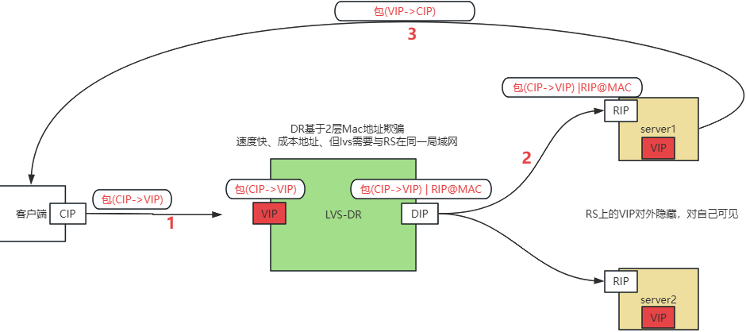

# LVS 四层负载均衡

LVS 是一个由章文嵩博士发起和领导的著名开源项目，它是一个高度可扩展、高性能的**四层负载均衡器**，集成在 Linux 内核中。它有时也被称为**四层交换**。LVS 的目标是构建一个高性能、高可用的服务器集群，对外提供一个单一的**虚拟 IP 地址（VIP）**，将客户端的请求透明地分发到后端的多台真实服务器上，从而实现负载均衡和高可用性。

## LVS 的三种工作模式

这是 LVS 最核心和精妙的部分，三种模式决定了数据包如何被转发。

### NAT 模式 (Network Address Translation)

- **工作原理**：
  1. 客户端请求数据包（目标地址为 VIP）到达 Director。
  2. Director 通过负载均衡算法选取一台 Real Server，修改数据包的目标地址为 Real Server 的 RIP，然后转发。
  3. Real Server 处理请求，准备返回响应包（源地址为 RIP，目标地址为客户端 IP）。
  4. **关键：Real Server 的默认网关必须指向 Director**。因此响应包会先回到 Director。
  5. Director 将响应包的源地址从 RIP 改回 VIP，然后发回给客户端。
- **优点**：
  - Real Server 可以使用任何操作系统，只要支持 TCP/IP 协议即可。
  - 可以隐藏 Real Server 的真实 IP 地址。
- **缺点**：
  - **性能瓶颈**：进出所有流量（请求和响应）都要经过 Director。Director 的网络 I/O 容易成为瓶颈。

### DR 模式 (Direct Routing) - **最常用**

- **工作原理**：
  1. 客户端请求数据包（目标地址为 VIP）到达 Director。
  2. Director 通过负载均衡算法选取一台 Real Server，**不修改目标 IP**，而是**修改目标 MAC 地址**为选定的 Real Server 的 MAC 地址，然后将数据包在二层转发。
  3. **关键：所有 Real Server 上都配置有和 Director 相同的 VIP，但绑定在 lo（回环）接口上，并设置 ARP 抑制**，防止它们响应针对 VIP 的 ARP 请求，从而只有 Director 能接收发往 VIP的流量。
  4. Real Server 在 lo 接口上看到目标地址是 VIP 的数据包，进行处理。处理完成后，**直接构建响应包（源地址为 VIP，目标地址为客户端 IP），通过自己的独立路由路径发送给客户端**，而不再经过 Director。
- **优点**：
  - **性能极高**。只有入站请求经过 Director，出站响应直接由 Real Server 发出。极大地减轻了 Director 的负载。
  - 是生产环境中最常用的模式。
- **缺点**：
  - Real Server 和 Director 必须在**同一个物理网络**（同一 VLAN 或二层可达），因为需要依赖 MAC 地址转发。
  - Real Server 需要操作系统层级进行配置（配置 VIP 和 ARP 抑制）。

### TUN 模式 (IP Tunneling)

- **工作原理**：
  1. 采用 IP 隧道技术。
  2. Director 接收到客户端请求后，**重新封装一个 IP 包**：将原始请求包作为新数据包的数据，在新包的头部，目标 IP 是 Real Server 的 RIP，源 IP 是 Director 的 DIP。
  3. 这个封装后的数据包被发送给 Real Server。
  4. Real Server 收到后，解封装，看到内部的原始请求包（目标地址是 VIP）。**Real Server 上也需要配置 VIP**（绑定在隧道接口上）。
  5. Real Server 处理请求，然后像 DR 模式一样，**直接**将响应包发回给客户端。
- **优点**：
  - 可以跨机房、跨地域部署，Director 和 Real Server 可以不在同一个局域网。
  - 只有入站请求经过 Director，出站响应直接返回。
- **缺点**：
  - IP 隧道封装和解封装需要额外开销，对 Real Server 性能有要求。
  - 需要 Real Server 操作系统支持隧道协议。

## LVS 的负载调度算法

LVS 提供了多种算法来决定如何将请求分发给后端的 Real Server，例如：
- **轮询 (Round Robin, rr)**：依次循环分发。
- **加权轮询 (Weighted Round Robin, wrr)**：根据服务器性能分配权重，按权重比例分发。
- **最少连接 (Least Connections, lc)**：将新请求分发给当前连接数最少的服务器。
- **加权最少连接 (Weighted Least Connections, wlc)**：在 lc 的基础上考虑服务器权重。
- **源地址散列 (Source Hashing, sh)**：根据源 IP 计算散列值，将同一客户端的请求总是发往同一台服务器，可实现会话保持。

## LVS构成

LVS 由两部分组成
- `ipvs` 负责核心的转发工作，直接工作内核层的netfilter上。
- `ipvsadm` 是一个命令行工具，用添加ipvs规则。只是在添加规则时用一下ipvsadm工具。

## LVS 专业术语
- `DS` director server，即 LVS 负载均衡器
- `RS` real server，即真实提供服务的server
- `CIP` 客户端 ip
- `VIP` 用于用户请求的目标 IP
- `DIP` 配置在负载均衡器上用于和内部 RS 通信的地址
- `RIP`  real server ip，即真实提供服务的server 的 IP 地址

## LVS-DR 模式配置概述

### 负载均衡 DS
- 配置地址。负载均衡上的vip与dip都需要走网络流量，所以VIP与DIP都需要配置在走网络流量的物理网卡，不能配置在lo上，但是VIP与DIP是可以配置在一块走网络流量的网卡上。
- 配置转发规则。用ipvsadm添加ipvs转发规则。		

### 被代理的机器 RS
-  配置地址。rs机器上的RIP需要接收网络流量，rs机器上的VIP是不需要走网络流量的。因此，RIP应该配置在走网络流量的物理网卡，VIP 应该配置在不走网络流量的本地回环网卡上。
- 关闭 ARP 响应（针对vip冲突的解决方案）

## LVS-DR 模式的工作流程

### 外部的流程: 包抵达负载均衡之前做的事情

- 客户端来自于外网-需要跨公网放到到我们的机器 VIP，此时 CIP 是客户端的公网 IP
- 客户端来自于内网，此时 CIP 就是客户端的私网IP

### 包抵达负载均衡后的处理流程

- 收到包（CIP->VIP）
- 负载均衡找出一台机器
- 把包发过去，不改源ip与目标ip，而是更改包的目标mac地址改成上算法挑选出的那台机器的mac地址
- 目标RS收到包之后，发现目标mac是自己，然后继续解析。解析到ip层(linux机器判断目标ip是否是自己，会从所有网卡里进行比对包括lo网卡，如果是就认为该包是我自己，否则就丢弃该包。发现目标ip就是配置在自己机器上lo网卡上的vip地址，确定包就是给自己的就开始回包。回包（VIP ------> CIP）。

## 部署1：四层LVS直接代理应用

比如：四层 lvs 代理 web 服务。此时 RS 是 web服务器。

### 主机规划

~~~bash
VIP：192.168.10.200
 
DIP：192.168.10.99
 
web01(nginx+静态页面): 192.168.10.100:8080
web02(nginx+静态页面): 192.168.10.111:8080
~~~

### 环境准备

- 关闭 selinux
- 关闭防火墙
- 配置静态IP
- 同步时间

### 四层 LVS 负载均衡部署

#### 1. 安装 ipvs

~~~bash
# 1、安装ipvsadm等相关工具
yum -y install ipvsadm ipset sysstat conntrack libseccomp 
 
# 2、配置加载
cat > /etc/sysconfig/modules/ipvs.modules << "EOF" 
#!/bin/bash 
ipvs_modules="ip_vs ip_vs_lc ip_vs_wlc ip_vs_rr ip_vs_wrr ip_vs_lblc ip_vs_lblcr ip_vs_dh ip_vs_sh ip_vs_fo ip_vs_nq ip_vs_sed ip_vs_ftp nf_conntrack" 
 
for kernel_module in ${ipvs_modules}; 
do 
/sbin/modinfo -F filename ${kernel_module} > /dev/null 2>&1 
if [ $? -eq 0 ]; then 
/sbin/modprobe ${kernel_module} 
fi 
done 
EOF
 
chmod 755 /etc/sysconfig/modules/ipvs.modules && bash /etc/sysconfig/modules/ipvs.modules && lsmod | grep ip_vs
~~~

#### 2. 为四层lvs机器配置vip

~~~bash
#1、需要特别注意的是，虚拟ip地址的广播地址是它本身，子网掩码是255.255.255.255。
ifconfig ens160:0 192.168.10.200 broadcast 192.168.10.200 netmask 255.255.255.255 up
 
#2、添加路由规则
route add -host 192.168.10.200 dev ens160:0
 
#3、启用系统的包转发功能
echo "1" >/proc/sys/net/ipv4/ip_forward
~~~

#### 3. 添加负载均衡配置

~~~bash
# 强调强调强调：LVS本身不支持将请求的目标端口从一个端口转换到另一个端口，所以
# ipvsadm -a -t 192.168.71.200:6666 -r 192.168.71.112:8080 -g # 这种添加方法是错误的，必须端口一致
 
ipvsadm -C #清除内核虚拟服务器表中的所有记录
ipvsadm -A -t 192.168.10.200:8080 -s rr # -s rr表示采用轮询策略。
ipvsadm -a -t 192.168.10.200:8080 -r 192.168.10.100:8080 -g #添加服务器节点，-g表示指定LVS 的工作模式为直接路由模式
ipvsadm -a -t 192.168.10.200:8080 -r 192.168.10.111:8080 -g #添加服务器节点
ipvsadm -Ln #查看节点状态，加个“-n”将以数字形式显示地址、端口信息

[root@rocky ~]# ipvsadm -Ln
IP Virtual Server version 1.2.1 (size=4096)
Prot LocalAddress:Port Scheduler Flags
  -> RemoteAddress:Port           Forward Weight ActiveConn InActConn
TCP  192.168.10.200:8080 rr
  -> 192.168.10.100:8080          Route   1      0          0
  -> 192.168.10.111:8080          Route   1      0          0
~~~

### RS 配置

在两台 web 服务器上都依次执行下述配置。

#### 1. 在本地回环网卡上配置 VIP 地址

~~~bash
ifconfig lo:0 192.168.10.200 broadcast 192.168.10.200 netmask 255.255.255.255 up 
route add -host 192.168.10.200 dev lo:0
~~~

#### 2. 关闭 ARP 解析

~~~bash
echo "1" >/proc/sys/net/ipv4/conf/lo/arp_ignore
echo "1" >/proc/sys/net/ipv4/conf/all/arp_ignore
 
echo "2" >/proc/sys/net/ipv4/conf/lo/arp_announce
echo "2" >/proc/sys/net/ipv4/conf/all/arp_announce
 
 
cat >> /etc/sysctl.conf << EOF
net.ipv4.ip_forward=1
net.ipv4.conf.lo.arp_ignore=1
net.ipv4.conf.all.arp_ignore=1
net.ipv4.conf.lo.arp_announce=2
net.ipv4.conf.all.arp_announce=2
EOF
 
sysctl -p #使用修改生效
~~~

### 测试访问

命令行访问 VIP 加端口即可看到web服务页面。

~~~bash
curl http://192.168.10.200:8080
~~~

使用浏览器访问时会遇到多个请求都在一个server上。这是因为 web 使用的是 nginx 服务，开启了 `keepalive_timeout` 服务，演示时可以把它的值设置为0（生产环境不建议设置为0）。

~~~bash
# /etc/nginx/nginx.conf
http {
    keepalive_timeout   0;
}
~~~

从 nginx 的日志可以看出，在 web 层可以从 `remote_addr` 获取客户端的真实 IP 地址。这是因为 LVS 四层代理没有修改数据包中的源 IP，所以在被代理服务上直接就拿到了客户端 IP 地址。

## 部署2：四层LVS + nginx七层 + 应用

四层 LVS 代理 七层NGINX 代理web 应用。这种方案下 RS 是 七层负载均衡器，需要在它的本地回环网卡上配置 VIP 

~~~bash
四层lvs ------> 七层 nginx -------> web 应用
~~~

### 主机规划

~~~bash
VIP：192.168.10.200
 
DIP：192.168.10.99

# 2七层
七层1(nginx做七层代理): 192.168.10.101:8080
七层2(nginx做七层代理): 192.168.10.102:8080

# 2台 web服务
web01(nginx+静态页面): 192.168.10.100:8080
web02(nginx+静态页面): 192.168.10.111:8080
~~~

###  Web 服务器部署nginx当web服务

### 两台七层配置

~~~bash
http {
    upstream web_app_servers {
        server 192.168.10.100:8080 weight=1;
        server 192.168.10.111:8080 weight=1;
    }
    server {
        listen 8081; # 强调：这里个的配置直接就监听端口，我们之前的课程中在其末尾加的proxy_protocol一定要去掉
        location / {
            proxy_pass http://web_app_servers;
            # -------------------》只加上下面这一段即可
            proxy_set_header X-Real-IP $remote_addr;
            proxy_set_header X-Forwarded-For $proxy_add_x_forwarded_for;
            proxy_set_header Host $http_host;
            proxy_set_header X-Forwarded-Proto $scheme;
        }
    }
}
~~~

### 四层负载均衡配置

#### 1. 安装 ipvs

~~~bash
# 1、安装ipvsadm等相关工具
yum -y install ipvsadm ipset sysstat conntrack libseccomp 
 
# 2、配置加载
cat > /etc/sysconfig/modules/ipvs.modules <<"EOF" 
#!/bin/bash 
ipvs_modules="ip_vs ip_vs_lc ip_vs_wlc ip_vs_rr ip_vs_wrr ip_vs_lblc ip_vs_lblcr ip_vs_dh ip_vs_sh ip_vs_fo ip_vs_nq ip_vs_sed ip_vs_ftp nf_conntrack" 
 
for kernel_module in ${ipvs_modules}; 
do 
/sbin/modinfo -F filename ${kernel_module} > /dev/null 2>&1 
if [ $? -eq 0 ]; then 
/sbin/modprobe ${kernel_module} 
fi 
done 
EOF
 
chmod 755 /etc/sysconfig/modules/ipvs.modules && bash /etc/sysconfig/modules/ipvs.modules && lsmod | grep ip_vs
~~~

#### 2. 四层负载均衡器添加 VIP

~~~bash
#1、需要特别注意的是，虚拟ip地址的广播地址是它本身，子网掩码是255.255.255.255。
ifconfig ens160:0 192.168.10.200 broadcast 192.168.10.200 netmask 255.255.255.255 up
 
#2、添加路由规则
route add -host 192.168.10.200 dev ens160:0
 
#3、启用系统的包转发功能
echo "1" >/proc/sys/net/ipv4/ip_forward
~~~

#### 3. 添加负载均衡规则

~~~bash
ipvsadm -C #清除内核虚拟服务器表中的所有记录
ipvsadm -A -t 192.168.10.200:8080 -s rr # -s rr表示采用轮询策略。
ipvsadm -a -t 192.168.10.200:8080 -r 192.168.10.101:8080 -g #添加服务器节点，-g表示指定LVS 的工作模式为直接路由模式
ipvsadm -a -t 192.168.10.200:8080 -r 192.168.10.102:8080 -g #添加服务器节点
ipvsadm -Ln #查看节点状态，加个“-n”将以数字形式显示地址、端口信息
~~~

### RS 配置

#### 1. 在本地回环网卡上配置 vip

在两台七层负载器上配置

~~~bash
ifconfig lo:0 192.168.10.200 broadcast 192.168.10.200 netmask 255.255.255.255 up 
route add -host 192.168.10.200 dev lo:0
~~~

#### 2. 关闭 ARP 解析

~~~bash
echo "1" >/proc/sys/net/ipv4/conf/lo/arp_ignore
echo "1" >/proc/sys/net/ipv4/conf/all/arp_ignore
 
echo "2" >/proc/sys/net/ipv4/conf/lo/arp_announce
echo "2" >/proc/sys/net/ipv4/conf/all/arp_announce
 
 
cat >> /etc/sysctl.conf << EOF
net.ipv4.ip_forward=1
net.ipv4.conf.lo.arp_ignore=1
net.ipv4.conf.all.arp_ignore=1
net.ipv4.conf.lo.arp_announce=2
net.ipv4.conf.all.arp_announce=2
EOF
 
sysctl -p #使用修改生效
~~~

