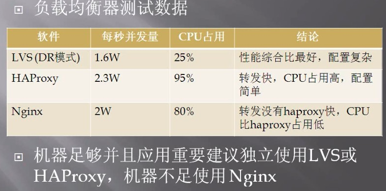

# 负载均衡层

负载均衡，就是让缓解服务的压力，均衡服务的压力，抽象出来一层流量分担的角色。

## 四层和七层负载均衡

所谓四层或者七层负载均衡，指的是负载的位置处于 OSI 七层网络协议层中的哪一层。四层负载均衡指的是在传输层，根据 IP + 端口的方式代理服务。七层负载均衡指的是在应用层，常使用URL路径的方式代理服务。

### 需要强调的一件事

数据包传输过程是打包和拆包的过程，发送过程是打包过程，接收过程是拆包过程。需要明确的是，**整个过程数据包的层层包裹并不会被拆开丢掉**，而是在沿途过程，每层的网络设备只是拆开解析当前层的数据包，以便知道下一站往哪里传送（可能会修改数据），向下一站发送的时候会将数据包重新封装好。

## 四层负载均衡的应用场景

### 1. 四层负载数据库从库

使用 IP + PORT 的方式进行负载均衡，转发多个从库，配合数据库一主多从方案实现数据库的读写分离。四层负载均衡代理多个从库对外保留一个负载均衡的地址供客户端访问使用。比如使用 nginx 实现四层代理多个 mysql从库。

~~~bash
# /etc/nginx/nginx.conf
# 四层代理使用 stream

stream {
    upstream db_read_servers {
        server 172.16.1.51:3306;
        server 172.16.1.52:3306;
        server 172.16.1.53:3306;
    }
 
    server {
        listen 13306;
        proxy_pass db_read_servers;
    }
}
~~~

### 2. 四层代理七层提供并发

七层负载代理 web 服务器，多个 七层代理再被四层负载代理。这样做的优点可以保证七层代理的负载均衡高可用，同是方法集群的并发能力。可以有两种实现方案，各有优缺点。

#### 方案1：每个七层负载均衡器都代理全部的 web 服务器

这种方式下，每个七层负载器都可以直接代理任意一台 web 服务器，解决七层代理负载器的单点故障问题，提供最大程度的灵活和容错能力。

- 优点：七层负载均衡器的高可用；管理简单
- 缺点：负载无法做到分散，可能把任务都分在一个 web 服务器上；更新 web 服务器列表时需要更新全部的七层负载均衡器。

#### 方案2：一个七层负载器代理部分 web 服务器

这种配置下，一个七层负载器代理部分 web 服务器，可以将负载更均匀的分配给 web 服务器，降低单点压力。并且配置灵活，每个七层负载器都可以定制自己所管理的 web 服务器的代理规则。

- 优点：解决web单点压力，配置灵活
- 缺点：七层负载均衡存在单点故障；配置灵活增加了管理和维护的复杂度。

## 负载均衡的软硬件
- F5 硬件。很贵。新能好。支持代理 四层和七层。
- LVS 软件。性能堪比 F5。支持代理四层和四层。常用代理四层。
- Haproxy 软件。性能不错。支持代理四层和七层。常用代理七层。
- Nginx 软件。性能不错。支持代理四层和七层，支持代理 web 层。功能多好用。

推荐阅读：[服务器集群负载均衡(F5,LVS,DNS,CDN)区别以及选型](https://cloud.tencent.com/developer/article/1804197)