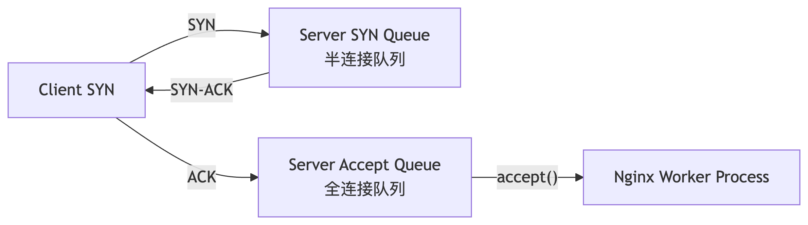

# nginx 优化


所谓 nginx 优化，目的是为了优化服务。包括：web 服务、负载均衡器服务等。单纯 nginx 优化没有意义，要配合 linux 系统一块优化，才会发挥作用。


## 架构优化

**优化前需要先弄明白两件事情**：

- 第一件：弄明白整个架构的链路和分层，画出架构/链路图。
- 第二件：了解架构承载的业务特点。ToB or ToC、流量规律等。


**排查系统瓶颈**：
- 分析链路图，追踪这个请求的流程。
- 确认峰值 QPS、系统应用集群能承载的 QPS
- 查看沿途发日志、慢日志等。
- 使用 `top` 命令、`netstat` 命令查看是否存在 CPU 负载、内存不够、连接过多等情况。


**架构高性能优化思路**
- 高频读。就少读、就近读、读缓存 。
- 高频写：就少写、数据拆分、漏斗写，buffer写 。
- 优化步骤：先细分、分层，分层之后才能对症下药。
- 动静分离、冷热分离、读写分离、负载均衡、缓存、DNS等。


**架构纬度分层优化**
- 数据库层。数据库慢查询、优化sql、索引、加数据库缓存层、读写分离等。
- WEB 层。预估的峰值QPS、低峰期压测出每台web能抗的qps，判断是否需要扩充机器。机器性能有差异调整负载均衡算法：加权轮训、最少连接等。
- 负载均衡层。机器负载太高，使用多级负载均衡、买硬件F5
- 文件服务器层。nfs 不够用，使用分布式存储。
- 网络问题。丢包多、延迟大，那就优化网络环境、升级网络设备。宽度不够加宽带。距离远那就 CDN。
- 针对棘手的问题-，那就分离出来一层，单独想办法处理。


**单机通用优化**

~~~
1、硬件
    负载均衡：cpu核多一些、内存大一些
    应用层：无特殊要求，因为有很多应用服务器，可以用权重控制转发比例
    文件服务器：内存、磁盘大一些
    数据库：内存、磁盘都要大一些
    数据库缓存：内存大一些
 
2、系统
   内核优化参数
   (1) ipv4相关: /proc/sys/net/ipv4/...
   (2) tcp半链接池、全连接池
 
3、软件---服务
   例如nginx的优化，详解如下
 
4、软件---应用
   每个程序都有自己环境相关优化参数
~~~

​                           

​                             

## 系统优化

详见之前的博客。这里主要强调文件描述符和内核参数优化。

#### 文件描述符

~~~bash
# 系统全局设置
# 在/etc/security/limits.d/下放配置文件优先级更高，并且无需重启系统，退出当前终端重新进入即可生效

cat > /etc/security/limits.d/k8s.conf <<'EOF' 
* soft nofile 65535 
* hard nofile 131070 
EOF 
 
*       #所有用户
soft    #当超过设置的文件句柄数时，仅提示
hard    #当超过设置的文件句柄数时，直接限制
 
#2.查看文件句柄数设置
ulimit -Sn 
ulimit -Hn
 
#3.查看打开的文件句柄数
[root@lb01 ~]# lsof | wc -l
2945
[root@web01 ~]# lsof | wc -l
12490
 
#4.查看指定服务的打开文件句柄数
[root@web01 ~]# lsof -p 13592 | wc -l
~~~

#### 内核参数优化

| 参数                                        | 含义                                                         |
| :------------------------------------------ | :----------------------------------------------------------- |
| `net.ipv4.tcp_fin_timeout = 2`              | 设置TCP连接在FIN-WAIT-2状态的超时时间为2秒，以加快连接回收。 |
| `net.ipv4.tcp_tw_reuse = 1`                 | 允许内核将`TIME-WAIT`状态的socket重新用于新的TCP连接，提高连接利用率。 |
| `net.ipv4.tcp_tw_recycle = 1`               | **（注意：新版内核已移除此参数）** 允许快速回收`TIME-WAIT`状态的socket。 |
| `net.ipv4.tcp_syncookies = 1`               | 开启SYN Cookie功能，用于防范SYN Flood攻击。                  |
| `net.ipv4.tcp_keepalive_time = 600`         | TCP连接空闲600秒后开始发送keepalive探测包，检查对端是否存活。 |
| `net.ipv4.ip_local_port_range = 4000 65000` | 设置系统可用本地端口范围为4000到65000。                      |
| `net.ipv4.tcp_max_syn_backlog = 16384`      | 设置半连接队列（SYN队列）的最大长度，用于存放未完成三次握手的连接请求。 |
| `net.ipv4.tcp_max_tw_buckets = 36000`       | 系统同时存在的`TIME-WAIT`状态socket的最大数量，超出则立即被清理。 |
| `net.ipv4.route.gc_timeout = 100`           | 路由缓存项的垃圾回收超时时间，设置为100秒。                  |
| `net.ipv4.tcp_syn_retries = 1`              | 内核放弃建立连接前发送SYN包的重试次数。                      |
| `net.ipv4.tcp_synack_retries = 1`           | 内核放弃建立连接前发送SYN+ACK包的重试次数。                  |
| `net.core.somaxconn = 16384`                | 设置全连接队列（Accept队列）的最大长度，即已完成三次握手等待应用层Accept的连接数上限。 |
| `net.core.netdev_max_backlog = 16384`       | 设置当内核处理速度比网卡接收数据包速度慢时，网卡设备输入队列（ backlog ）中数据包的最大数量。 |
| `net.ipv4.tcp_max_orphans = 16384`          | 系统所能处理的不属于任何进程的TCP socket（孤儿socket）最大数量。 |
| `net.ipv4.ip_forward = 1`                   | 开启IP转发功能，使系统可以作为路由器或VPN网关。              |

### 临时设置

**使用 `sysctl` 命令**。使用 `-w` 参数来临时修改一个参数。

~~~bash
# 临时修改 fin_timeout 和 somaxconn
sudo sysctl -w net.ipv4.tcp_fin_timeout=2
sudo sysctl -w net.core.somaxconn=16384
~~~

### 永久设置

永久设置需要将参数写入配置文件，这样每次系统启动时都会自动加载。主要配置文件：

- `/etc/sysctl.conf`。编辑文件后，使用 `sysctl -p` 命令使配置立即生效（无需重启）。
- `/etc/sysctl.d/` 目录。在该目录下创建自定义 `.conf` 文件，然后使用 `sudo sysctl --system` 使其生效。


## nginx 单节点优化

~~~nginx
worker_processes  auto; # 通常设置为auto就行，有几个核就设置为几
worker_cpu_affinity auto;	# cpu亲和。把 worker 和 cpu 绑定
worker_rlimit_nofile 65535;  # 配合着要把文件描述符调大
events {
    use epoll;  # 使用epoll网络io模型
    worker_connections 1024;  # 单个 workder 最大并发连接数
}

# 定义线程池
thread_pool egon_pool threads=3 max_queue=1024; 

http {
    
    server_tokens off;  # 隐藏 nginx 版本
    client_max_body_size 200m;	# 上传文件大小限制   
  
    # 网络io优化参数
    # sendfile 开启可以减少上下文切换
    sendfile     on;
    tcp_nopush     on; 
    tcp_nodelay     on;
    keepalive_timeout  65;   # 客户端和 nginx 之间的长连接时间
    keepalive_requests 100; 
 
    #2.5开启gzip压缩，节省带块加速网络传输
    gzip  on;
    gzip_min_length 1k;
    gzip_types text/plain text/css application/json application/javascript;
    
    # 配置请求头缓存区
    client_header_buffer_size    128k;  
    large_client_header_buffers  4 128k;
  
    # 启用线程池
    aio threads=egon_pool; 
  
    server {
        # 启用 reuseport，每个 worker 独享一个全连接池
        # 设置全连接池大小为10240, 需要配合内核参数net.core.somaxconn
        # 它的最终有效值是 min(10240, net.core.somaxconn)
        listen 8089 reuseport backlog=10240;
    }
  
}
~~~

>扩展：CPU 亲和：设置亲和性后，worker 进程在运行时始终在同一个 CPU 核心上执行，从而有效利用 CPU 缓存，减少内存延迟，提高整体性能。但需要注意，如果服务器上同时运行着其他 CPU 密集型任务，那不适合设置 CPU 亲和。


## nginx 做代理服务器的代理配置优化

~~~nginx
upstream php_server {
    server 127.0.0.1:9000;
    keeplive 8;		# 开启长连接，需要后端服务也支持 http 长连接
}
 
server {
    listen 80;
    server_name linux.wp.com;
 
    location / {
        root /code/wordpress;
        index index.php;
    }
 
    location ~* \.php$ {
        fastcgi_pass php_server;
        fastcgi_param SCRIPT_FILENAME /code/wordpress/$fastcgi_script_name;
        fastcgi_param HTTPS on;
    
        # 开启长连接，需要FastCGI服务器（如PHP-FPM）支持保持连接
        fastcgi_keep_conn on; 
        
        # 透传 ip 等参数
        proxy_set_header Host $http_host;
        proxy_set_header X-Real-IP $remote_addr;
        proxy_set_header X-Forwarded-For $proxy_add_x_forwarded_for;
        
        # 代理优化参数
        proxy_connect_timeout 60s;
        proxy_read_timeout 60s;
        proxy_send_timeout 60s;
        proxy_buffering on;
        proxy_buffer_size 8k;
        proxy_buffers 8 8k;
        proxy_next_upstream http_500 http_502 http_503 http_504;
    }
}

~~~

参数太多，配置太乱，可以使用 `include` 把参数写在一个 .conf 文件中，然后导入即可。

~~~nginx
# cat /etc/nginx/proxy_params 
proxy_set_header Host $http_host;
proxy_set_header X-Real-IP $remote_addr;
proxy_set_header X-Forwarded-For $proxy_add_x_forwarded_for;
proxy_connect_timeout 60s;
proxy_read_timeout 60s;
proxy_send_timeout 60s;
proxy_buffering on;
proxy_buffer_size 8k;
proxy_buffers 8 8k;
proxy_next_upstream http_500 http_502 http_503 http_504;


# 然后在文件中引入
location / {
    proxy_pass http://tomcat;
    include proxy_params; # -----》引入上面的文件
}
~~~


## 静态资源缓存设置

~~~nginx
server {
    listen 80;
 
    location ~* \.(png|jpg|gif)$ {
        root /code/cache;
        
        # 设置缓存7天
        expires 7d;
    
        # 配置不走缓存
        etag off;
        add_header Cache-Control no-cache;
    }
}

~~~


## 半连接队列和全连接队列

TCP 三次握手时，linux 内核会维护两个队列：半连接队列（SYN 队列）和全连接队列（ACCEPT 队列）。

服务端收到客户端的 SYN 请求后，内核会把这个连接放入半连接池（半连接队列），然后回复客户端 SYN-ACK，接着客户端返回 ACK，服务端收到后会把连接从半连接队列中移除，并放入全连接队列，等待应用程序从全连接对垒中取出使用。半连接队列和全连接队列都有最大长度限制，超出限制时，请求就会被丢弃并返回 RST。

Linux 内核中这两个最大长度都是可以设置的，默认都是 128。
- 设置全连接池大小（临时设置）：`sysctl -w net.core.somaxconn=65530`
- 设置半连接池大小（临时设置）：`sysctl -w net.ipv4.tcp_max_syn_backlog=10240`



### nginx 设置连接池大小

nginx 配置中 `backlog` 用来配置 ACCEPT 队列的大小，它默认值是 511

~~~nginx
server {
    listen 80 backlog=10240;
} 
~~~

>注意：`backlog` 设置的值要配合内核中 `somaxconn` 。在提高内核值的基础上，再提高 nginx 的配置，这样才能起到提高并发能力的效果。


查看队列是否溢出的命令：

- 查看全连接队列的溢出情况：`netstat -s | grep "overflowed"`
- 查看半连接队列的溢出情况：`netstat -s | grep "SYNs to LISTEN"`


## nginx 中 worker 的工作模式

Nignx 里面的 master 进程负责管理多个 worker 进程，worker 进程负责处理请求任务。worker 进程从全连接队列中取出请求然后处理请求。worker 使用全连接队列的方式分为两种情况（工作模式）。

#### 多个 worker 共享一个全连接队列

这是 nginx 默认的方式。只有一个 ACCEPT 队列，所有的 worker 都从其中取出连接然后处理请求任务。

- **优点**：因为共享一个全连接队列，耗时的任务只会阻塞一个 worker，其他空闲的 worker 可以继续取出连接并处理请求，不会拖慢全部连接的处理。
- **缺点**：会发生进程级别的争抢导致资源额外消耗。


#### 每个 worker 独享一个全连接队列

这种模式下每个 worker 都有一个自己专属的全连接队列，取连接时不会发生进程级别的争抢现象。所有 worker进程会都监听相同的接口。然后由内核负责将请求负载均衡到这些监听进程中去，相当于每个进程独享自己的全链接队列。

- **优点**：减少进程级别争抢，减少额外消耗。
- **缺点**：worker 处理耗时任务时，它队列里面的连接无法分享给其他空闲的 worker 进程。导致单个连接请求的延迟增大，CPU 分配不均匀。


## nginx 开启 reuseport 

nginx 使用 `reuseport` 启用复用端口，开启多个 worker 独享一个全连接队列模式。

~~~nginx
server {
    listen 80 reuseport;
}
~~~

开启后查看 listen 的 socket 端口情况

~~~bash
# worker 进程设置为4个, 4个worker进程 reuse了相同的端口
[root@rocky ~]# ss -lnt |grep 8888
LISTEN 0      511               0.0.0.0:8888       0.0.0.0:*   
LISTEN 0      511               0.0.0.0:8888       0.0.0.0:*   
LISTEN 0      511               0.0.0.0:8888       0.0.0.0:*   
LISTEN 0      511               0.0.0.0:8888       0.0.0.0:*   

# 因为是resuse重用的同一个端口，
# 所以在系统层面只能看到一个端口
[root@rocky ~]# netstat -tunlap | grep -w 8888
tcp        0      0 0.0.0.0:8888            0.0.0.0:*               LISTEN      31432/nginx: master 
~~~


#### 开启 reuseport 的效果

- CPU 负载下降
- CPU 使用率下降
- 上下文写换次数下降
- Nginx 服务平均延迟下降，单个请求的最高延迟可能会增加
- Nginx 慢请求数量下降


## 启动 worker 多线程模式

一个 worker 进程内只有一个线程，这意味着每个工作进程在同一时间只有一个在处理客户端请求。尽管每个工作进程是单线程的，但 nginx 通过事件驱动和非阻塞I/O的方式（epoll 模型）能够处理大量并发请求，并且单线程的模式避免了上下文切换的开销，实现高性能和高吞吐量。这种设计在处理静态内容和反向代理等场景下表现出色。

单线程的 worker 可能因为耗时任务阻塞全连接池，此时在 worker 进程内使用多线程模式，可以让 CPU 分配相对均匀、提高 CPU 利用率。

**配置 worker 进程内开启多线程**

~~~nginx
# 定义一个名为‘my_pool’的线程池，3个线程，最大队列1024
thread_pool my_pool threads=3 max_queue=1024;

http {
    # 使用自定义线程池
    aio threads=my_pool; 
}
~~~

其中，
- 指令 `thread_pool` 定义和命名一个线程池。在 `main`  中使用。其中 `max_queue` 指定等待线程池处理的任务队列的最大长度。当所有线程都在忙时，新任务会进入队列等待。如果队列也满了，任务会被拒绝并记录错误。
- 指令 `aio` 指定启用线程池。可以在 `http`, `server`, `location` 中使用。
  - 使用自定义线程池  `aio threads=my_pool; ` 
  - 使用默认线程池 `aio threads; `  Nginx 会使用名为 `default` 的线程池。如果你没有定义名为 `default` 的线程池，Nginx 会自动创建一个（使用默认参数：`threads=1, max_queue=65536`）。

通过合理配置线程池，可以让 Nginx 在处理大文件下载等高磁盘 I/O 负载的场景时，依然保持极高的并发能力和整体性能。

>扩展：在 k8s 中 ingress-nginx 启用了端口复用，开启了 aio 线程池。


#### 启用线程池的前提

**确保 Nginx 编译时包含了线程池支持**。通过以下命令来检查，如果输出 `with-threads`，则说明支持线程池。

```bash
nginx -V 2>&1 | grep -o with-threads
```


## 配置防盗链

配置字段 `valid_referers` 是 nginx 中用于检查HTTP Referer 请求头部字段的指令，主要用于防止资源被其他站点盗用。可以配置在 `server` 块 和 `location` 块内。

`valid_referers` 指令可以接受多个参数

~~~bash
1、none：该参数匹配那些没有Referer头字段的请求。例如，用户直接在浏览器的地址栏中输入URL访问的请求。
2、blocked：该参数匹配那些Referer头字段被防火墙或者代理服务器删除，或者是被客户端软件修改为"-"的请求。
3、server_names：该参数匹配当前server块中定义的server_name。例如，如果你在server块中定义了server_name www.example.com;，那么server_names将匹配来自www.example.com的请求。
4、string：字符串可以是任何你定义的特定域名。当然，星号（*）也被视为有效的字符，可以用来匹配子域名。例如，*.example.com将匹配所有以.example.com结尾的域名。
~~~

#### 示例

~~~nginx
server {
    listen 8080;
    server_name linux.beidaolian.com 192.168.71.15;
 
    location ~* \.(png|jpg|gif)$ {
        root /usr/share/nginx/html/;
        
        # server_names 默认只包含我们自己的域名
        # 多加个 *.baidu.com 为了让百度收录
        valid_referers none blocked server_names *.baidu.com; 
        if ($invalid_referer) {
           return 500;
        }
    }
}
~~~


## 配置跨域请求

域由三部分组成：协议、域名、端口号。三个都一样，两个 URL 才被认为是一个域或者说是 "同源"。 浏览器有一个同源策略，这个策略发现请求的 URL 和当前站点不同源，会阻止响应不会阻止请求。如果响应中告知浏览器允许访问，那么浏览器就会允许响应。

~~~nginx
server {
    listen 80;
    server_name yourdomain.com;
    
    location / {
        # 基本CORS设置
        add_header 'Access-Control-Allow-Origin' 'https://yourfrontend.com';
        add_header 'Access-Control-Allow-Methods' 'GET, POST, OPTIONS, PUT, DELETE';
        add_header 'Access-Control-Allow-Headers' 'DNT,User-Agent,X-Requested-With,If-Modified-Since,Cache-Control,Content-Type,Range,Authorization';
        add_header 'Access-Control-Allow-Credentials' 'true';
        
        # 处理预检请求
        if ($request_method = 'OPTIONS') {
            add_header 'Access-Control-Max-Age' 1728000;
            add_header 'Content-Type' 'text/plain; charset=utf-8';
            add_header 'Content-Length' 0;
            return 204;
        }
        
        proxy_pass http://django_app:8000;
        proxy_set_header Host $host;
        proxy_set_header X-Real-IP $remote_addr;
    }
}
~~~


## nginx 优化总结

~~~bash
1、CPU亲和、worker进程数、调整nginx进程打开的文件句柄数
2、使用Epool网络模型、调整每个worker进程的最大连接数
3、文件的高效读取sendfile、nopush
4、文件的传输实时性、nodealy
5、开启tcp长连接，以及长连接超时时间keepalive_timeout
6、开启文件传输压缩gzip
7、开启静态文件expires缓存
8、隐藏nginx版本号
9、禁止通过ip地址访问，禁止恶意域名解析，只允许域名访问
10、配置防盗链、以及跨域访问
11、防DDOS、cc攻击，限制单IP并发连接，以及http请求
12、优雅显示nginx错误页面
13、nginx加密传输https优化
14、nginx proxy_cache、fastcgi_cache、uwsgi_cache 代理缓存，第三方工具（squid、varnish）
~~~

