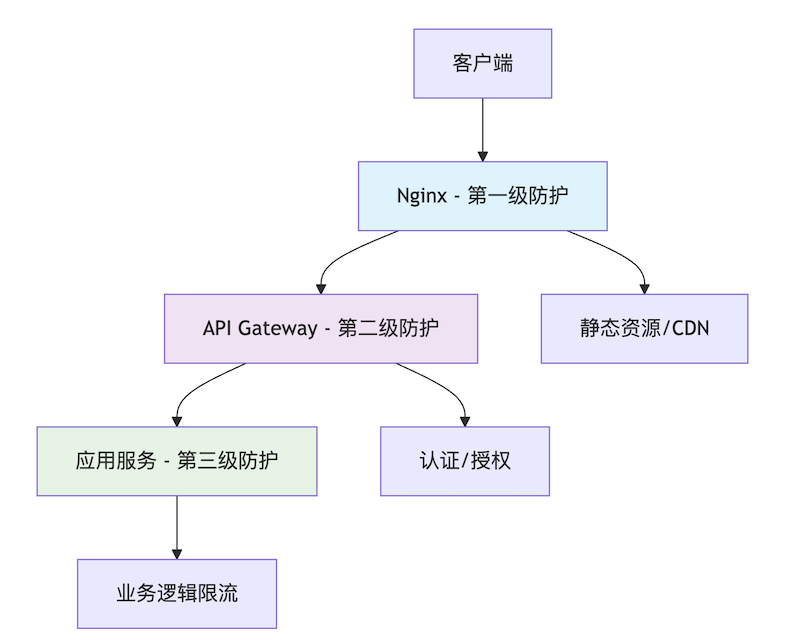

# 降级熔断限流

分布式系统需要做容错处理，否则容易造成服务故障雪崩问题。容错主要有三个：降级、熔断和限流。


## 降级

为了保住核心服务，在高流量时把边缘服务先暂时关掉。以牺牲部分非核心功能和非关键体验为代价，来保障系统核心功能和整体稳定性的策略。它本质上是一种“取舍”艺术。

#### 触发场景

- **计划内降级**：例如在“双11”、“618”等大促期间，提前关闭商品评论、用户积分明细、推荐系统等非核心服务，将全部资源（CPU、数据库连接、带宽）留给交易、支付等核心链路。
- **计划外降级**：当系统监控到资源即将耗尽（如CPU使用率超过90%），或某个非核心依赖服务响应缓慢/失败时，主动触发降级，避免被拖垮。

#### 实现方式

- **静态降级**：通过配置开关或功能开关，在代码层面预留“后门”。需要降级时，通过配置中心动态地将开关关闭，系统则跳过这部分逻辑，返回一个预设的默认值（兜底数据）。比如：商品详情页的推荐模块，降级时直接返回一个空列表或热门商品缓存。
- **动态降级**：系统自动监控指标（如错误率、响应时间），当达到阈值时，自动触发降级逻辑。


## 熔断

熔断模式借鉴了电路保险丝的思想。当某个特定服务（依赖）的调用失败（如超时、异常）达到一定阈值时，熔断器会“跳闸”进入**打开状态**，在一段时间内**自动拒绝**所有对该服务的请求，直接执行降级逻辑（快速失败），从而防止资源被无谓占用和故障蔓延。

#### 触发场景

- 某个外部API、数据库或下游服务持续超时或返回大量错误。


#### 状态机（核心原理）

熔断器通常有三种状态：

- **关闭状态**。请求正常通过。系统会统计失败次数/比率。当在时间窗口内，失败次数超过预设阈值，熔断器会切换到打开状态。
- **打开状态**。所有请求都会被立即拒绝，并执行预设的降级方法（fallback）。经过一个预设的“休眠时间”后，熔断器会进入半开状态。
- **半开状态**。允许少量试探请求通过。如果这些请求成功，则认为下游服务已恢复，熔断器切换回**关闭状态**。如果仍有请求失败，则熔断器重新回到**打开状态**，并继续等待下一个休眠时间窗口。


示例：FastAPI + pybreaker

~~~python
from fastapi import FastAPI, HTTPException
import pybreaker
import requests

app = FastAPI()

# 熔断器实例
breaker = pybreaker.CircuitBreaker(
    fail_max=5,  # 5次失败后熔断
    reset_timeout=30,  # 30秒后进入半开状态
)

@breaker
def call_user_service(user_id: int):
    """调用用户服务的受保护方法"""
    response = requests.get(f'http://user-service/users/{user_id}', timeout=3)
    response.raise_for_status()
    return response.json()

@app.get("/users/{user_id}")
async def get_user(user_id: int):
    try:
        user_data = call_user_service(user_id)
        return {"status": "success", "data": user_data}
    except pybreaker.CircuitBreakerError:
        # 熔断开启时的降级逻辑
        return {
            "status": "degraded", 
            "message": "User service temporarily unavailable",
            "data": {"id": user_id, "name": "Fallback User"}
        }
    except requests.RequestException as e:
        raise HTTPException(status_code=503, detail="Service unavailable")

# 监控端点
@app.get("/circuit-breaker/status")
async def get_circuit_status():
    return {
        "state": breaker.current_state,
        "fail_counter": breaker.fail_counter,
        "last_failure": str(breaker._last_failure) if breaker._last_failure else None
    }
~~~


## 限流

核心业务无法承受大流量，需要对核心服务做限流。限流的核心目标是：**在系统可承受的范围内，尽可能地处理请求，同时优雅地拒绝掉超额请求，保证系统不崩溃，保障大部分用户的正常使用。**


#### 分层限流

在请求的整个链路上，分层设置限流措施。负载均衡、网关、应用程序。



| 层级           | 实现方式                                  | 优点                                                | 缺点                                                    | 适用场景                                                     |
| :------------- | :---------------------------------------- | :-------------------------------------------------- | :------------------------------------------------------ | :----------------------------------------------------------- |
| **应用程序层** | 代码中集成令牌桶算法                      | 1. 灵活性最高 2. 可基于业务逻辑限流 3. 精细控制     | 1. 资源消耗在应用服务器 2. 实现复杂 3. 集群同步困难     | 1. 基于用户/业务规则的限流 2. 方法级/API级细粒度控制 3. 需要复杂业务逻辑的限流 |
| **网关层**     | Spring Cloud Gateway, Kong, API Gateway等 | 1. 统一入口控制 2. 集群限流相对容易 3. 与应用解耦   | 1. 需要额外组件 2. 配置相对复杂 3. 业务感知有限         | 1. API级别的统一限流 2. 微服务架构 3. 需要认证、鉴权的场景   |
| **Nginx层**    | `limit_req_zone`, `limit_conn_zone`       | 1. 性能极高 2. 网络层拦截，节省后端资源 3. 配置简单 | 1. 限流策略相对简单 2. 业务感知能力弱 3. 集群同步有挑战 | 1. 基于IP/连接数的限流 2. 防CC攻击 3. 粗粒度流量控制         |

#### nginx限流配置

使用 请求限流模块。

```nginx
http {
    # 定义限流区域：10r/s 表示每秒10个请求
    # 10m 内存空间可以限制乐 80000 个ip
    limit_req_zone $binary_remote_addr zone=api:10m rate=10r/s;
    
    # 限制连接数
    limit_conn_zone $binary_remote_addr zone=addr:10m;

    server {
        listen 80;
        
        location /api/ {
            # 使用限流，突发队列为5个请求
            limit_req zone=api burst=5 nodelay;
            
            # 限制每个IP最多10个连接
            limit_conn addr 10;
            
            proxy_pass http://backend_servers;
        }
        
        # 静态资源不限流
        location /static/ {
            proxy_pass http://backend_servers;
        }
    }
}
```


#### python 使用 redis 实现分布式令牌桶限流

~~~python
import redis
import time
import json

class DistributedTokenBucket:
    """基于Redis的分布式令牌桶"""
    
    def __init__(self, redis_client, key, capacity, fill_rate):
        self.redis = redis_client
        self.key = f"rate_limit:{key}"
        self.capacity = capacity
        self.fill_rate = fill_rate
    
    def consume(self, tokens=1):
        lua_script = """
        local key = KEYS[1]
        local tokens = tonumber(ARGV[1])
        local capacity = tonumber(ARGV[2])
        local fill_rate = tonumber(ARGV[3])
        local now = tonumber(ARGV[4])
        
        local bucket = redis.call('hmget', key, 'tokens', 'last_time')
        local current_tokens = capacity
        local last_time = now
        
        if bucket[1] then
            current_tokens = tonumber(bucket[1])
            last_time = tonumber(bucket[2])
        end
        
        -- 计算应该补充的令牌
        local elapsed = now - last_time
        local tokens_to_add = elapsed * fill_rate
        current_tokens = math.min(capacity, current_tokens + tokens_to_add)
        
        -- 检查是否可以消费
        if current_tokens >= tokens then
            current_tokens = current_tokens - tokens
            redis.call('hmset', key, 'tokens', current_tokens, 'last_time', now)
            redis.call('expire', key, math.ceil(capacity / fill_rate) * 2)
            return 1
        else
            return 0
        end
        """
        
        now = time.time()
        result = self.redis.eval(
            lua_script, 1, 
            self.key, tokens, self.capacity, self.fill_rate, now
        )
        return bool(result)

# 使用示例
import redis
redis_client = redis.Redis(host='localhost', port=6379, db=0)

def api_endpoint(user_id):
    # 为每个用户创建独立的限流器
    limiter = DistributedTokenBucket(
        redis_client, 
        key=f"user:{user_id}", 
        capacity=100, 
        fill_rate=10  # 每秒10个令牌
    )
    
    if not limiter.consume():
        return {"error": "Rate limit exceeded"}, 429
    
    # 正常处理业务逻辑
    return {"data": "success"}
~~~

