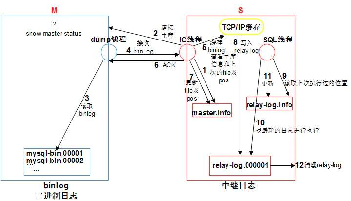

# 主从同步

主从同步可以在架构上实现读写分离，提高系统架构的并发能力。

总来来说，就是把主库用来写数据，在从库上读数据。基于主库的 binlog 实现数据同步。从库从主库那里获取 binlog，在从库上执行一遍，这样尽可能保证主从数据一致。

主从的好处，

- 可以实现读写分离/服务器负载均衡，提升架构并发性能。
- 通过复制实现数据异地备份，保障数据安全。
- 提高数据库系统的可用性。

## 主从复制原理

整体来说有三个部分：

- 第一步。主库把修改记录存到 binlog。
- 第二步。从库的 IO 线程将主库的二进制日志拷贝到自己的中继日志（relay log）。
- 第三步。从库的 SQL 线程解析中继日志然后在从库执行主库的修改记录，保持和主库数据一致。

具体执行流程简述如下

1. 从库的 IO 线程，读取 master.info 信息，获取主库信息并连接主库。
2. 主库接收从库的链接请求后，会生成一个准备 binlog DUMP 的线程，来响应从库。
3. 主库一旦有新的日志生成，会发送“信号”给主库的 binlog dump 线程，该线程会读取 binlog 日志的更新。
4. TP(传送)给从从库的 IO 线程。
5. 从库 IO 线程将收到的日志存储到了 TCP/IP 缓存。
6. 从库写入 TCP/IP 缓存后，立即返回 ACK 给主库 ，此时主库工作完成。
7. 从库 IO 线程更新 master.info 文件 binlog 文件名和 postion
8. 从库 IO 线程将缓存中的数据，存储到 relay-log 日志文件，此时 IO 线程工作完成。
9. 从库 SQL 线程读取 relay-log.info 文件，获取到上次执行到的 relay-log 的位置，作为起点。
10. 从库 SQL 线程基于从步骤 9 中获取到的起点，去中继日志获取后续操作，在从库回放 relay-log
11. 从库 SQL 线程回放完成之后，会更新 relay-log.info 文件，把当前操作的位置记入，作为下一次操作的起点。
12. 从库 relay-log 会有自动清理的功能。

## 主从复制方式

主要有两种方式：异步方式和半同步方式。默认是异步方式。

- 异步方式。客户端往主库提交一个写请求，写入主库的 binlog 后就立即响应客户端，主库不等待从库完成同步操作。这种方式即为异步方式。
- 半同步方式。客户端提交写请求之后，主库记录 binlog 之后要等待其中一个从库接收到 binlog 并写入 relay log 之后再响应客户端。所谓半同步指的是等待从库完成中级日志的记录，而不用等到从库 SQL 线程 执行 binlog 同步。

之所以没有完全同步方式，主要为了提升整体的效率。

 