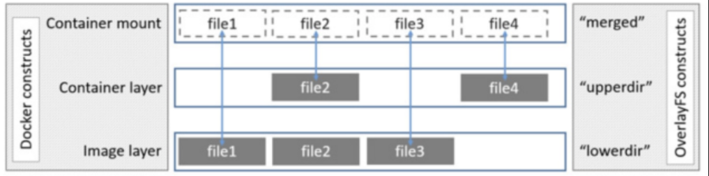

# 容器化

想要单机利用率提高，就要在单机上部署多个进程服务。又想要服务之间实现隔离，互不影响。可以使用虚拟化技术和容器化技术。

## 虚拟化

在一个计算机硬件上运行多个虚拟机，每个虚拟机里面独立安装完整的操作系统，在操作系统上运行服务进程。

虚拟化技术的精髓就是虚拟机，虚拟机实现的效果：1. 隔离；2. 限定虚拟机对资源的使用上限制，不要干扰其他虚拟机。

常见的虚拟化技术：kvm、exsi、xen等。

虚拟化技术的缺点：虚拟机相对臃肿不够轻量级，虚拟机本身会占用很多资源。

## 容器化

容器化需要实现三个目标：

- 隔离。使用 linux内核提供的 namespace，实现6大名称空间的隔离。
- 限定容器对资源的使用上限。基于 cgroup 实现。
- 文件系统。使用 UnionFS 联合文件系统实现容器内的文件系统。

一个完成的操纵系统大致包含两部分：

- bootfs：内核、启动文件。
- rootfs：文件系统。

## 名称空间 namespace

容器引擎创建一个容器，本质就是创建了一个名称空间。

名称空间的核心目的就是为了隔离关键资源，保证不与其他空间冲突，namespace到底隔离了哪些关键资源呢？主要分为6种：

#### 1. pid

保证不同名称空间里拥有自己完全独立的一套 pid 号。不同的名称空间里即便 pid 号一样也不会冲突。

#### 2. uts

主机名与网络信息服务。

#### 3. ipc

进程间通信，是 unix/linux下进程直接通信的一种方式。

#### 4. mount

容器内挂载点与系统分离开

#### 5. network

用于隔离网络资源（/proc/net,IP地址，网卡、路由）。一个名称空间里可以有自己独立的网卡，监听的端口不会与其他名称空冲突

#### 6. user

用户的id、组id与其他名称空间与冲突。

## 容器镜像

一个完成的操作系统镜像：bootfs + rootfs

一个容器镜像：rootfs

同一个宿主机上的多个容器共享该宿主机的内核。

## UnionFS 联合文件系统

所谓联合文件系统就是可以把为文件系统上多个目录内容联合挂载到同一个目录下，使用者也就是容器看起来认为是一个目录，实际上在物理机上是由多个目录构成的。

overlay 是 UnionFS 的一种。新版的 Docker 使用的存储引擎是 overlay2。

overlay2 分为三层。最底层是 `lowerdir` 镜像层，只读。中间层为 `upperdir` 容器层，容器自己写操作都放在这个一层指定的目录里面。最上层是 `mergerd` 展示层，内容来自 `lowerdir` 和 `upperdir`，在容器内看到就是这一层。

#### 补充

第一次写一个文件，容器第一次写一个已经存在的文件，容器层不存在这个文件。overlay/overlay2 驱动执行 `copy-up` 操作，将文件从镜像层拷贝到容器层。然后容器修改容器层新拷贝的文件。

`copy-up` 操作只发生在第一次写文件时，后续的对同一个文件的写操作都是直接针对拷贝到容器层的文件。
OverlayFS 只工作在两层中。这比 AUFS 要在多层镜像中查找时性能要好。

删除文件和目录。删除文件时，容器会在镜像层创建一个 whiteout 文件，而镜像层的文件并没有删除，但是whiteout 文件会隐藏它。容器中删除一个目录，容器层会创建一个不透明目录，这和whiteout 文件隐藏镜像层的文件类似。

重命名目录。只有在源文件和目的路径都在顶层容器层时，才允许执行 rename 操作，否则返回 EXDEV。因此，应用需要能够处理 EXDEV，并且回滚操作，执行替代的”拷贝和删除”策略。

传统 Linux 加载 bootfs 时会先将 rootfs 设置为 read-only，待系统自检之后将 rootfs 设置为 read-write，然后就可以在这 rootfs 上进行读写操作。

Docker 在 bootfs 自检之后不会把 rootfs 设置为 read-write，而是利用联合文件系统挂载机制将镜像中的其他 layer 加载到之前的 read-only 的 rootfs 层之上，每一层都是 rootfs，并且都是 read-only，所以我们无法修改一个已知镜像里面的 Layer。

只有当创建容器时，系统会分配一层空的 read-write 的 rootfs，用于保存容器内的修改。

综上，镜像其实就是一个文件系统，它宿主机的内核一块为程序提供一个虚拟的 linux 环境。在启动 docker 容器时，依据镜像，docker 为容器构建一个虚拟的 linux 环境。

