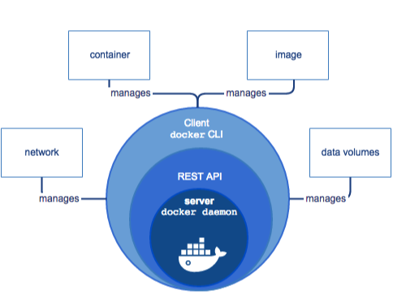
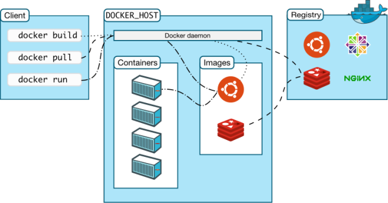
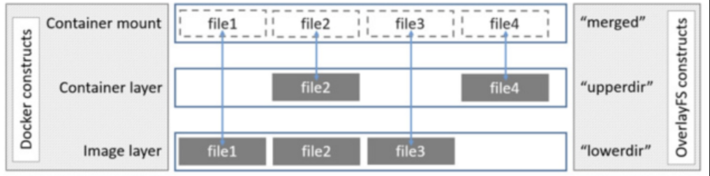

# docker

想要提高单机利用率，就要在单机上部署多个进程服务。又想要服务之间实现隔离，互不影响。可以使用虚拟化技术或容器化技术。

## 虚拟化

在一个计算机硬件上运行多个虚拟机，每个虚拟机里面独立安装完整的操作系统，在操作系统上运行服务进程。

虚拟化技术的精髓就是虚拟机，虚拟机实现的效果：1. 隔离；2. 限定虚拟机对资源的使用上限制，不要干扰其他虚拟机。

常见的虚拟化技术：kvm、exsi、xen等。

虚拟化技术的缺点：虚拟机相对臃肿不够轻量级，虚拟机本身会占用很多资源。

## Docker 和虚拟机的区别

1. 虚拟化技术依赖的是物理 CPU 和内存，是硬件级别的；而 Docker 是构建在操作系统层面的，利用操作系统的容器化技术。Docker 同样的可以运行在虚拟机上面。
2. 虚拟机中的系统就是我们常说的操作系统镜像，比较复杂；而 Docker 比较轻量级，我们可以使用 Docker 部署一个独立的 Redis，就像类似于在虚拟机当中安装一个 Redis 应用。但使用 Docker 部署的应用是完全隔离的。
3. 传统的虚拟化技术是通过快照来保存的；而 Docker 引用了类似于源码的管理机制，将容器的快照历史版本一一记录下来，切换成本低。
4. 传统的虚拟化技术在构建系统的时候非常复杂；而 Docker 可以通过一个简单的 Dockerfile 文件来构建整个容器，更重要的是 Dockerfile 可以手动编写，这样应用开发人员可以通过发布 Dockerfile 来定义应用的环境和依赖，这样对于持续交付非常有利。

## 容器化

容器化需要实现三个目标：

- 隔离。使用 linux内核提供的 namespace，实现六大名称空间的隔离。
- 限定容器对资源的使用上限。基于 cgroup 实现。
- 文件系统。使用 UnionFS 联合文件系统实现容器内的文件系统。

一个完成的操纵系统大致包含两部分：

- bootfs：内核、启动文件。
- rootfs：文件系统。

## Docker 引擎

Docker Engine 是一个 C/S 架构的应用程序，主要包含下面几个组件：

- 常驻后台进程 Dockerd，用来管理docker 对象。
- 一个用来和 Dockerd 交互的命令行 CLI 接口（使用 REST API 进行交互）

## Docker 架构

Docker 使用了 C/S 体系架构，Docker 客户端与 Docker 守护进程通信，Docker 守护进程负责构建，运行和分发 Docker 容器。Docker 客户端和守护进程可以在同一个系统上运行，也可以使用 Docker 客户端连接到远程Docker 守护进程。Docker 客户端和守护进程使用 REST API 通过 UNIX 套接字或网络接口进行通信。

#### Docker 守护进程

Docker 守护进程用来监听 Docker API 的请求和管理 Docker对象，比如镜像、容器、网络和 Volume。

####  Docker 客户端

 Docker 客户端是和 Docker 守护进程进行交互的最主要的方式方法，比如可以通过 `docker run` 来运行一个容器，客户度把请求发送给 docker 守护进程，由守护进程执行。

#### Docker 仓库

Docker Registry 用来存储 Docker 镜像的仓库，Docker Hub 是 Docker 官方提供的一个公共仓库，而且 Docker默认也是从 Docker Hub 上查找镜像的，当然也可以很方便的搭建一个私有仓库。

我们使用 `docker pull` 命令，就会从配置的 Docker 镜像仓库中去拉取镜像，使用 `docker push` 命令，会将我们构建的镜像推送到对应的镜像仓库。

#### Images 镜像

镜像是一个模板，带有 Docker 容器的说明，一般来说的，镜像会基于另外的一些基础镜像。

#### Containers 容器

容器是一个镜像的可运行的实例，可以使用 Docker REST API 或者 CLI 来操作容器，容器的实质是进程，但与直接在宿主执行的实例进程不同，容器进程属于自己的独立的命名空间。因此容器可以拥有自己的 **root文件系统、自己的网络配置、自己的进程空间、甚至自己的用户ID。**

容器内的进程是运行在一个隔离的环境里，使用起来，就好像在一个独立于宿主的系统下操作一样。这种特性使得容器封装的应用比直接在宿主运行更加安全。

## Docker 核心概念

Docker 中有三大核心概念，这个概念点是实现容器的基础。

#### 名称空间 namespace

Linux 内核从 2.4.19 版本中开始陆续引入 namespace 概念。名称空间是 Linux 内核强大的特性，目的是将某个特定的系统资源通过抽象方法隔离起来。每个容器都有自己的名称空间，运行在其中的应用就好像运行在一个独立的 linux 主机上一样。命名空间保证了容器之间彼此互不影响。

容器引擎创建一个容器，本质就是创建了一个名称空间。

名称空间的核心目的就是为了隔离关键资源，保证不与其他空间冲突，namespace到底隔离了哪些关键资源呢？主要分为6种：

#### 1. pid

保证不同名称空间里拥有自己完全独立的一套 pid 号。不同的名称空间里即便 pid 号一样也不会冲突。

#### 2. uts

主机名与网络信息服务。

#### 3. ipc

进程间通信，是 unix/linux下进程直接通信的一种方式。

#### 4. mount

容器内挂载点与系统分离开

#### 5. network

用于隔离网络资源（/proc/net,IP地址，网卡、路由）。一个名称空间里可以有自己独立的网卡，监听的端口不会与其他名称空冲突

#### 6. user

用户的id、组id与其他名称空间与冲突。

## 容器镜像

一个完成的操作系统镜像：bootfs + rootfs

一个容器镜像：rootfs

同一个宿主机上的多个容器共享该宿主机的内核。

## UnionFS 联合文件系统

所谓联合文件系统就是可以把为文件系统上多个目录内容联合挂载到同一个目录下，使用者也就是容器看起来认为是一个目录，实际上在物理机上是由多个目录构成的。

overlay 是 UnionFS 的一种。新版的 Docker 使用的存储引擎是 overlay2。

overlay2 分为三层。最底层是 `lowerdir` 镜像层，只读。中间层为 `upperdir` 容器层，容器自己写操作都放在这个一层指定的目录里面。最上层是 `mergerd` 展示层，内容来自 `lowerdir` 和 `upperdir`，在容器内看到就是这一层。

#### 补充

第一次写一个文件，容器第一次写一个已经存在的文件，容器层不存在这个文件。overlay/overlay2 驱动执行 `copy-up` 操作，将文件从镜像层拷贝到容器层。然后容器修改容器层新拷贝的文件。

`copy-up` 操作只发生在第一次写文件时，后续的对同一个文件的写操作都是直接针对拷贝到容器层的文件。
OverlayFS 只工作在两层中。这比 AUFS 要在多层镜像中查找时性能要好。

删除文件和目录。删除文件时，容器会在镜像层创建一个 whiteout 文件，而镜像层的文件并没有删除，但是whiteout 文件会隐藏它。容器中删除一个目录，容器层会创建一个不透明目录，这和 whiteout 文件隐藏镜像层的文件类似。

重命名目录。只有在源文件和目的路径都在顶层容器层时，才允许执行 rename 操作，否则返回 EXDEV。因此，应用需要能够处理 EXDEV，并且回滚操作，执行替代的”拷贝和删除”策略。

传统 Linux 加载 bootfs 时会先将 rootfs 设置为 read-only，待系统自检之后将 rootfs 设置为 read-write，然后就可以在这 rootfs 上进行读写操作。

Docker 在 bootfs 自检之后不会把 rootfs 设置为 read-write，而是利用联合文件系统挂载机制将镜像中的其他 layer 加载到之前的 read-only 的 rootfs 层之上，每一层都是 rootfs，并且都是 read-only，所以我们无法修改一个已知镜像里面的 Layer。

只有当创建容器时，系统会分配一层空的 read-write 的 rootfs，用于保存容器内的修改。

综上，镜像其实就是一个文件系统，它宿主机的内核一块为程序提供一个虚拟的 linux 环境。在启动 docker 容器时，依据镜像，docker 为容器构建一个虚拟的 linux 环境。

