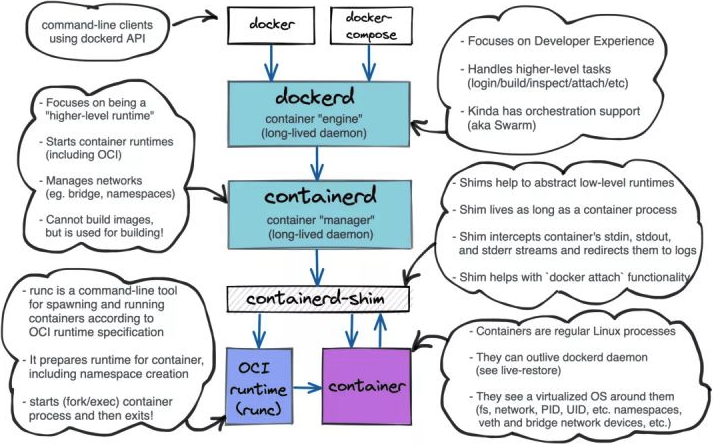

# 容器运行时

简单来说，容器运行时（runtime）是负责在操作系统上启动和运行容器的软件。它是容器技术的核心引擎，没有它，容器就无法运行。为了更深入地理解，我们可以从两个层面来看：**狭义容器运行时**和**广义容器运行时**。

| 类型       | 职责                                       | 例子                  |
| :--------- | :----------------------------------------- | :-------------------- |
| 狭义运行时 | 直接与内核交互，创建隔离环境并运行进程。   | `runc`, `crun`        |
| 广义运行时 | 管理镜像、网络、存储，并调用狭义运行时而。 | `containerd`, `CRI-O` |


#### 狭义容器运行时

狭义容器运行时指的是真正与容器直接交互、在底层执行命令的组件。一般也称为 lower-level 容器运行时。

他们的职责主要有：

- 隔离环境。使用 Linux 内核特性（如 Namespaces 和 Cgroups）为进程创建一个隔离的运行环境。Namespaces 负责隔离，Cgroups负责资源限制。
- 运行容器。根据容器镜像中的定义，启动并运行容器内的进程。
- 管理容器的什么周期。启动、停止、暂停、删除容器。

常见的低级别运行时：

- runc。最主流、最标准的低级运行时。它实现了容器启停、资源隔离等功能。实现了 **OCI** 标准。
- run。一个用 C 语言编写的、性能更好的运行时，常用于替代 runc。


```alert type=note
什么是 **OCI** <br>
Docker 联合 Google、CoreOS 还有其他供应商于2015年创建了一个开源组织，名字为 OCI 全称是（Open ontainer Initiative），翻译过来是开放容器倡议。这个组织隶属于 Linux 基金会，其目的是为了制定容器技术的通用标准，本质是为了确认技术标准的话语权。<br>
OCI 主要有两个规范：<br>
- **容器运行时规范**：定义了如何运行一个“文件系统包”（即容器）。<br>
- **容器镜像规范**：定义了容器镜像的格式。
```


#### 广义容器运行时

在实际应用中（比如使用 Docker 或 k8s 时），我们所说的“容器运行时”通常指一个功能更丰富的广义运行时。它不仅包含上面提到的低级运行时，还包含一系列用于管理容器镜像（如下载、解压、验证）和容器的高级功能。

可以把广义容器运行时看作一个“容器管理器”，它内部会调用像 `runc` 这样的低级运行起来实际启动容器。

**常见的广义运行时例子：**

- **containerd**：这是一个行业标准的、功能强大的容器运行时。它最初是 Docker 的一部分，后来被分离出来成为一个独立的 CNCF 项目。Docker 引擎现在实际上是建立在 `containerd` 之上的。k8s 也可以通过 CRI 直接与 `containerd` 交互。
- **CRI-O**：这是一个专为 k8s 设计的轻量级容器运行时。它实现了 k8s 的 **CRI** 接口，可以直接与 `runc` 等 OCI 兼容的低级运行时协作。它的目标是只运行符合 OCI 标准的容器，非常精简和安全。


```alert type=note
关键概念：CRI <br>
容器运行时接口是 k8s 定义的一个插件接口，它让 kubelet 能够使用各种不同的容器运行时，而无需重新编译 k8s。containerd 和 CRI-O 都实现了 CRI。
```


# Docker 分层

从 docker 1.11 之后，docker daemon 单体拆分为多个标准模块。拆分之后，docker 的结构分为以下5个部分，每个部分都可以被替换。



#### docker-cli

这个是 docker 的客户端，有命令行工具，比如 docker 、docker compose 等，也可以是 rest api。

#### dockerd

dockerd 全称是 docker daemon，它是 docker 的守护进程，是 high-level 的运行时，负责用户登陆认证、构建镜像、卷管理、日志等功能，接收客户端命令等功能。它的父进程是系统的1号进程。

#### containerd

containerd 是一个守护进程，它的父进程是系统的1号进程。是一个 high-level 运行时。它独立负责容器运行时和生命周期，比如创建、启动、停止、终止、删除容器等。它不负责构建镜像。

#### containerd-shim

containerd-shim 和容器进程共存亡。当有了创建容器的需求后，containerd 会创建一个 containerd-shim 进程，然后 containerd-shim 进程会调用 runc 创建一个容器进程。创建容器后 runc 退出。containerd-shim 和容器进程交互，负责容器进程的输入输出等。

需要注意，虽然 containerd 创建了 containerd-shim，但是后者的父进程是系统的1号进程。前者创建了后者之后，就和后者没有了关系。

containerd-shim 进程和与之关联的容器进程生死与共，如果 containerd-shim 进程挂了那么容器进程必挂，反之亦然。

#### runc

它是一个 lower-level 运行时，由 containerd-shim 进程会调用 runc 具体创建容器进程。根据标准完成创建容器所需的具体工作，包括配置 `namespaces`、`cgroups` 和挂载根文件系统。启动容器后，`runc` 自身会立即退出，后续的容器进程托管交由 `containerd-shim` 负责。


#### 层级关系

宿主机上，一个 dockerd 进程、一个 containerd 进程。创建一个容器就会创建一对父子进程（containerd-shim 进程和容器进程）。

需要注意的是：

- dockerd、containerd、containerd-shim 进程的父进程都是系统1号进程。
- 容器进程的父进程是与之关联的 containerd-shim 进程，他俩生死与共。

~~~bash
dockerd
    containerd
        containerd-shim----runc---->容器进程
        containerd-shim----runc---->容器进程
        containerd-shim----runc---->容器进程
~~~


## 为什么需要 containerd-shim

dockerd 不负责创建容器，它会把创建容器的请求交给 containerd，后者收到请求后，也不会直接创建容器，而是创建一个 containerd-shim 的进程，containerd-shim 进程调用 runc 最终完成容器的创建任务。这是创建一个容器的流程。

容器进程需要一个父进程监控它的状态并做必要管理，比如收集状态、标准输入输出等文件句柄打开等工作，总之需要一个能管事的父进程。

如果 containerd 直接创建容器，containerd 当容器进程的父进程，那么大概率会出现一个 containerd 进程管理一堆子进程（容器进程）的局面。这个时候不仅会影响效率，还会出现 "单点故障"。即如果 containerd 挂掉了（比如重启 docker 服务），整个宿主机上的所有容器都要挂掉。

docker 服务配置配置参数 `live-restore` 就是基于该设计而来的。

 containerd-shim 的出现，刚好解决这个问题，并且 containerd-shim 进程和容器进程是一一绑定。一个 containerd-shim 进程管理一个容器进程（独生子），专门负责收集容器进程的状态，上报给 containerd，并在容器中 pid 为1的进程退出后接管容器中的子进程，确保容器内不会出现僵尸状态的进程。

这就是 containerd-shim 进程的必要性。
