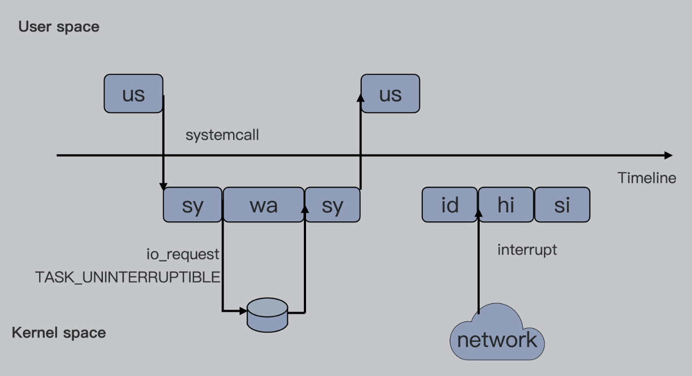
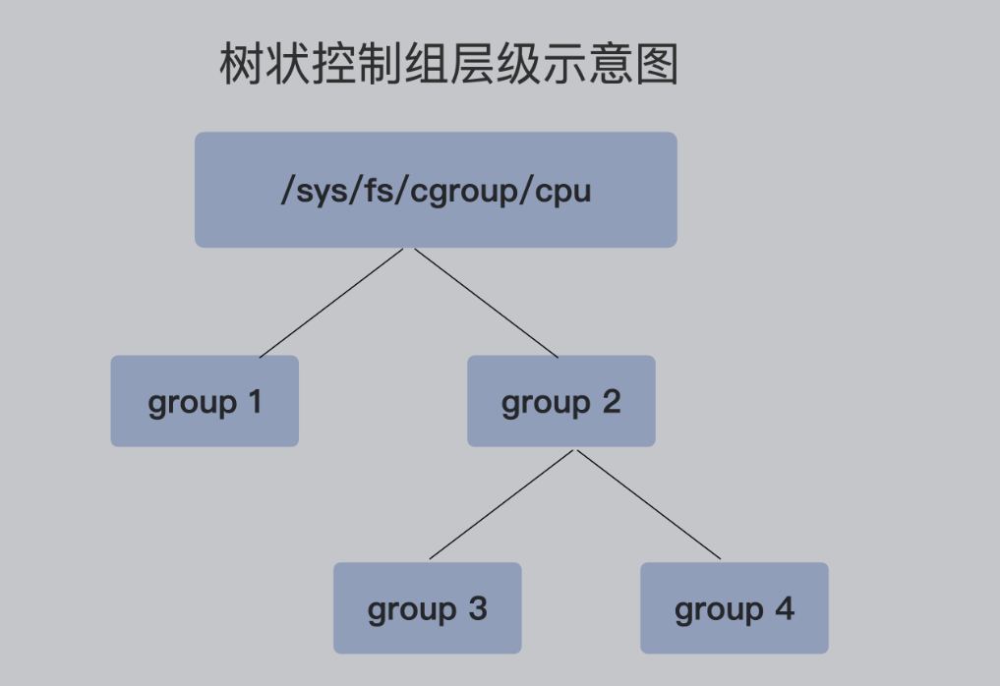

# cgroup

Cgroup 是一种机制，用来限制进程对资源的使用，这其中有一种限制进程对 CPU 资源的使用，它就是 cpu cgroup。k8s 中 pod 的 request 和 limit 底层其实就是在配置 cpu cgroup。

## cpu usage

cpu 的使用情况复杂，有的状态会计入 cpu 的使用时间，有的不会计入。

可以通过 top 命令查看到如下关于 cpu usage 的指标。其中的关键指标解释如下：

- us  用户态进程占用 cpu 时间的百分比，不包括低优先级进程的用户态时间（nice值1-19）
- sys 内核态进程占用cpu时间的百分比
- ni Nice，nice值1-19的进程用户态占cpu时间的百分比，注意ni与us一样，都是在用户态
- id Idle，系统空闲cpu的百分比
- wa Iowait，系统等待I/O的cpu时间占比，该时间不计入进程的CPU时间
- hi Hardware irq，处理硬件中断所占用CPU的时间，该时间同样不计入进程的CPU时间
- si Softtirq，处理软件中断的时间，该时间不计入进程的CPU时间
- st Steal，表示同一宿主机上的其他虚拟机抢走的CPU时间

强调：无论是 hi 还是 si，占用的 cpu 时间，都不会计入进程的 cpu 时间，因为本来中断程序就是单独的程序，它们属于内核态，因此 cgroup 不会限制它们。

总结：

- cpu 的使用分为两类：一类是用户态（us ni），另一类是内核态（sy）
- 至于 wa、hi、si、这些 io 或者中断相关的 cpu 使用，cpu cgroup 不会限制。

## cpu cgroup的使用

每个 cgroups 子系统都是通过一个虚拟文件系统的方式挂到一个目录下。cpu cgroup 一般是挂载到 `/sys/fs/cgroup/cpu` 目录下。

在该目录下，每个控制组都是一个目录，各个控制组之间的关系是一个树状的层级关系。

####  创建控制组

创建控制组后，会在目录下面生成一系列文件。

~~~bash
[root@me cpu]# pwd
/sys/fs/cgroup/cpu
[root@me cpu]# mkdir group1
[root@me cpu]# ls -l group1/
total 0
-rw-r--r-- 1 root root 0 Oct 27 22:18 cgroup.clone_children
--w--w--w- 1 root root 0 Oct 27 22:18 cgroup.event_control
-rw-r--r-- 1 root root 0 Oct 27 22:18 cgroup.procs
-r--r--r-- 1 root root 0 Oct 27 22:18 cpuacct.stat
-rw-r--r-- 1 root root 0 Oct 27 22:18 cpuacct.usage
-r--r--r-- 1 root root 0 Oct 27 22:18 cpuacct.usage_percpu
-rw-r--r-- 1 root root 0 Oct 27 22:18 cpu.cfs_period_us
-rw-r--r-- 1 root root 0 Oct 27 22:18 cpu.cfs_quota_us
-rw-r--r-- 1 root root 0 Oct 27 22:18 cpu.rt_period_us
-rw-r--r-- 1 root root 0 Oct 27 22:18 cpu.rt_runtime_us
-rw-r--r-- 1 root root 0 Oct 27 22:18 cpu.shares
-r--r--r-- 1 root root 0 Oct 27 22:18 cpu.stat
-rw-r--r-- 1 root root 0 Oct 27 22:18 notify_on_release
-rw-r--r-- 1 root root 0 Oct 27 22:18 tasks
~~~

#### 删除控制组

不能直接使用 `rm -rf group1` 的方式删除，会报错。要安装 `libcgroup` 工具删除控制组。

~~~bash
# 安装LIBCGROUP工具:使用 libcgroup 工具前
# 请先安装 libcgroup 和 libcgroup-tools 数据包
# REDHAT系统安装
yum install libcgroup libcgroup-tools -y
 
# UBUNTU系统安装:
apt-get install cgroup-bin
 
# 验证是否安装成功
cgdelete -h

cgdelete cpu:/group1
cgdelete cpu:/group2
 
# 有子group需要-r删除
cgdelete -r cpu:/group1
~~~

#### CFS 参数

在云平台上，大部分程序都不是时时调度的进程，而是普通调度（SCHED_HORMAL）类型进程，对于普通调度用到的算法，在 linux 系统中目前是 CFS（completely fair scheduler，即完全公平调度器）。在 cpu cgroup 中和 cfs 相关的参数有三个。

- `cpu.cfs_period_us`：用来配置 cfs 的调度周期，单位是微秒，默认值是 100000 微秒，即100 毫秒。
- `cpu.cfs_quota_us`：配置一个调度周期内，此控制组被允许的运行时间，默认是 -1 表示不限制运行时间。比如配置值是 50000，就是 50 毫秒，在 100 毫秒周期内的前提下，该控制组控制的进程最多使用 0.5个 CPU。
- `cpu.shares` ：控制的是在同一级下的多个控制组，如果其控制的进程对 cpu 的占用超过了宿主机的实际 cpu 个数，那么该配置就会生效，具体按照配置的比例分配 cpu 使用。

#### 把进程的 PID 加入控制组

~~~bash
# 1、把进程的pid加入控制组group4
echo 2993 > /sys/fs/cgroup/cpu/group2/group4/cgroup.procs
 
# 2、限制cpu为3.5个cpu
echo 350000 > /sys/fs/cgroup/cpu/group2/group4/cpu.cfs_quota_us
 
# 3、设置cpu.shares
echo 3072 > /sys/fs/cgroup/cpu/group2/group4/cpu.shares
~~~

#### 总结

两个参数 `cpu.cfs_period_us` 和 `cpu.cfs_quota_us` 决定每个控制组所有进程可使用 cpu 资源的最大值。另一个参数 `cpu.shares` 决定了控制组内子控制组可用 cpu 的相对比例，只不过只有当系统 cpu 被占满时，该比例才会在各个控制组之间起作用。

k8s 中两个资源参数

~~~bash
request------》cpu.shares
# 只是一个初始的申请量，实际使用量以进程占用为准
# 可以在request的基础上继续超用

limit --------》cpu.cfs_quota_us/cpu.cfs_period_us
# 控制资源使用的上限，最多最多用到 limit 设置的值，
# 但是能不能真的达到limit的限制，还需要考虑宿主机资源是否够用才行
~~~

