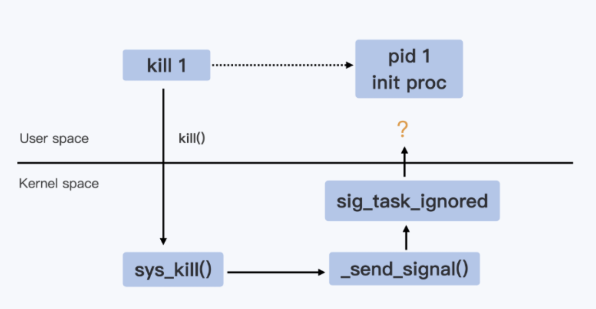
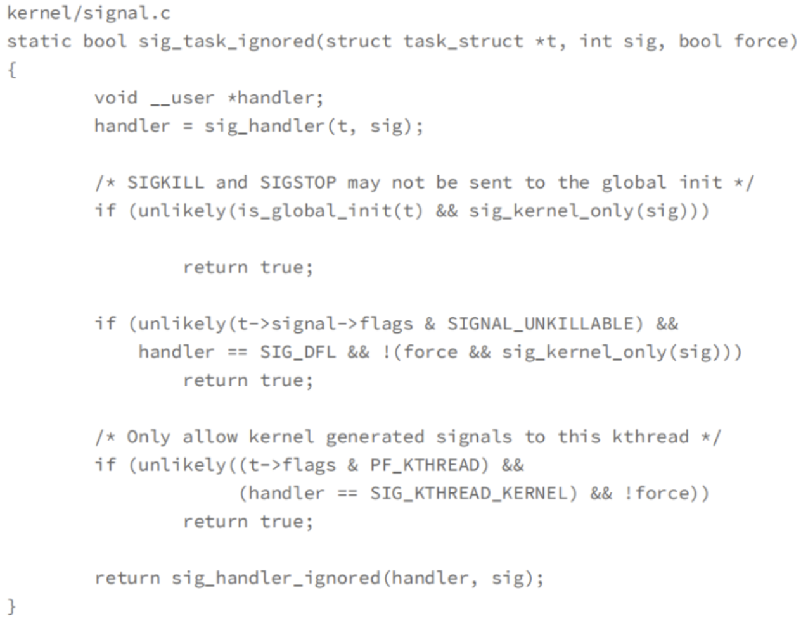
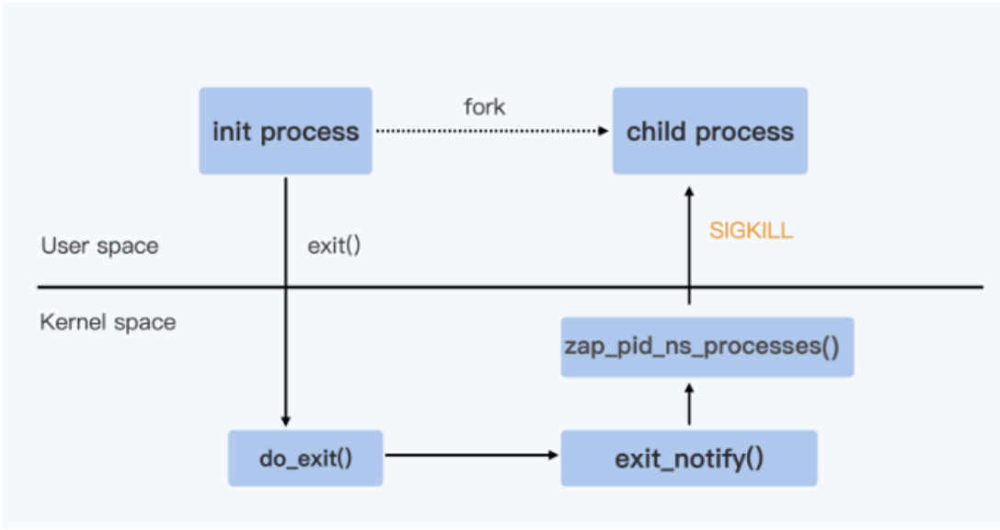

# 进程管理

容器内的进程管理过程和宿主机上的容器管理过程是类似的。先说在宿主机上，操作系统启动后会创建一个 pid 为 0 的进程，他是所有进程的祖先。0 号进程会创建两个进程，一个是 PID 为 1 的进程，负责管理所有的用户态进程；另一个是 PID 为 2 的进程，负责管理所有内核态的进程。

再说容器内，容器内的 1 号进程是容器的启动命令创建的进程，它的父进程是 PID 为 0 的进程。本质上容器内的进程都在宿主机上对应一个进程。

想要查看容器内 PID 为 1 的进程在宿主机上对应进程的 PID，可以使用如下命令。

~~~bash
docker inspect <container> | grep -wi pid
~~~

还可以使用 `docker top <container>`， 查看容器内所有进程在宿主机上对应进程的 PID

~~~bash
[root@me ~]# docker top c1
UID                 PID                 PPID                C                   STIME               TTY                 TIME                CMD
root                6455                6432                0                   20:30               ?                   00:00:00            tail -f /dev/null
root                6658                6432                0                   20:40               ?                   00:00:00            sleep 1000
~~~

需要注意 `docker top` 命令显示的容器中的进程可能不太全。如果是 `nsenter` 产生的进程，`docker top` 命令看不到。

>~~~bash
># 终端1
>docker container run -d --name test centos:7 tail -f /dev/null
>docker top test
> 
># 终端2
>docker exec -ti test sh # 进入容器后启动几个进程，可以在终端1用top命令看到
> 
># 终端3
># 进入后启动的新进程用top看不到，但是exec进入容器是可以看到的
>nsenter -t 容器的pid --mount --uts --ipc --net --pid 
>~~~

那么容器内 1 号进程的父进程（PID 为 0 的进程）在宿主机上的哪个进程呢？其实可以使用 `ps -elf` 查看容器 1 号进程的父进程 PID。其实本质上我们可以从容器创建的过程中分析出来，容器1号进程的父进程在宿主机上就是一个 `containerd-shim` 进程。

容器是通过 `containerd-shim` 去调用 `runc `来启动容器的，`runc `启动完容器后本身会直接退出，`containerd-shim` 则会成为容器进程的父进程，负责收集容器进程的状态，上报给 `containerd`， 并在容器中 pid 为 1 的进程退出后接管容器中的子进程进行清理，确保不会出现僵尸进程。`containerd`，`containerd-shim` 和容器进程（即容器主进程）三个进程之间是有依赖关系的。

容器一号进程的特点：

- 它是容器内的第一个进程，该进程代表了整个容器的生命周期，1号结束容器则结束，0号进程完蛋当然容器也完蛋。
- 容器内的1号进程必须是一个在前台一直运行的进程。

## 两个问题

问题1：容器内的一号进程是用户指定或创建的，大多数情况下，容器内的其他进程都是一号进程的子进程，如果这些子进程先挂掉了，进入僵尸状态，此时容器一号进程是否可以回收这些僵尸进程？

问题2：使用 `docekr stop` 停掉容器，会向容器一号进程发送一个 `SIGTERM` 信号（就是 `kill -15`）。如果容器一号进程没有信号转发的能力，一号进程会向容器名称空间中的所有进程都发送一个 `-9` 强制杀死信号；如果一号进程有信号转发的能力，它会向容器名称空间中的所有进程都转发 `-15` 信号。

类比操作系统的一号进程，容器内的一号进程需要具备两个能力：

- 具有回收子进程的能力。
- 具有信号转发能力。

>补充：僵尸进程
>
>进程进程是每个进程退出前都会经历的一个状态，这是 Linux 操作系统设计的一个特点。在这个设计下，每个进程退出前，都会把自己占用的重型资源（CPU、内存、文件描述符等）释放，但是会保留 PID 号、状态信息可忽略不计的资源。
>
>僵尸状态的进程必须由它的父进程回收然后才能最终退出，但是如果碰到不负责任或者没有回收僵尸进程能力的父进程，那么僵尸进程就无法回收。
>
>碰到这种情况，一般是没有问题的。但是就怕遇到僵尸状态的数量不断积累，这样会不停占用 PID 号，而 宿主机上 PID 号的数量是有限的，如果耗尽，那么就无法再创建新的进程。遇到这种棘手的情况，唯一的解决就是把这些僵尸进程的父进程干掉，由操作系统的一号进程收养僵尸进程，并回收这些僵尸进程。
>
>当然了，也可能是父进程向操作系统发起 `wait/waitpid` 回收僵尸进程的速度慢了，这种情况可以给父进程发信号，通知它加快回收状态为僵尸态的儿子进程。但是还有一点需要注意：父进程发起 `wait/waitpid` 调用只能回收子进程，无法回收子进程的子进程。
>
>僵尸进程无法被 `kill -9 ` 杀死，因为僵尸进程已经是死掉的进程。

## 容器内残留僵尸进程的原因

容器内的一号进程是产生了多个子进程，如果一号进程没有考虑回收僵尸进程，或者没有能力回收僵尸进程，那么容器内的这些一号进程的子进程们一旦过掉，因为不能被一号进程回收，就会一直停留在僵尸状态。久而久之，僵尸状态的进程就会累计增多，白白占用 PID 等资源。

如果此时关掉容器，或者杀死这个容器关联的 `containerd-shim` 进程（它就是容器一号进程的父进程），容器就会挂掉，容器内的所有进程都没有了，当然所有的僵尸进程也会被回收了。但是我们要讨论的是不关闭容器的前提下回收僵尸进程，因为容器运行着业务服务，不能随便被停掉。

####  示例：python创建多进程模拟僵尸进程

~~~bash
# 1、创建工作目录
mkdir /test
cd /test
 
# 2、创建脚本文件run1.sh
cat >> test.py << EOF
#coding:utf-8
from multiprocessing import Process
import os
import time
 
def task1():
    print("儿子,PID:%s PPID:%s" %(os.getpid(),os.getppid()))
    pp1=Process(target=task2)
    pp2=Process(target=task2)
    pp3=Process(target=task2)
    pp1.start()
    pp2.start()
    pp3.start()
    time.sleep(100000)
 
def task2():
    print("孙子,PID:%s PPID:%s" %(os.getpid(),os.getppid()))
    time.sleep(100000)
 
if __name__ == "__main__":
    p=Process(target=task1)
    p.start()
 
    print("爸爸,PID: %s" %os.getpid())
    time.sleep(10000)
 
EOF
 
# 3、创建dockerfile
cat > dockerfile << EOF
FROM centos:7
 
ADD test.py /opt
CMD python /opt/test.py
 
EOF
 
# 4、构建镜像并运行
docker build -t test_defunct:v1 .
docker run -d --name test1 test_defunct:v1
 
# 5 进入容器，使用 ps aux 和 ps -elf 查看进程关系

# 6 使用 kill -9 分别杀死 pid 号为 8 9 10 三个进程，然后 ps -elf
# 发现他们都变成僵尸进程了
~~~

## 容器内出现僵尸进程的解决方案

容器时一个独立的个体，但是容器内的进程毕竟还是要占用宿主机上的资源，如果容器内产生过多进程，都会影响宿主机的正常运行。

因此，不论是容器正常的不断的产生新进程，还是容器内出现 BUG 不断累积僵尸进程，者都是不合理地、无节制地消耗宿主机 PID 资源的行为，要从两个方面来解决。

#### 站在宿主机的角度

从容器外的角度，站在宿主机上，要从根上限制住一个容器可能的 PID 数量。具体操作可以在宿主机上配置 PID CGROUP 来限制每个容器的最大进程数量。

~~~bash
# 宿主机查看 PID 数量，该值可设置，
# linux操作系统支持的最大的pid范围是0-4194304个
cat /proc/sys/kernel/pid_max 
 
 
# 无论容器内是正常创建新进程，还是因为bug而不断累积僵尸进程，
# 我们总归应该对其进行限制，不能让一个容器无法无天地创建进程，
# 此时就用到Cgoup机制，具体是是指pids Cgroup，
# 一般Cgroup文件系统挂载点在/sys/fs/cgroup/pids
 
# 每创建一容器，创建容器的服务就会在宿主机的/sys/fs/cgroup/pids
# 在宿主机执行
[root@test01 pids]# cd /sys/fs/cgroup/pids
[root@test01 pids]# df .
文件系统       1K-块  已用  可用 已用% 挂载点
cgroup             0     0     0     - /sys/fs/cgroup/pids
 
# 如果是docker命令直接启动的容器，
# 则查看，后面跟着的id号
# 使用命令docker container ls |grep test2查看到的，
# 注意必须是存活的容器才可以
[root@test01 pids]# ls docker/67c4f885b2a8e72c7ea7f4b8f7e28f413fdc7a8060881d8fc1a5ff484da801e5/
cgroup.clone_children  cgroup.procs       pids.current  tasks
cgroup.event_control   notify_on_release  pids.max
 
# pids.max 文件中设置容器内可以使用进程的数量，默认是max 表示不限制
# 修改为任意正整数表示允许容器内创建进程的最大数量

# 如果是kubelet调用容器引擎产生的容器，则查看
[root@test01 pids]# ls system.slice/data-docker-overlay2-8a0bb1b29a2e51278f278ac5f1e8aa4206ce817b767c908cedbb9d5cb6f7a8f5-merged.mount/
cgroup.clone_children  cgroup.procs       pids.current  tasks
cgroup.event_control   notify_on_release  pids.max
 
# 可以df | grep 8a0bb1b29a查看到对应的挂载
~~~

#### 站在容器内角度

如果是开发者，需要编写代码，让仅程序的主进程定期发起回收僵尸进程的逻辑。

如果是代码维护者，可以引入一个具备回收僵尸进程能力的进程作为一号进程。此时一般有两个方案：方案一使用 bash 解释器；方案二使用 tini 。

使用 bash 解释器的具体做法是把容器内的一号进程使用 bash 脚本的方式启动，在 bash 脚本内编写业务代码的启动命令。

~~~bash
# shell 脚本
cat >> run.sh << EOF
#!/bin/bash
python /opt/test.py
 
# 添加这一样是为了防止上面那一行进程被干掉后，本进程还有代码在运行着，否则就也结束了
tail -f /dev/null 
EOF

# dockerfile
cat >> dockerfile << EOF
FROM centos:7
 
ADD test.py /opt    
ADD run.sh /opt
CMD sh /opt/run.sh

EOF
~~~

bash 解释器作为容器一号进程可以解决回收僵尸进程的问题，但是无法实现平滑关闭容器内所有进程。具体来说就是，当使用 `docker stop` 停驶容器时，容器一号进程会收到 `SIGTERM` 信号，但是容器一号进程没有转发信号的能力，它向容器内的其他进程发送 `SIGKILL` 强制杀死进程。

linux 中 `SIGTERM`  比较特殊，它允许被程序捕获，并再程序推出前自定义执行一些回收资源的操作，实现程序平滑关闭的功能。当然程序捕获到这个信号后也可以对其视而不见，不做任何处理。

## 使用 tini 作为容器一号进程

tini 是一个开源项目，一个替代庞大复杂的 systemd 体系的解决方案，是一个最小化 init 系统，专门适用于充当容器内的1号进程，容器内所有其他进程都受其管理。tini项目地址：https://github.com/krallin/tini。

tini 命令集成了类似操作系统init的功能，所以，tini 不仅具备定期发起系统调用回收僵尸儿子的能力，还具备信号转发的能力，比如你向 tini 发送信号，那么它也会向它自己的子进程发送同样的信号，这在平滑关闭保证资源正常回收的操作非常有用。 

在 tini 里会不断在调用带 WNOHANG 参数的 waitpid()，通过这个方式清理它的僵尸儿子，注意了，只能是子进程。

>Linux 还提供了一个类似的系统调用waitpid()，这个调用的参数更多。其中就有一个参数 WNOHANG，它的含义就是，如果在调用的时候没有僵尸进程，那么函数就马上返回了，而不会像 wait() 调用那样一直等待在那里。

#### 使用 tini 的两大原因

- 可以收养孤儿进程，并具备回收僵尸子进程的能力。
- 具备信号转发功能。

#### tint 进程的特点

- 作为容器一号进程，并创建用户自定义的业务进程。
- 默认将信号传递给子进程，也支持更多传递方式。
- 监听子进程，并回收僵尸状态的子进程。
- 跟随最初创建的业务进程的退出而退出。

>tini 的确没有注册 `SIGTERM`，它的退出并不是因为 `SIGTERM` 的信号让它退出的，而是它发现它子进程都退出之后，随即主动退出的，这样容器也退出了。

#### 启用 tini 的两种方式

方式1：docker run --init

Docker1.13 中继承了 tini，并包含再 Docker CE 的所有版本。使用 docker 命令运行容器，可以在 run 时只当参数 `--init` 来启用 tini，不需要在镜像中安装 tini，会自动注入 tini 到容器中，然后业务程序作为 tini 进程的子进程。

~~~bash
docker run -d --init --name test1 t1:v1
~~~

方式2：k8s 中使用 tini 需要安装 tini

~~~bash
# 需要先下载好一个tini命令，
# 然后编写dockerfile文件如下，制作成一个容器

FROM centos:7
 
ENV TINI_VERSION v0.19.0
 
# 1、从网上下载tini，
# 官网地址https://github.com/krallin/tini/releases/
# ADD https://github.com/krallin/tini/releases/download/${TINI_VERSION}/tini /tini
 
# 2、基本本地下载好的tini命令
ADD tini /tini
 
RUN chmod +x /tini
 
ADD test.py /opt    
 
ENTRYPOINT ["/tini","--"]
 
# Run your program under Tini
# CMD ["/your/program", "-and", "-its", "arguments"]
 
# ===============然后启动时，就不需要指定--init参数了===============
docker run -d --name test1 t1:v1 
~~~

#### 使用 tini 需要注意

- tini 并不能回收所有的僵尸进程，它只监听并回收它的直接子进程。如果它的孙进程变成了僵尸，而僵尸进程的父进程不回收它。此时 tini 也无法回收这个僵尸进程。
- tini 监管的业务子进程如果挂掉了，tini 的生命周期也就结束了，整个容器就停止了。
- tini 转发信号时，默认只把信号转发给它的子进程，无法转发到孙进程。如果想要转发到所有进程，需要在 dockerfile 内添加环境变量。

~~~dockerfile
ENV TINI_KILL_PROCESS_GROUP 1
~~~

 

## 使用 strace 命令监听进程收到的信号

安装工具

~~~bash
yum install -y strace
~~~

使用 strace

~~~bash
strace -p <pid号>
~~~

## 进程收到信号的三种反应

一个进程收到信号可能有三种反应：忽略、捕获、默认行为。

- 忽略。就是到带信号不做任何处理。
- 捕获。指的就是用户进程自己注册针对这种信号的处理逻辑。
- 默认行为。Linux 操作系统为每个信号都定义了默认的行为。对大多数信号来说，都不需要捕获注册自己的处理逻辑，使用默认的就好。

注意：常规编程语言都需要手动处理信号。但是 golang 语言特殊，它在编译可执行程序时默认为很多信号注册了 handler.

#### 演示1：shell 程序注册信号

~~~bash
#!/bin/bash
# 操作1：捕捉信号、执行引号内的操作
trap "echo 已经识别信号TERM" TERM
 
trap "echo 已经识别中断信号:ctrl+c" INT
 
# 示例2：捕捉信号、不执行任何操作
# trap "" INT  
 
# 示例3：也可以同时捕获多个信号
# trap "" HUP INT QUIT TSTP
 
while true;
do
  sleep 0.5
done
~~~

#### 演示2：python 程序注册信号

~~~python
#coding:utf-8
import signal
import time
 
def handler(signal_num,obj):
    print("资源清理操作...")
    print(signal_num)
    print(obj)
    exit()  # 清理完资源后不要忘记关闭
 
def task():
    print("程序运行中...")
    time.sleep(10000000000)
 

if __name__ == "__main__":
    signal.signal(signal.SIGTERM,handler)
    task()    
~~~

## 两个特权信号

所谓特权指的是无法被忽略、无法被捕获，只能执行该信号的默认行为。

这俩信号分别是：

- `SIGKILL` （-9）强制杀死
- `SIGSTOP` （-19）强制暂停进程，重新开始进程发送 `-18`

## kill 命令的执行流程

命令 `kill` 执行时就是一个进程，它想要给另一个进程发送信号，中间要经过内核转发。具体转发流程如下：

kill 命令向内核发送信号，调用系统接口 `kill()`，然后进入到内核函数 `sys_kill()`。内核态流程：

~~~bash
sys_kill() ---> send_signal() ---> sig_task_ignored()
~~~

这个过程中，把信号发给目标进程前需要经历最后一个关卡（`sig_task_ignored`），被它放行的信号给回通知到用户态指定的进程。这个函数内部有三个判断依据，任何一个成立都会返回 true，表示忽略当前信号不转发给目标进程。

如下是这个函数的代码，在此我们只关心第二个判断条件。

第二个判断有细分为三个子条件，三个子条件都成立才返回 TRUE。

- 第一个子条件表示进程必须是 `SIGNAL_UNKILLABLE`。在每个 Namespace 的1号进程创建时，都会被打上 `SIGNAL_UNKILLABLE` 这个标签，也就是说只要是1号进程都会有该 flag，此条件针对1号进程一定满足。
- 第二个子条件是判断信号的注册逻辑是否为默认行为。如果用户进程没有为其注册handler，那么针对该信号有一个默认的 handler，这个默认的 handler 就叫 `SIG_DFL`。总结一句话就是：没有注册 handler该条件就成立。
- 第三个子条件表示发送信号的进程和接受信号的进程是否在同一个名称空间。

>补充1：针对特权信号SIGKILL（-9）与SIGSTOP（-19）你是无法注册handler的，所以这俩信号的handler一定是SIG_DFL。但是，针对SIGTERM（-15）信号，你还是可以注册handler的，那它就不是SIG_DFL；，当然如果你没有注册handler，则默认还是SIG_DFL。
>
>补充2：golang 语言特殊，它在编译可执行程序时默认为很多信号注册了 handler，其中包括 `-15` 信号，所以它里面很多信号的 handler 都不是 SIG_DFL。

## 容器内特殊信号对进程的影响

在容器中使用 `kill` 命令给容器一号进程发送 `-9`  信号是无效的，即是无法杀死一号进程。

在容器中使用 `kill` 命令给容器一号进程发送 `-19`  信号也是无效的。

在容器中使用 `kill` 命令给容器一号进程发送 `-15`  信号可能是有效的。
- 如果没有给容器一号进程注册 `-15` 信号的处理逻辑，那么一号进程收不到信号，也不会响应信号。
- 如果给容器一号进程注册了 `-15` 信号了处理逻辑，一号进程可以收到信号，如何响应具体看注册逻辑。

## 总结

在容器平台上，无论是 k8s 删除一个 pod，还是用 docker 关闭一个容器，都会用到 `containerd` 这个服务。

每创建一个容器，`containerd` 服务都会创建一个 `containerd-shim` 进程，这个进程是容器内的0号进程。`containerd-shim` 进程具有会后僵尸进程的功能，并且它还是容器内回收僵尸进程的最后兜底的进程。如果容器一号进程退出了，内核清理其下的子孙进程，这些待清理的孤儿进程都被 `containerd-shim` 进程收养并回收。

如果容器一号进程没有退出，它的子孙进程出现了僵尸进程，此时必须有一号进程回收僵尸进程，`containerd-shim` 进程无法帮忙回收僵尸进程，这就需要容器的开发者注意回收退出进程。

另一方面，`containerd` 停止容器时，会向容器一号进程发送一个 `-15` 信号，一号进程如果捕获了这个信号并退出，其下 PID对应的名称空间便会被销毁，如果一号进程没有信号转发的能力，那么内核就会向该名称空间内的其他进程发送 `-9` 信号。

具体来说就是，当容器一个进程退出时，会调用系统 exit()，然后进入内核的 `do_exit()` 功能，该函数内会释放进程的相关资源，然后接着调用 `exit_notify()` 来通知和这个进程相关的父子进程。

对容器来说，还要考虑 pid 名称空间内的其他基础南横，于是就会调用 `zap_pid_ns_processes()` 函数，这个函数中会判断，如何时处于退出状态的一号进程，就会向名称空间内的其他进程搜发送 `SIGKILL` 信号。

于是我们就明白了为啥一号进程收到 `TERM` 信号，而容器内的其他进程收到的是 `KILL` 信号。

想要保证容器能够优雅关闭。需要做两件事情：

- 让容器内的一号进程拥有信号转发能力，停驶容器时给容器一号进程发送 `-15` 信号，然后给容器内的其他进程都转发 `-15` 信号。
- 为容器内设计资源暂用的进程都提前注册关于 `-15` 信号的 handler，并在 handler 中编写号资源回收的代码。

使用 tini 作为容器的一号进程，其实就相当于给容器定制了一个类似宿主机操作系统的一号进程。它很完善，不仅可以定期回收僵尸子进程，还可以转发信号，保证容器内进程在执行  `docker stop` 容器时保证容器内进程收到的是 `-15` 信号，方便实现 graceful shutdown.

