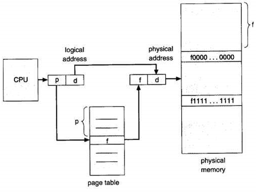
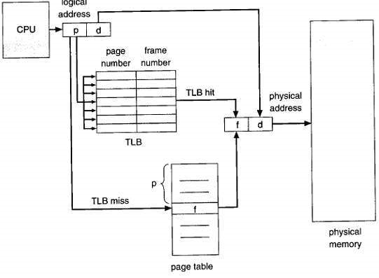

# VSZ 与 RSS

Linux 系统的内存都是超配的，应用程序申请的内存都是虚拟内存（VSZ），实际使用时才会把数据写到真实的物理内存（RSS）。操作系统给程序的只是一个地址范围，该范围映射到对应的物理内存上。所以程序申请的内存可以超过物理内存，比如物理内存只有 1G，使用 malloc 可以申请到 2G 内存。


# MMU

为了提高内存的使用效率，现代计算机引入了 MMU（memory management unit），它的核心思想是利用虚拟地址替代物理地址，即 CPU 寻址时使用虚址，由 MMU 负责将虚址映射为物理地址。MMU 的引入，解决了对物理内存的限制，对程序来说，就像自己在使用 4G 内存一样。

内存分页是在使用 MMU 的基础上，提出的一种内存管理机制。它将虚拟地址和物理地址按固定大小（4K）分割成页和页帧，并保证页与页帧的大小相同。

这种机制，从数据结构上，保证了访问内存的高效，并使 OS 能支持非连续性的内存分配。在程序内存不够用时，还可以将不常用的物理内存页转移到其他存储设备上，比如磁盘，这就是大家耳熟能详的虚拟内存（swap）。

上面提到，虚拟地址与物理地址需要通过映射，才能使 CPU 正常工作。而映射就需要存储映射表。在现代 CPU 架构中，映射关系通常被存储在物理内存上一个被称之为页表（page table）的地方。




# 页表寄存器缓冲 TLB

也表是存储在内存中的，CPU 通过总线访问内存，速度肯定慢于直接访问寄存器。为了进一步优化性能，现代 CPU 架构引入了 TLB，用来缓存一部分经常使用的页表内容。



# 大内存分页

TLB 是有限的，这点毫无疑问。当超出 TLB 的存储极限时，就会发生 TLB miss，之后，OS 就会命令 CPU 去访问内存上的页表。如果频繁出现 TLB miss，程序的性能会下降得很快。为了让 TLB 可以存储更多的页地址映射关系，我们的做法是调大内存分页大小。

如果一个页 4M，对比一个页 4K，前者可以让 TLB 多存储 1000 个页地址映射关系，性能的提升是比较可观的。

#### 调整 OS 内存分页

在 Linux 和 Windows 下要启用大内存页，有一些限制和设置步骤。

Linux上 的限制：需要 2.6 内核以上或 2.4 内核已打大内存页补丁。确认是否支持，请在终端敲如下命令：

```bash
cat /proc/meminfo | grep Huge
AnonHugePages:     20480 kB
HugePages_Total:       0
HugePages_Free:        0
HugePages_Rsvd:        0
HugePages_Surp:        0
Hugepagesize:       2048 kB
```

如果有 HugePage 字样的输出内容，说明你的 OS 是支持大内存分页的。`Hugepagesize` 就是默认的大内存页 size。