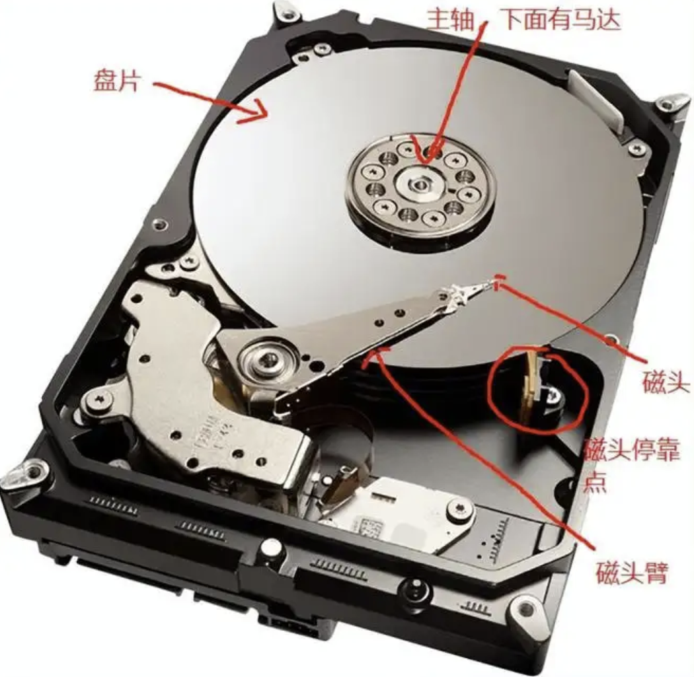
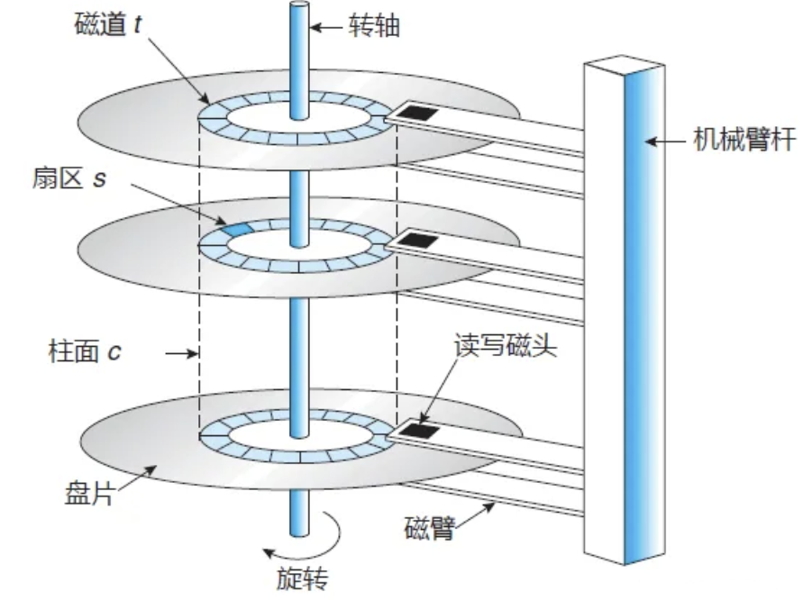
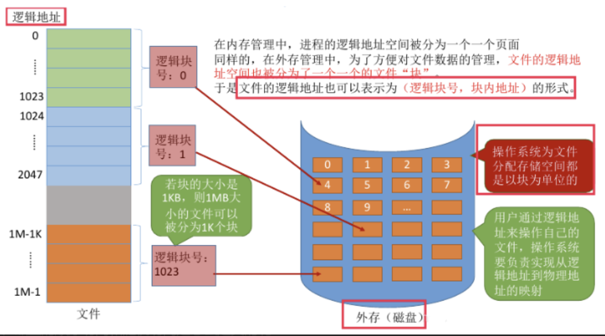
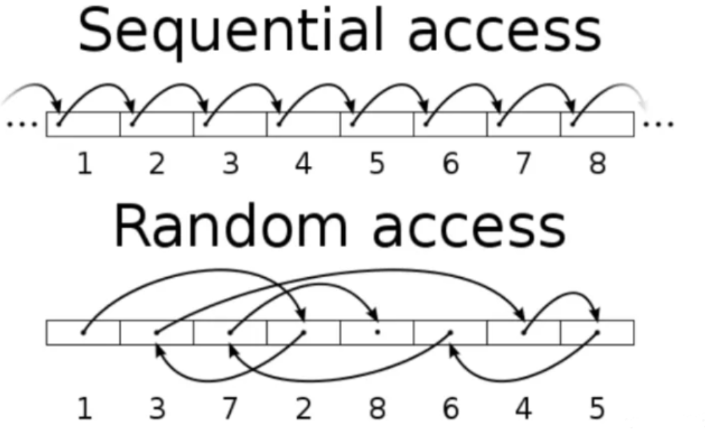

# 读写基础概念

## 机械磁盘的结构

机械磁盘的结构分物理结构和逻辑结构。

物理结构中主要有盘片和磁头。盘片负责存储数据。磁头负责读取数据。读数据依靠两部分运动：1. 主轴马达带动盘片转动；2. 机械手臂控制磁头来回移动。

逻辑结构中主要有：磁道、扇区和柱面。

## 机械磁盘做一次 IO 操作耗时

磁盘发生一个完整的 IO 操作存在如下流程：

1. 控制器对磁盘发出一个 IO 操作命令；
2. 磁盘的驱动臂（Actuator Arm）带读写磁头（Head）离开着陆区（Landing Zone，位于内圈没有数据的区域），移动到要操作的初始数据块所在的磁道（Track）的正上方。这个过程被称为寻址（Seeking），对应消耗的时间被称为寻址时间（Seek Time）;
3. 找到对应磁道，磁头要等到磁盘盘片（Platter）旋转到初始数据块所在的扇区（Sector）落在读写磁头正上方的之后开始读取数据。在这个等待盘片旋转到可操作扇区的过程中消耗的时间称为旋转延时（Rotational Delay）;
4. 接下来就随着盘片的旋转，磁头不断的读/写相应的数据块，直到完成这次 IO 所需要操作的全部数据，这个过程称为数据传送（Data Transfer），对应的时间称为传送时间（Transfer Time）。

总结，一次磁盘 IO 耗时由三部分组成，分别是平均寻道时间、平均延迟时间、传输时间。其中平均寻道时间大概是转半圈的耗时；传输时间几乎可以忽略不记。

所以，机械磁盘做一次I/O操作需要耗费的时间 = 平均延迟时间 + 平均寻道时间。

>常见磁盘一次 IO 的耗时
>
>~~~bash
># 1. 常见磁盘平均物理寻道时间为：
>7200转/分的STAT硬盘平均物理寻道时间是9ms
>10000转/分的STAT硬盘平均物理寻道时间是6ms
>15000转/分的SAS硬盘平均物理寻道时间是4ms
>
># 2. 常见硬盘的旋转延迟时间为：
>7200 rpm的磁盘平均旋转延迟大约为转半圈耗费的时间(1/7200/60s) / 2 = 4.17ms
>10000 rpm的磁盘平均旋转延迟大约为转半圈耗费的时间(1/10000/60s) / 2 = 3ms，
>15000 rpm的磁盘其平均旋转延迟约为转半圈耗费的时间(1/15000/60s) / 2 = 2ms。
>
># 3. 机械磁盘一次 IO 的耗时：
>7200 rpm的磁盘 = 9 + 4 = 13ms
>10000 rpm的磁盘 = 6 + 3 = 9ms
>15000 rpm的磁盘 = 4 + 2 = 6ms
>~~~

## 衡量硬盘性能的两个常见的指标

#### IOPS

IOPS：英文全称 Input/Output Operations Per Second ，翻译过来就是每秒钟磁盘读或写的次数，即一秒内，磁盘完成多少次读/写操作。这个数值越大，表示性能越好。

#### BPS

BPS：是指每秒钟磁盘的 I/O 流量，即一秒内，磁盘写入和读出的数据总量。，一般以 MB/s 为单位。这个 BPS 有时候也被称为吞吐量（Throughput），或者带宽（Bandwidth，简称 BW）。

BPS 与 IOPS 的关系，大概的关系 BPS = IOPS * 数据块的大小

#### IOPS 的理论计算方法

~~~bash
# 公式：IOPS = 1000 ms/ (寻道时间 + 旋转延迟)

7200 rpm的磁盘IOPS = 1000 / (9 + 4.17) = 76 IOPS
10000 rpm的磁盘IOPS = 1000 / (6+ 3) = 111 IOPS
15000 rpm的磁盘IOPS = 1000 / (4 + 2) = 166 IOPS
~~~

#### 实际计算方法

理论值终究和实际值有区别，一般结合专门的测试工具（如 fio），参考实际的读写量和完成时间进行计算。

比如：完成 10000  个1KB 的 I/O 请求，用时 10 秒。 

- 即 1 秒内完成了 1000 个读/写， IOPS = 1000。
- 在 10 秒内完成了总共 10000 * 1KB 大小的数据量，BPS = 1MB/s

比如：完成 1 个 10MB 的 I/O 请求，用时 0.2 秒。

- IOPS = 5
- BPS = 50MB/s

## IO 操作的基本单位

对于磁盘来说，最小的读写单位是一个扇区，一个扇区默认 512 Bytes，

使用命令 `fdisk -l` 查看磁盘读写信息。

~~~bash
[root@me ~]# fdisk -l

Disk /dev/vda: 42.9 GB, 42949672960 bytes, 83886080 sectors
Units = sectors of 1 * 512 = 512 bytes
Sector size (logical/physical): 512 bytes / 512 bytes
I/O size (minimum/optimal): 512 bytes / 512 bytes
Disk label type: dos
Disk identifier: 0x000edc45

   Device Boot      Start         End      Blocks   Id  System
/dev/vda1   *        2048    83886046    41941999+  83  Linux
~~~

对于操作系统，最小的读写单位是一个 block 块，一个 block 块默认是 8 个扇区。

使用命令 `stat` 查看。

~~~bash
[root@me ~]# stat /
  File: ‘/’
  Size: 4096      	Blocks: 8          IO Block: 4096   directory
Device: fd01h/64769d	Inode: 2           Links: 22
Access: (0555/dr-xr-xr-x)  Uid: (    0/    root)   Gid: (    0/    root)
Access: 2025-10-30 21:57:07.133692933 +0800
Modify: 2025-10-25 21:35:03.914442382 +0800
Change: 2025-10-25 21:35:03.914442382 +0800
 Birth: -
~~~

## LBA 和 PBA

PBA（physical block address 物理块地址），物理地址是数据在磁盘上的实际地址。

LBA（logical block address 逻辑块地址），逻辑地址是程序中使用的块地址，编号顺序递增，一般逻辑和物理地址会有一个对应关系（例如：对于硬盘来说LBA与PBA就是一一对应的）。

文件的逻辑块与物理款的组织方式有：连续分配、链接分配、索引分配。

## 顺序访问和随机访问

#### 顺序访问

一次 IO 操作，访问的逻辑块地址是连续的，这就叫顺序访问。

注意：顺序访问的前提，当初组织文件时，事先在硬盘上申请一块连续的空间，存放数据时就依次存放。

#### 随机访问

一次 IO 操作，每访问一个块都需要经历一次平均延迟和平均寻道时间，这就叫随机访问。

#### 总结

- 顺序访问只在访问第一个块时经历平均延迟+平均寻道时间，后续的块因为是紧挨着的，所以直接连续读出来就行。
- 而随机访问几乎每次都需要重新经历一遍平均延迟+平均寻道时间，所以 IO 速度相对较慢。

## 机械盘和固态盘

## 随机读写和顺序读写

## 文件分配方式

文件的逻辑块与物理款的组织方式有：连续分配、链接分配、索引分配。

