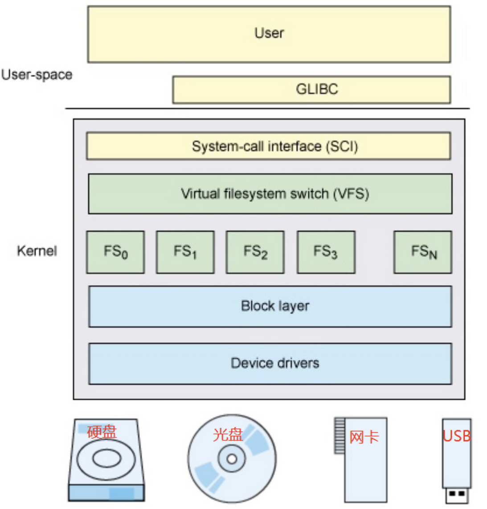
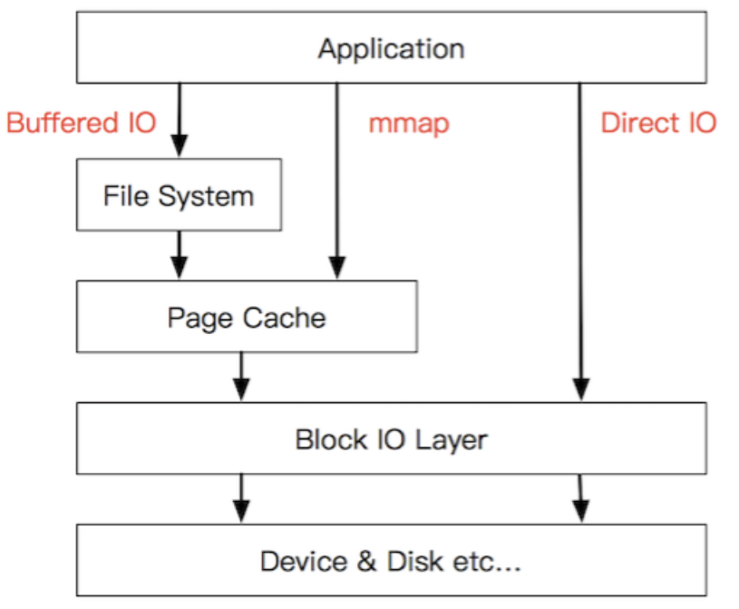

# 文件读写

容器里面的进程需要读写数据，如何给容器分配资源？本质上容器也是宿主机上的一个进程，进程读写文件需要占用资源，资源不足可能导致读写效率波动。

## 虚拟文件系统 VFS

虚拟文件系统（VFS，vitural filesystem switch），也称虚拟文件系统或虚拟文件系统转换，是一个内核软件，是在具体的文件系统之上抽象的一层，用来处理与文件系统相关的所有调用，目的是给各种文件系统提供统一的接口，使上层应用程序能够使用通用接口访问不同文件系统。

#### 用户写入文件的大致流程

用户写入一个文件，使用 POSIX 标准的 write 接口，会被操作系统接管，转调 sys_write 这个系统调用（属于SCI层）。然后 VFS 层接受到这个调用，通过自身抽象的模型，转换为对给定文件系统 filesystem、给定设备的操作，这一关键性的步骤是 VFS 的核心，需要有统一的模型，使得对任意支持的文件系统都能实现系统的功能。

VFS 这一层建模和抽象是有必要的，如果放在 SCI 层会导致操作系统的系统调用的功能过于复杂，易出 bug。那么就只能让底层文件系统都遵循统一实现，这对于已经出现的各种存储设备来说天然就有不同的特性，也是无法实现的。因此 VFS 这样一层抽象是有其必要性的。

## Bufferd IO 和 Direct IO

文件读写分为同步和异步，两种者的区别是读写数据是否使用 page cache。

- Bufferd IO 称为缓存 IO、标准 IO、异步 IO，这是大多数文件系统的默认 IO 操作，读写数据使用 page cache。
- Direct IO 称为同步 IO，数据直接写到硬盘，中间不经过 page cache。

#### Bufferd IO

在 Linux 的缓存 I/O 机制中，Bufferd IO  的方式是通过两个系统调用实现的：read()和write()。

- 调用 read() 时，如果操作系统内核地址空间的页缓存（page cache）有数据就读取出该数据并直接返回给应用程序；如果没有从磁盘读取数据到页缓存，然后再从页缓存拷贝到应用程序的地址空间。
- 调用 write() 时：数据会先从应用程序的地址空间拷贝到操作系统内核地址空间的页缓存，然后再写入磁盘。根据 Linux 的延迟写机制，当数据写到操作系统内核地址空间的页缓存就意味着 write() 完成了，操作系统会定期地将页缓存的数据刷到磁盘上。

缓存 I/O 优点：

- 缓存 I/O 使用了操作系统内核的页缓存，保护了磁盘。
- 缓存 I/O 减少读盘的次数，提高了读取速度。

总的来说，Buffer I/O 为了提高读写效率和保护磁盘而使用了页缓存机制。不过由于页缓存处于内核空间，不能被应用程序（用户进程）直接寻址，所以还需要将页缓存数据再拷贝到内存对应的用户空间中。这样，需要两次数据拷贝才能完成用户进程对数据的读取操作。写操作也是一样，将页缓存的数据写入磁盘的时候，必须先拷贝到内核空间对应的主存，然后在写入磁盘中。

因此，Buffer I/O 中引入一类特别的操作叫做内存映射文件（mmap），它的不同点在于，中间会减少一层数据从用户地址空间到操作系统地址空间的复制开销。使用 mmap 函数的时候，会在当前进程的用户地址空间中开辟一块内存，这块内存与系统的文件进行映射。对其的读取和写入，会转化为对相应文件的操作。并且，在进程退出的时候，会将脏页自动回写到对应的文件里面。

#### Direct IO

凡是通过直接 I/O 方式进行数据传输，数据均直接在用户地址空间的缓冲区和磁盘之间直接进行传输，中间少了页缓存 page Cache 的支持。

虽然说操作系统层提供的 page Cache 缓存往往会使应用程序在读写数据的时候获得更好的性能，但是对于某些特殊的应用程序，比如说数据库管理系统这类应用，他们更倾向于选择他们自己的缓存机制，因为数据库管理系统往往比操作系统更了解数据库中存放的数据，数据库管理系统可以提供一种更加有效的缓存机制来提高数据库中数据的存取性能。

## 脏数据

针对 Bufferd I/O，写数据是先写入 page cache，还没来得及写入磁盘，这部分数据称之为脏数据，即 dirty pages。

脏数据合适刷盘？

- 在 linux 内核中会有专门的内核线程（每个磁盘设备对应的 kworker/flush 线程）会定期负责把脏数据落到磁盘中。

因为 buffered IO 的读写效率更高，所以大多数场景使用的都是该模式。关于读取和写需要考虑的内容还是有区别的。读缓存在绝大多数情况下是有益无害的，程序可以直接从RAM中读取数据。写缓存比较复杂。

写数据的注意点：

- Linux 内核将磁盘写入缓存，过段时间再异步将它们刷新到磁盘。这对加速磁盘 I/O 有很好的效果，但是当数据未写入磁盘时，丢失数据的可能性会增加。
- 也存在缓存被写满的情况。
- 还可能出现一次性磁盘写入过多数据，以致使系统卡顿。这些卡顿是因为系统认为，缓存太大用异步的方式来不及把它们都写进磁盘，于是切换到同步的方式写入。

## 写缓存优化的内核参数

针对写缓存的这些问题，可以调节几个重要的内存参数。这些参数的设置路径都是：`/proc/sys/vm/dirty_*`。

~~~bash
[root@me ~]# sysctl -a | grep dirty
vm.dirty_background_bytes = 0
vm.dirty_background_ratio = 10
vm.dirty_bytes = 0
vm.dirty_expire_centisecs = 3000
vm.dirty_ratio = 30
vm.dirty_writeback_centisecs = 500
~~~

**核心参数：**

- `vm.dirty_background_ratio`：设置内存中可容纳脏数据的百分比上限。当脏数据超过此比例时，后台进程（如pdflush）会开始将其写入磁盘。例如，内存 32G，值设为10，表示允许 3.2G 脏数据存在，超出则会触发清理。
- `vm.dirty_ratio`：系统内存中脏数据的绝对最大容量限制。达到此限制时，所有新的I/O 操作将被阻塞，直至脏数据写入磁盘。此机制可能导致 I/O 延迟，但能防止内存中脏数据过多。
- `vm.dirty_background_bytes` 和 `vm.dirty_bytes`：上述参数的字节数版本。若设置这些参数，对应的比例版本会自动失效。

**辅助控制参数：**

- `vm.dirty_writeback_centisecs`：控制后台进程唤醒检查脏数据的频率（单位：百分之一秒）。默认 5 秒。
- `vm.dirty_expire_centisecs`：定义脏数据在内存中的最大存活时间（单位：百分之一秒）。超过此时长的数据会被后台进程异步写入磁盘，以降低数据丢失风险。默认 30 秒。

#### 脏数据占用比例

脏数据占用比例 = 脏页内存 / 节点可用内存 * 100%

其中，
- 可用内存就是 free 命令显示的 avaliable 的数值。
- 查看脏页内存，下面命令结果中的 `nr_dirty` 值表示一共有 22 个页脏数据。脏数据大小约等于：**22 pages × 4 KB/page = 88 KB**

~~~bash
[root@me ~]# cat /proc/vmstat | egrep "dirty|writeback"
nr_dirty 22
nr_writeback 0
nr_writeback_temp 0
nr_dirty_threshold 101667
nr_dirty_background_threshold 33889
~~~

脏页统计结果

| 指标                            | 值     | 说明                                                       |
| :------------------------------ | :----- | :--------------------------------------------------------- |
| **`nr_dirty`**                  | **22** | **当前系统内存中的脏页数量为22个。**                       |
| `nr_writeback`                  | 0      | 当前正在回写到磁盘的页数为0。                              |
| `nr_writeback_temp`             | 0      | 临时回写页数为0（通常与某些特定内核功能相关）。            |
| `nr_dirty_threshold`            | 101667 | 系统全局脏页数量阈值（对应 `vm.dirty_ratio`）。            |
| `nr_dirty_background_threshold` | 33889  | 系统后台脏页数量阈值（对应 `vm.dirty_background_ratio`）。 |

## 解决写缓存问题的方式

如果磁盘性能好速度快。为了减少数据保存在缓存中丢失的概率。应该较少内存，加快落盘。

如果磁盘性能差，数据不是很重要（有备份数据等）。应该增加内存，提高读写性能。

如果为了应对瞬时高峰数据。需要把 `dirty_background_ratio` 调小，`dirty_ratio` 调大。目的是让平时内存数据少，把内存空间用来缓存高峰期的数据压力。

## 问题：容器写文件的延时为什么波动很大？

可能原因是：`dirty_background_ratio` 设置的很高，宿主机之前那就缓存了很多脏数据，再加上突然的写操作，导致缓存量很快达到了 `dirty_ratio`，触发 buffer io 阻塞，从而降低了写效率。

还有一种可能是容器 memory cgroup 的 `memory.limit_in_bytes` 设置的很小，导致容器可用内存不足（设置值时没有考虑到读写操作），容器可能在频繁的释放 page cache 和重新申请内存，这些操作会带来额外的系统开销，导致容器写文件的延时波动很大。

解决思路：

1. 对于容器的内存 cgroup 限制，不仅要考虑进程使用的内存量，也要考虑进程的 I/O 量，需要给大点内存，以便预留充足的内存作为 Buffered IO 的 page cache。
2. 文件写入方式改为直接 I/O，不用 page cache，这样看起来速度会慢，但是综合内存不足导致来回释放 page cache 的开销，应该还是会提升一下效率的。

