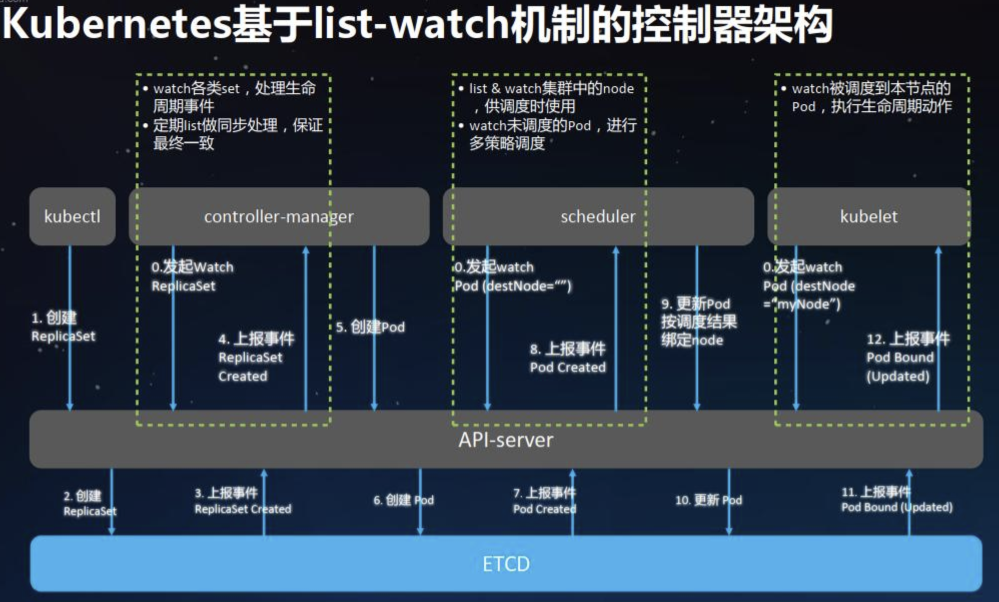

# k8s是什么

k8s，全称Kubernetes，是一个跨宿主机管理容器的系统。


## 为何要用 k8s

因为单独使用 docker 创建容器，裸跑容器存在容器管理问题。

docker 只是一个容器引擎，负责基于容器的三大核心技术（名称空间、cgroup、联合文件系统）来创建容器，但创建出容器之后的管理工作，docke 引擎做的并不完善。比如：

- 监控容器的存活状态，挂掉了自动重启
- 集群化模式下，把容器调度到最合适的节点上
- 容器的跨宿主机网络通信等。
- 容器自动化管理，故障监控与自愈，自动化部署等


k8s 就是为了解决上述的容器管理问题而生的。


## 云原生

云原生总结一句话：软件从诞生之初就是专门为了运行在云平台上。

云原生涉及到的技术：

- 微服务
- Devops
- CICD
- 容器


​		

## 何时要用 k8s

	1、什么时候使用 Kubernetes
	
	- 你们公司的应用是微服务架构的，或者应用数量较多运维成本大的时候也可以用
	- 开发者需要快速部署自己的新功能到测试环境进行验证
	- 降低硬件资源成本，提高资源使用率
	- 容器自动化管理，故障监控与自愈，自动化部署等
	
	2、什么时候不适合使用 Kubernetes
	
	- 应用是轻量级的单体应用，没有高并发的需求
	- 团队不适应变革


## k8s 架构

k8s 是一个主从架构。

master 节点负责集群的调度、整套k8s集群的维护工作，是 k8s 集群的总控中心。高可用集群建议部署至少 3 台 master。

master 节点通过与 Slave 节点不间断通信来维持整个集群的健康状态，集群中各个资源的状态信息存放于 etcd 中。若 master 节点不可用，则我们便无法管理 k8s 集群中的各种资源。

Master 上部署的组件有 apiserver、scheduler、controller-manager 等管理组件，此外通常还需要部署 etcd


slave节点 也称 从节点、worker节点、node节点。

从节点上的 kubelet 组件会把本节点的资源信息、pod 的状态等信息汇报给 master 的 apiserver 组件，然后存入 etcd 中。

kubelet 组件会调用容器引擎来创建容器。

Slave 节点上部署有 kubelet、kube-proxy、容器引擎等工作组件。


​		

## 核心概念与组件

组件：实际存在的软件。
资源：组件创建出的逻辑单位，例如 namespace、pod、deployment、configmap、statefulset 等。


#### namespace 名称空间

名称空间是一门技术，这门技术可以用在不同的地方。

容器中用名称空间技术来隔离：pid、ipc、uts、mount、network、user

k8s 中用名称空间技术来把一系列资源隔离到一起（例如pod、deployment、configmap、statefulset）

k8s 引入名称空间技术的好处：

- 当很多人共用一套 k8s 集群时，可以用 namespace 将彼此使用的资源隔离开，互不干扰。
- 一组资源被组织到一个 namespace 后，更方便 k8s 进行统一性的管理配置，例如资源配额、访问控制等。

```bash
# Resource Quota 限定一个名称空间总共能用多少资源
# Limit range 现在当前名称空间内，每个pod或者容器的最大资源使用量
```

​				

#### pod

pod 是一种把相关的容器组织到一起的方式/单位，pod 内可以组织一个或多个容器（准确的说一个pod内至少两个容器）

pod 是 k8s 的最小工作/调度单位。

为何要引入POD这种概念来组织一下容器，直接管理容器不好吗？

- 引入 pod，可以封装，屏蔽底层容器的差异化。
- POD 内的多个容器共享网络名称空间、共享挂载卷。比如业务应用由多个容器构成，并且想要实现本地通信，也可能有共享存储的需求。

pod 的两大特性：

- pod 内的多个容器共享网络（网络来自于pause容器）
- pod 内的多个容器共享该pod的存储卷


​	

## 组件

#### node节点上组件之 kubelet

kubelet 的作用：

- 把本节点的资源信息、pod 状态上报给 master 节点的 apiserver 然后存入 etcd 中。
- 接收来自 master 的创建 pod 的请求，然后调用容器引擎以及网络插件把 pod 创建完成。
- kubelet 的 GC 机制会负责定期清理工作节点上的镜像以及退出的容器。

kubelet对接容器引擎：

- 在k8s1.24 版之前，可以非常方便的对接 docker 容器引擎

~~~bash
kubelet –> docker shim （在 kubelet 进程中） –> dockerd –> containerd
~~~

- 在 k8s1.24 版之后，默认对接的是 containerd 容器引擎

```bash
kubelet –> cri plugin（在 containerd 进程中） –> containerd
```


对接container的优点：

- 调用路径更短，效率更高。
- k8s 的 kubelet 版本更新迭代更便捷，直接对接 cri-containerd 即可。


#### node节点上组件之 kube-proxy

kube-proxy 不负责 pod 的网络构建，负责的是 pod 的负载均衡（智能负载均衡、4层），网络是由网络插件实现的。

kube-proxy 组件创建 service 资源，具体使用的就是 service。service 状态由 kube-proxy 维护。

service的特点:

- service 与 pod 的动态关联（挂掉pod自动剔除对其的代理，新pod自动添加对其的代理）：基于标签来选中
- service  底层基于ipvs（与lvs类似）实现流量的负载均衡。


#### master节点上组件之 etcd

etcd 是一个分布式kv存储系统，也是一个分布式数据库，采用 RAFT 算法，超过半数以上的 etcd 节点挂掉后，整个 etcd 集群才不可用 。

整个 k8s 的状态都存在 etcd 中。

etcd 集群的性能决定了集群的规模。集群规模逐步扩大，需要关注 etcd 的性能是否更得上。

​			

#### master节点上组件之 apiserver

在 k8s中，只有apiserver可以访问操作etcd，其他组件想操作etcd都必须请求。

apiserver，所以因此apiserver是 整个K8S 集群入口。

​			

#### master节点上组件之 kube-scheduler

创建pod时，scheduler组件会经过两个阶段来完成物理节点的挑选：

- 预选。选出符合条件的。
- 优选。选出资源最优秀的。

​			

#### master节点上组件之 kube-controller-manager

控制器负责管理维护 pod 的状态，使其始终处于预期的状态，该过程称之为调谐（Reconcile）

控制器有多种，比如：deployment、replicaset、statefulset、cronjob。			

不仅仅是 pod 资源，几乎每一种k8s的资源都有对应的控制器来负载管理维护使其始终处于预期状态，完成自动化管理工作

内置的控制器都由  kube-controller-manager 组件管理。

内置的控制器都由该组件管理，控制器管理器与控制器的关系如下：			

	controller-manager------>多种控制器（deployment、statefulset、cronjob等）------> POD

controller-manger 会通过 apiserver 访问 etcd，来获取每种控制器的状态。一旦控制器的状态不符合预期，就会根据该控制器的特性，来进行调谐的过程。


## List-watch 机制		

k8s 中各组件间协同都采用 list-watch 机制进行通信。

客户端首先执行一次 list 操作来初始化资源状态，然后通过 watch 操作来持续接收后续的更新。

list 采用 http 短连接的方式获取完成的状态数据，watch 通过 http 长连接的方式获取跟新数据。


k8s 使用 list-watch 机制的特点：

- 高效。与简单的短轮询相比，这种机制可以更有效地获取资源状态的更新，并减少了网络流量和 APIserver 服务器的负载。
- 可靠。组件长时间都处于 watch 状态，关注实时信息，有可能因为一些网络抖动故障导致 watch 丢失了某些事件。组件会定期发起 list 操作来获取最新的全量状态，弥补 watch 的不足。

  		

## 创建 pod 的完整流程
0. controller-manager组件、scheduler组件、kubelet组件都 watch 监听 apiserver、监听自己的关注的资源状态。只要有更新，apiserver 就会上报该更新给对应的组件。
1. 客户端命令 kubectl 提交创建 pod 的请求（比如：该 pod 的控制器采用 Replicaset）
2. apiserver 收到该请求，会把创建 replicaset 的请求写入 etcd
3. 上报事件 replicaset created
4. controller-mamanger 收到 replicaset created 事件，进入调谐阶段。controller-mamanger 发现当前该 pod 是 0 副本，预期要创建1个副本。
5. 所以 controller-mamanger 发起要创建一个 pod 的请求给 apiserver
6. apiserver 将创建 pod 的事件存入 etcd 中
7. apiserver 上报 Pod created 事件 
8. scheduler 组件收到 Pod created 事件，scheduler 经过预选与优选来选出一台合适的物理节点来创建新 pod
9. scheduler 把调度结果（要在某一台物理节点上创建新 pod）发送给 apiserver
10. 将事件存入 etcd 中
11. 上报该事件
12. 某一个物理节点上的 kubelet 会收到该事件，进入 pod 创建环节。
13. kubelet 会调用容器引擎以及网络插件创建出 pod。
    - 13.1 kubelet 会先调用容器引擎创建出一个 pause 容器。
    - 13.2 然后 kubelet 会调用网络插件来把 pause 容器的网络打通。
    - 13.3 kubelet 会调用容器引擎来创建出业务容器，并且业务容器采用的 container 网络模式，与 pause 容器共享网络。

    



