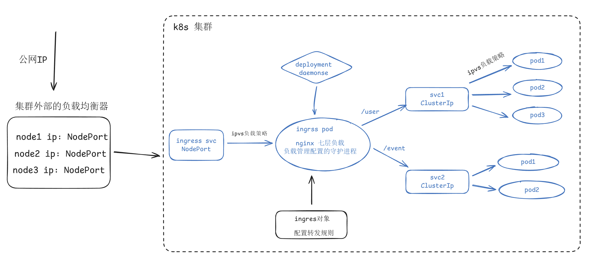

# ingress

~~~alert type=note
svc 对外暴露服务有两种类型：NodePort、LoadBalancer <br>
k8s 擅长跑微服务
~~~

## k8s 暴露单体服务的思路

单体服务跑在一个或多个 pod 中，为了实现 pod 的故障自愈和多副本，需要使用 k8s 中的控制器管理。然后再准备一个 svc 代理这些 po的，svc 的类类型可以是 `NodePort`、也可以是 `LoadBalancer`。

- 如果选择 `NodePort` 类型的 svc，则需要在 k8s 集群外，自建负载均衡器代理（代理多个节点Ip+nodeport）。适合集群规模不大，自己管理负载均衡能应付过来。
- 如果选择 `LoadBalancer` 类型的 svc，前提是云厂商在集群外提供现成的负载均衡，就不需要自建了。适合整个k8s环境是跑在云平台上，可以利用云平台的特性，集群规模大也能应付过来，因为是自动维护的。

请求流程：

1. 用户访问应用域名，经 dns 解析拿到集群外的负载均衡器的 ip + port
2. 请求打到集群外的负载均衡器，负载均衡器选出一个合适的 k8s 节点的 ip + nodepot
3. 匹配 ipvs 规则，计算出一个pod 的 ip + port
4. 基于网络插件完成封包然后发送请求

总结：如果单体服务，只需要一个 svc，就可以把服务对外暴露。


## k8s 暴露微服务的思路

微服务场景下，每个微服务都有一个或多个 pod 副本（肯定也需要有控制器管理自愈），这些 pod 需要被一个 svc 代理。因此微服务架构中，可能有多个 svc，一个 svc 表示一个服务，后面代理多个 pod。

每个微服务都负责做不同的事情，需要引入一个七层负载均衡来做一个统一的流量分发。

这个七层负载均衡就是 ingress，根据 uri 路径把请求转发给不同的 svc。

ingress 通常是跑在 pod 里的，被一个控制器如 deployment 控制器来管理自愈，ingress 的 pod 里面需要有两部分：

- 首先要有一个 七层转发软件，常用的就是 nginx
- 然后需要有一个守护进程，负责管理 ningx 的运行，比如注入新配置后需要重启nginx。


当然了，ingress 需要被一个 svc 代理（即 ingress 的 svc），整个 k8s 集群上的多个微服务由 ingress svc 转发。只需要把 ingress svc 做成 `NodePort` 类型或者 `LoadBalancer`  类型的 svc 即可对外暴露整个服务。

请求流程：

1. 用户访问应用域名，经 dns 解析拿到集群外的负载均衡器的 ip + port
2. 请求打到集群外的负载均衡器，负载均衡器选出一个合适的 k8s 节点的 ip + nodepot
3. 请求打到 ingress svc，由 ingress pod 根据 uri 转发请求到一个微服务的 svc
4. 由 微服务的 svc 计算出一个 pod 的 ip + port
5. 基于网络插件完成封包然后发送请求


## ingress 是什么

ingress 是一种七层流量转发机制，即七层负载均衡。请求抵达 ingress 后，ingress 会匹配 url 的路径部分，将不同的路径分发不同的后端 svc 来处理，请求到了 svc 之后，svc 依据自己标签选中的微服务pod 以及负载均衡策略（例如ipvs）来将请求转发给某个 pod。

~~~alert type=important
svc 拥有负载均衡能力的前提是它有 clusterIP
~~~

引入七层负载均衡可以把微服务重新汇聚成一个整体，然后对外暴露提供一个完整的软件供用户使用。


#### ingress 控制器的组成部分

使用 ingress 实现七层流量转发能力需要解决两个问题：七层转发、控制管理

**七层转发**：配置转发某个 svc 最好使用 svc 的域名（即 svc 的 fqdn 域名）而不是 ip，想要使用 fqdn，那需要把七层转发的软件运行在 Pod 中。另一方面，ingress 的软件需要能够被管理起来能够自愈，那就引入 k8s 的控制器资源（deployment）来管理。

**控制管理**：负责管理维护其配置的守护进程，一旦转发配置变动，自动重新加载新配置。

上面这两部分功能合在一块放在一个 pod 中，有一个专门的称呼叫 ingress controller。

为了方便配置，使用 ingress 对象，往 ingress 的软件中注入配置，具体表现为使用 yaml 清单的方式注入配置。



## ingress 部署方案

按照是否需要为 ingress 的 pod 创建 svc 来区分，可以分为两大方案。

- 如果 ingress pod 使用 hostNetwork 网络模式，则不需要创建 svc
- 如果 ingress pod 不使用 hostNetwork 网络模式，那就需要创建 svc，这种情况下再根据 svc 的类型，可以再细分为两种部署方案。

方案1：创建 ingress svc，使用 deploment 管理 ingress pod（pod 网络不是 hostNetwork ），ingress svc 的类型是 LoadBalancer

方案2：创建 ingress svc，使用 deploment 管理 ingress pod（pod 网络不是 hostNetwork ），ingress svc 的类型是 NodePort

方案3：不创建 ingres svc，使用 Daemonset 管理 ingress pod（pod 用 hostNetwork 网络模式），每个 k8s 节点部署一个 ingress pod


## 部署 ingress

主流常用 ingress-nginx 的方式。


#### 创建 ingress svc，deployment 管理 ingress pod

部署步骤：

- 官网下载 ingress-nginx 的部署模板（即 yaml 配置清单）
- 修改  yaml 配置清单，并应用
- 准备两个业务 svc，于预先规划好 uri 前缀
- 编写转发配置规则清单，并应用


##### 第一步：下载 ingress-nginx 的部署模板并修改配置清单

下载配置清单 deploy.yaml

~~~bash
wget https://raw.githubusercontent.com/kubernetes/ingress-nginx/controller-v1.10.1/deploy/static/provider/cloud/deploy.yaml
~~~

查看镜像版本

~~~bash
[root@k8s-master-01 test2]# grep -i 'image: registry.k8s.io' deploy.yaml 
        image: registry.k8s.io/ingress-nginx/controller:v1.10.1@sha256:e24f39d3eed6bcc239a56f20098878845f62baa34b9f2be2fd2c38ce9fb0f29e
        image: registry.k8s.io/ingress-nginx/kube-webhook-certgen:v1.4.1@sha256:36d05b4077fb8e3d13663702fa337f124675ba8667cbd949c03a8e8ea6fa4366
        image: registry.k8s.io/ingress-nginx/kube-webhook-certgen:v1.4.1@sha256:36d05b4077fb8e3d13663702fa337f124675ba8667cbd949c03a8e8ea6fa4366
~~~

替换模板中的镜像为国内镜像

~~~bash
[root@k8s-master-01 test2]# grep 'registry.cn-' deploy.yaml 
        image: registry.cn.../ingress-controller:v1.10.1
        image: registry.cn.../kube-webhook-certgen:v1.4.1 
        image: registry.cn.../kube-webhook-certgen:v1.4.1
~~~

修改 svc 的类型为 `NodePort`，注意：只需要修改名字为 ingress-nginx-controller 的 svc 的类型。

~~~bash
apiVersion: v1
kind: Service
metadata:
  labels:
    app.kubernetes.io/component: controller
    app.kubernetes.io/instance: ingress-nginx
    app.kubernetes.io/name: ingress-nginx
    app.kubernetes.io/part-of: ingress-nginx
    app.kubernetes.io/version: 1.10.1
  name: ingress-nginx-controller   # svc的名字
  namespace: ingress-nginx	
spec:
  ...
  selector:
    app.kubernetes.io/component: controller
    app.kubernetes.io/instance: ingress-nginx
    app.kubernetes.io/name: ingress-nginx
  type: NodePort	# 修改 type 值为 NodePort，需改前为LoadBalancer
~~~

应用清单并查看 pod 和 svc。看到一个 ingress pod 和一个 ingress svc 在运行。

~~~bash
[root@k8s-master-01 test2]# kubectl -n ingress-nginx get pods
NAME                                       READY   STATUS      RESTARTS   AGE
ingress-nginx-admission-create-wgmfv       0/1     Completed   0          17s
ingress-nginx-admission-patch-6dhnd        0/1     Completed   0          17s
ingress-nginx-controller-c946575d4-jj572   0/1     Running     0          17s
[root@k8s-master-01 test2]# 
[root@k8s-master-01 test2]# 
[root@k8s-master-01 test2]# kubectl -n ingress-nginx get svc
NAME                                 TYPE        CLUSTER-IP      EXTERNAL-IP   PORT(S)                      AGE
ingress-nginx-controller             NodePort    10.97.185.211   <none>        80:30617/TCP,443:31689/TCP   24s
ingress-nginx-controller-admission   ClusterIP   10.107.56.196   <none>        443/TCP                      24s
~~~


##### 第二步：准备两个业务 svc

准备两个 svc：

- 规划 uri 前缀为 `/host` 转发到 gowebhost svc
- 规划 uri 前缀为 `/ip` 转发到 gowebip svc

gowebhost 微服务 yaml 清单

~~~yaml
# gowebhost-svc.yaml
apiVersion: apps/v1
kind: Deployment
metadata:
  labels:
    app: gowebhost
  name: gowebhost
spec: 
  replicas: 2
  selector: 
    matchLabels:
      app: gowebhost     
  template:                
    metadata:
      labels:
        app: gowebhost
    spec:                  
      containers:
      - image: nginx:latest
        name: nginx
---
apiVersion: v1
kind: Service
metadata:
  labels:
    app: gowebhost
  name: gowebhost
spec:
  ports:
  - port: 9999			# svc 端口为 9999
    protocol: TCP
    targetPort: 80
  selector:
    app: gowebhost
  type: ClusterIP		# 集群内部 svc
~~~

gowebip 微服务 yaml 清单

~~~yaml
# gowebip-svc.yaml
apiVersion: apps/v1
kind: Deployment
metadata:
  labels:
    app: gowebip
  name: gowebip
spec: 
  replicas: 2
  selector: 
    matchLabels:
      app: gowebip     
  template:                
    metadata:
      labels:
        app: gowebip
    spec:                  
      containers:
      - image: nginx:latest
        name: nginx
---
apiVersion: v1
kind: Service
metadata:
  labels:
    app: gowebip
  name: gowebip
spec:
  ports:
  - port: 8888			# svc 端口为 9999
    protocol: TCP
    targetPort: 80
  selector:
    app: gowebip
  type: ClusterIP		# 集群内部 svc
~~~

创建两个业务 svc

~~~bash
kubectl apply -f gowebhost-svc.yaml
kubectl apply -f gowebip-svc.yaml
~~~

查看两个业务 svc 和 pod

~~~bash
[root@k8s-master-01 test2]# kubectl get svc gowebhost gowebip
NAME        TYPE        CLUSTER-IP       EXTERNAL-IP   PORT(S)    AGE
gowebhost   ClusterIP   10.101.210.70    <none>        9999/TCP   67s
gowebip     ClusterIP   10.106.238.217   <none>        8888/TCP   60s
[root@k8s-master-01 test2]# 
[root@k8s-master-01 test2]# 
[root@k8s-master-01 test2]# kubectl get pod 
NAME                         READY   STATUS    RESTARTS   AGE
gowebhost-5b8675875c-9m4kc   1/1     Running   0          76s
gowebhost-5b8675875c-r8z7k   1/1     Running   0          76s
gowebip-554fbb659b-fjzlz     1/1     Running   0          69s
gowebip-554fbb659b-hkcwb     1/1     Running   0          69s
~~~


##### 第三步：编写转发配置规则清单

编写 ingress 对象的配置清单。在元数据中使用 `annotations` 配置功能，在 `spec.rules` 下面配置域名和具体的转发规则。

>补充，编写时注意 `apiVersion`，查看支持的版本
>
>~~~bash
>kubectl explain ingress.apiVersion
>~~~

~~~yaml
# ingress-test.yaml
apiVersion: networking.k8s.io/v1  # 细分组和版本
kind: Ingress
metadata:
  name: ingress-test
  namespace: default	# 名称空间
  annotations:
    # kubernetes.io/ingress.class: "nginx"
    # 开启use-regex，启用path的正则匹配 
    nginx.ingress.kubernetes.io/use-regex: "true"
spec:
  ingressClassName: nginx
  rules:
    # 定义域名
    - host: test.ingress.com
      http:
        paths:
          # 不同path转发到不同端口
          - path: /ip
            pathType: Prefix
            backend:
              service:
                name: gowebip	# fqdn简写（上面指定了namespace
                port: 
                  number: 8888
          - path: /host
            pathType: Prefix
            backend:
              service:
                name: gowebhost
                port: 
                  number: 9999
~~~

应用，为 ingress pod 注入转发规则

~~~bash
kubectl apply -f ingress-test.yaml
~~~

等待 ingress 资源绑定了 ingrss svc 的 clusteIP 地址，即可使用。

~~~bash
[root@k8s-master-01 test2]# kubectl get ingress -w
NAME           CLASS   HOSTS              ADDRESS         PORTS   AGE
ingress-test   nginx   test.ingress.com   10.97.185.211   80      19s

# ADDRESS 就是 ingrss svc 的 clusteIP 地址
#
#
# 使用 describe 查看详细的 ingrss 对象信息
[root@k8s-master-01 test2]# kubectl describe ingress ingress-test 
Name:             ingress-test
Labels:           <none>
Namespace:        default
Address:          10.97.185.211
Ingress Class:    nginx
Default backend:  <default>
Rules:
  Host              Path  Backends
  ----              ----  --------
  test.ingress.com  
                    /ip     gowebip:8888 (10.244.1.184:80,10.244.2.141:80)
                    /host   gowebhost:9999 (10.244.1.183:80,10.244.2.140:80)
Annotations:        nginx.ingress.kubernetes.io/use-regex: true
Events:
  Type    Reason  Age                From                      Message
  ----    ------  ----               ----                      -------
  Normal  Sync    41m (x2 over 41m)  nginx-ingress-controller  Scheduled for sync
~~~


##### 第四步：测试

提前在 业务 pod 中准备测试页面：`host/test.html` 和 `ip/test.html`

然后使用域名访问（这里没有在集群外自建负载均衡器，直接访问 k8s 节点；修改本地 hosts 文件把 test.ingress.com 指向 k8s 节点 ip

~~~bash
curl http://test.ingress.com:30617/host/test.html
curl http://test.ingress.com:30617/ip/test.html
~~~


#### daemonset 管理 ingress pod，不需要创建 ingress svc

转发路径更短，效率更高

部署步骤：

- 官网下载 ingress-nginx 的部署模板（即 yaml 配置清单）
- 修改  yaml 配置清单，并应用
- 准备两个业务 svc，于预先规划好 uri 前缀
- 编写转发配置规则清单，并应用

##### 第一步：下载 ingress-nginx 的部署模板并修改配置清单

下载配置清单 deploy.yaml

~~~bash
wget https://raw.githubusercontent.com/kubernetes/ingress-nginx/controller-v1.10.1/deploy/static/provider/cloud/deploy.yaml
~~~

查看镜像版本

~~~bash
[root@k8s-master-01 test2]# grep -i 'image: registry.k8s.io' deploy.yaml 
        image: registry.k8s.io/ingress-nginx/controller:v1.10.1@sha256:e24f39d3eed6bcc239a56f20098878845f62baa34b9f2be2fd2c38ce9fb0f29e
        image: registry.k8s.io/ingress-nginx/kube-webhook-certgen:v1.4.1@sha256:36d05b4077fb8e3d13663702fa337f124675ba8667cbd949c03a8e8ea6fa4366
        image: registry.k8s.io/ingress-nginx/kube-webhook-certgen:v1.4.1@sha256:36d05b4077fb8e3d13663702fa337f124675ba8667cbd949c03a8e8ea6fa4366
~~~

替换模板中的镜像为国内镜像

~~~bash
[root@k8s-master-01 test2]# grep 'registry.cn-' deploy.yaml 
        image: registry.cn.../ingress-controller:v1.10.1
        image: registry.cn.../kube-webhook-certgen:v1.4.1 
        image: registry.cn.../kube-webhook-certgen:v1.4.1
~~~

注释掉名字为 ingress-nginx-controller 的 svc ，因为不需要创建 svc

~~~bash
# 注释掉 如下 svc 的配置
apiVersion: v1
kind: Service
metadata:
  labels:
    app.kubernetes.io/component: controller
    app.kubernetes.io/instance: ingress-nginx
    app.kubernetes.io/name: ingress-nginx
    app.kubernetes.io/part-of: ingress-nginx
    app.kubernetes.io/version: 1.10.1
  name: ingress-nginx-controller   # svc的名字
  namespace: ingress-nginx	
spec:
  ...
  selector:
    app.kubernetes.io/component: controller
    app.kubernetes.io/instance: ingress-nginx
    app.kubernetes.io/name: ingress-nginx
  type: LoadBalancer
~~~

把 ingress pod 的控制器由 deployment 修改为 `DaemonSet`，并注释掉滚动发版的配置。

修改 pod 的网络模式为 `hostNetwork`

~~~yaml
apiVersion: apps/v1
kind: DaemonSet
metadata:
  labels:
    app.kubernetes.io/component: controller
    app.kubernetes.io/instance: ingress-nginx
    app.kubernetes.io/name: ingress-nginx
    app.kubernetes.io/part-of: ingress-nginx
    app.kubernetes.io/version: 1.10.1
  name: ingress-nginx-controller
  namespace: ingress-nginx
spec:
  minReadySeconds: 0
  revisionHistoryLimit: 10
  selector:
    matchLabels:
      app.kubernetes.io/component: controller
      app.kubernetes.io/instance: ingress-nginx
      app.kubernetes.io/name: ingress-nginx
  #strategy:
  #  rollingUpdate:
  #    maxUnavailable: 1
  #  type: RollingUpdate
  template:
    metadata:
      labels:
        app.kubernetes.io/component: controller
        app.kubernetes.io/instance: ingress-nginx
        app.kubernetes.io/name: ingress-nginx
        app.kubernetes.io/part-of: ingress-nginx
        app.kubernetes.io/version: 1.10.1
    spec:
      hostNetwork: true		# 让 Pod 使用宿主机的网络命名空间
      containers:
      - args:
      ...
~~~

应用清单并查看 pod，看到两个 work 节点分别有一个 ingress pod

~~~bash
root@k8s-master-01 test2]# kubectl -n ingress-nginx get pods
NAME                                   READY   STATUS      RESTARTS   AGE
ingress-nginx-admission-create-56fn4   0/1     Completed   0          10m
ingress-nginx-admission-patch-29gdp    0/1     Completed   0          10m
ingress-nginx-controller-drrrn         1/1     Running     0          10m
ingress-nginx-controller-hcqw4         1/1     Running     0          10m
~~~

第二步和第三步同上

~~~bash
[root@k8s-master-01 test2]# kubectl apply -f ingress-test.yaml 
ingress.networking.k8s.io/ingress-test created
[root@k8s-master-01 test2]# 
[root@k8s-master-01 test2]#  
[root@k8s-master-01 test2]# kubectl get ingress
NAME           CLASS   HOSTS              ADDRESS                       PORTS   AGE
ingress-test   nginx   test.ingress.com   172.16.143.23,172.16.143.24   80      8s
~~~

##### 第四步：测试

提前在 业务 pod 中准备测试页面：`host/test.html` 和 `ip/test.html`

然后使用域名访问（这里没有在集群外自建负载均衡器，直接访问 k8s 节点；修改本地 hosts 文件把 test.ingress.com 指向 k8s 节点 ip

~~~bash
curl http://test.ingress.com:30617/host/test.html
curl http://test.ingress.com:30617/ip/test.html
~~~


##  ingress 对象资源

ingress 是一个 API 对象，和其他对象一样，通过 yaml 文件来配置，为负载均衡程序注入配置（一条 ingress就是写入nginx.conf中的一段配置）。

~~~yaml
apiVersion: networking.k8s.io/v1  # 可以查看详情kubectl explain ingress
kind: Ingress
metadata:
  name: ingress-test
  namespace: default
 
  annotations: 
    kubernetes.io/ingress.class: "nginx"
    nginx.ingress.kubernetes.io/use-regex: "true"  # 开启use-regex，启用path的正则匹配，
spec:
  tls: 
    - hosts:
      - test.ingress.com
      secretName: ingress-tls

  ingressClassName: nginx 
  
  rules:
    # 定义域名
    - host: test.ingress.com
      http:
        paths:
          # 不同path转发到不同端口
          - path: /ip
            pathType: Prefix
            backend:
              service:
                name: gowebip
                port: 
                  number: 8888
          - path: /host
            pathType: Prefix
            backend:
              service:
                name: gowebhost
                port: 
                  number: 9999
~~~

在ingress配置中，annotations 很重要，可以用来控制启用何种功能，如下 use-regex 启用正则匹配

~~~
nginx.ingress.kubernetes.io/use-regex: "true"
~~~

ingressClassName

~~~bash
[root@k8s-master-01 ~]# kubectl get ingressclass -o  yaml # 可以查看到名为nginx的控制器
apiVersion: v1
items:
- apiVersion: networking.k8s.io/v1
  kind: IngressClass
  metadata:
    ......
    name: nginx   # 这个名字就是你在创建ingress对象时引用的ingressClassName名
  spec:
    controller: k8s.io/ingress-nginx # 这个名字是在ingress-controller控制器启动args里指定的
kind: List
metadata:
  resourceVersion: ""
~~~

注意：如果你的 k8s 中安装了多个 ingress 控制器，在创建 ingress 对象时，你就需要 ingressClassName来选择你想要的 ingress 控制器。

由于一个集群中可能有多个 Ingress 控制器，所以我们还可以将一个特定的 `IngressClass` 对象标记为集群默认是 Ingress 类。只需要将一个 IngressClass 资源的 `ingressclass.kubernetes.io/is-default-class` 注解设置为 true 即可，这样未指定 `ingressClassName` 字段的 Ingress 就会使用这个默认的 IngressClass。

```
apiVersion: networking.k8s.io/v1
kind: IngressClass
metadata:
  annotations:
    ingressclass.kubernetes.io/is-default-class: "true"
```

> 如果集群中有多个 `IngressClass` 被标记为默认，准入控制器将阻止创建新的未指定 `ingressClassName` 的 Ingress 对象。最好的方式还是确保集群中最多只能有一个 `IngressClass` 被标记为默认。

rules 字段用于指定请求路由转发规则。

- 1、host：

```
提供了 host 域名，则 rules 则会匹配该域名的相关请求，此外 host 主机名可以是精确匹配（例如 foo.bar.com）或者使用通配符来匹配（例如 *.foo.com）。
```

- 2、http.paths：定义访问的路径列表

```
比如上面定义的 /testpath，每个路径都有一个由 backend.service.name 和 backend.service.port.number 定义关联的 Service 后端，在控制器将流量路由到引用的服务之前，host 和 path 都必须匹配传入的请求才行。
```

- 3、backend：该字段其实就是用来定义后端的 Service 服务的

```
与路由规则中 host 和 path 匹配的流量会将发送到对应的 backend 后端去。
```

了解：Resource

```
backend 后端除了可以引用一个 Service 服务之外，还可以通过一个 resource 资源进行关联，

Resource 是当前 Ingress 对象命名空间下引用的另外一个 Kubernetes 资源对象，Resource 后端的一种常见用法是将所有入站数据导向带有静态资产的对象存储后端，

但是需要注意的是 Resource 与 Service 配置是互斥的，只能配置一个，

如下所示：
apiVersion: networking.k8s.io/v1
kind: Ingress
metadata:
  name: ingress-resource-backend
spec:
  rules:
    - http:
        paths:
          - path: /icons
            pathType: ImplementationSpecific
            backend:
              resource:
                apiGroup: k8s.example.com
                kind: StorageBucket
                name: icon-assets
                
              
该 Ingress 资源对象描述了所有的 /icons 请求会被路由到同命名空间下的名为 icon-assets 的 StorageBucket 资源中去进行处理。
```

### （4）pathType字段

事实上每个路径都需要有对应的路径类型，当前支持的`pathType` 路径类型有三种：

kubectl explain ingress.spec.rules.http.paths.pathType

```
FIELD: pathType <string>
ENUM:
    Exact
    ImplementationSpecific
    Prefix

Exact（精确/完全）: 请求必须精确地匹配指定的路径、且区分大小写。例如，如果路径设置为/foo，则仅/foo会被匹配，而/foo/或/foo/bar不会匹配。

Prefix（前缀）: 基于以 `/` 分隔的 URL 路径前缀匹配，匹配区分大小写。如果设置为/foo，则任何以这个前缀开始的路径（比如/foo、/foo/、/foo/bar）都会被匹配。它不要求完全精确匹配，只要求请求的路径以指定的path开头。


ImplementationSpecific（交给特定控制器实现）: 当指定 pathType 为 ImplementationSpecific 时，意味着匹配路径的具体行为将由所选的 Ingress 控制器来决定，比如 nginx 或 traefik，每个控制器可能会有它自己对路径匹配的解释和实现方式。
在nginx的情况下，这通常涉及到更多细微或复杂的匹配条件，可能包括正则表达式或特定于nginx的行为。
```

示例

```
apiVersion: networking.k8s.io/v1
kind: Ingress
metadata:
  name: example-ingress
  namespace: default
spec:
  rules:
  - host: example.com
    http:
      paths:
      # 使用 Exact 类型的路径匹配方式，路径必须与 /exact-path 完全一致
      - path: /ip
        pathType: Exact
        backend:
          service:
            name: exact-service
            port:
              number: 80

      # 使用 Prefix 类型的路径匹配方式，任何以 /prefix-path 为前缀的路径都会匹配
      - path: /prefix-path
        pathType: Prefix
        backend:
          service:
            name: prefix-service
            port:
              number: 80

      # 使用 ImplementationSpecific 类型的路径匹配方式，具体行为由 Ingress Controller 决定
      - path: /regex-path
        pathType: ImplementationSpecific
        backend:
          service:
            name: regex-service
            port:
              number: 80

```

## 构建TLS站点

为 ingress 的访问加上证书。

创建私钥和证书

~~~bash
# 私钥
openssl genrsa -out tls.key 2048
# 证书
openssl req -new -x509 \
  -key tls.key \
  -out tls.crt \
  -days 365 \
  -subj "/C=CN/ST=ShangHai/L=ShangHai/O=Ingress/CN=test.ingress.com"
~~~

创建 tls 类型的 secret

~~~bash
kubectl -n default create secret tls ingress-tls \
--cert=tls.crt \
--key=tls.key
~~~

编写 ingress 的配置清单

~~~yaml
# ingress-test-ssl.yaml
apiVersion: networking.k8s.io/v1 
kind: Ingress
metadata:
  name: ingress-test
  namespace: default
  annotations:
    #kubernetes.io/ingress.class: "nginx"
    # 开启use-regex，启用path的正则匹配 
    nginx.ingress.kubernetes.io/use-regex: "true"
spec:
  tls:
    - hosts:
      - test.ingress.com
      secretName: ingress-tls	# 指定 tls 的 secret名字
  ingressClassName: nginx
  rules:
    # 定义域名
    - host: test.ingress.com
      http:
        paths:
          # 不同path转发到不同端口
          - path: /ip
            pathType: Prefix
            backend:
              service:
                name: gowebip
                port: 
                  number: 8888
          - path: /host
            pathType: Prefix
            backend:
              service:
                name: gowebhost
                port: 
                  number: 9999
~~~

应用 ingress 并查看

~~~bash
[root@k8s-master-01 test2]# kubectl get ingress -w
NAME           CLASS   HOSTS              ADDRESS   PORTS     AGE
ingress-test   nginx   test.ingress.com             80, 443   14s
ingress-test   nginx   test.ingress.com   172.16.143.23,172.16.143.24   80, 443   38s
~~~

使用 https 协议测试

~~~bash
curl https://test.ingress.com/host/test.html
~~~


## 重定向

~~~yaml
apiVersion: networking.k8s.io/v1
kind: Ingress
metadata:
  name: ingress-test
  namespace: default
  annotations:
    kubernetes.io/ingress.class: "nginx"
    # 域名重定向
    nginx.ingress.kubernetes.io/rewrite-target: https://www.baidu.com/s?wd=python
spec:
  ingressClassName: nginx
  rules:
    - host: test.ingress.com
      http:
        paths:
          - path: /
            pathType: Prefix
            backend:
              service:
                name: gowebip
                port: 
                  number: 8888
~~~

## 白名单

~~~yaml
apiVersion: networking.k8s.io/v1 
kind: Ingress
metadata:
  name: ingress-test
  namespace: default
  annotations:
    kubernetes.io/ingress.class: "nginx"
    # 设置ingress白名单
    nginx.ingress.kubernetes.io/whitelist-source-range: 192.168.71.12,192.168.71.13,192.168.71.2
spec:
  ingressClassName: nginx
  rules:
    - host: test.ingress.com
      http:
        paths:
          - path: /
            pathType: Prefix
            backend:
              service:
                name: gowebip
                port: 
                  number: 8888
~~~


