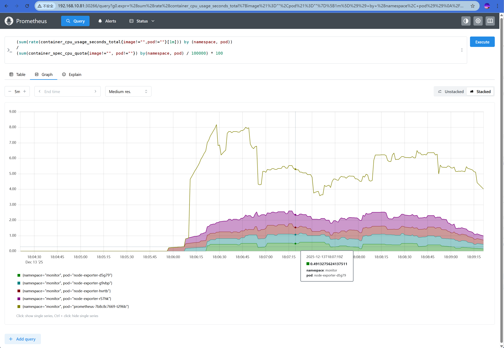

# 监控 k8s

采集 k8s 集群本身的指标：

- 监控 k8s 集群运行的服务。监控组件服务（kube-apiserver、 kube-scheduler、kube-controller-manager、etcd、coredns）的状态；监控业务服务（业务 pod）状态。
- 监控资源。比如 Deployment 的状态、pod 的状态。
- 监控容器。需要用到组件 `cAdvisor`，而  cAdvisor 已经内置在了 kubelet 组件之中，不需要单独去安装。


## 1. 监控容器

在 prometheus 的配置中增加下述 target，然后 apply -f

~~~yaml
# prometheus-cm.yaml
apiVersion: v1
kind: ConfigMap
metadata:
  name: prometheus-config
  namespace: monitor
data:
  prometheus.yml: |
    global:
      scrape_interval: 15s
      scrape_timeout: 15s
      evaluation_interval: 15s
    scrape_configs:
    - job_name: "prometheus"
      static_configs:
      - targets: ["localhost:9090"]
    - job_name: 'kubernetes-cadvisor'	# 新增如下配置
      kubernetes_sd_configs:
      - role: node
      scheme: https
      tls_config:
        ca_file: /var/run/secrets/kubernetes.io/serviceaccount/ca.crt
        insecure_skip_verify: true
      bearer_token_file: /var/run/secrets/kubernetes.io/serviceaccount/token
      relabel_configs:
      - action: labelmap
        regex: __meta_kubernetes_node_label_(.+)
        replacement: $1
      - source_labels: [__meta_kubernetes_node_name]
        regex: (.+)
        replacement: /metrics/cadvisor # <nodeip>/metrics -> <nodeip>/metrics/cadvisor
        target_label: __metrics_path__
~~~


如下配置，目的是修改暴露的 api 路径。

为了让 prometheus server 拉取监控指标是使用的 API 路径为：`https://<node ip>:10250/metrics/cadvisor`

~~~yaml
      - source_labels: [__meta_kubernetes_node_name]
        regex: (.+)
        replacement: /metrics/cadvisor # <nodeip>/metrics -> <nodeip>/metrics/cadvisor
        target_label: __metrics_path__
~~~

等一会后，待 pod 内更新了 cm 新配置。

```bash
curl -X POST "http://10.244.2.22:9090/-/reload"
```

> 10.244.2.22 是 prometheus pod 的 ip 地址


使用采集的容器指标计算每个 pod 对 cpu 的使用率

~~~
(sum(rate(container_cpu_usage_seconds_total{image!="",pod!=""}[1m])) by (namespace, pod))
/
(sum(container_spec_cpu_quota{image!="", pod!=""}) by(namespace, pod) / 100000) * 100
~~~

图形展示如下




## 2. 监控组件服务

主要监控的组件是：kube-apiserver、 kube-scheduler、kube-controller-manager、etcd、coredns

总体监控方法：

- 采用服务发现的方式监控（不推荐使用静态配置的方式）。
- 需要服务暴露 `/metrics` 接口，如果没有则可以采用 sidecar 的方式来负责暴露。
- 需要服务提供 endpoint（ip:port），如果没有则需要手动创建 svc（svc 会自动生成 endpoint），以便被 prometheus server 筛选到。


### 监控 apiserver

apiserver 暴露了 `/metrics` 接口，并且自带一个 svc，提供了 endpoint。因此只需要配置 promethes 的抓取目标即可。

~~~bash
[root@k8s-master-01 ~]# 
[root@k8s-master-01 ~]# 
[root@k8s-master-01 k8s-prometheus-yamls]# kubectl get svc kubernetes -o yaml
apiVersion: v1
kind: Service
metadata:
  creationTimestamp: "2025-12-12T13:54:37Z"
  labels:
    component: apiserver
    provider: kubernetes
  name: kubernetes			# 监控筛选值
  namespace: default		# 监控筛选值
  resourceVersion: "196"
  uid: b0b079f7-b1a9-43c7-88ee-c4a9f781d515
spec:
  clusterIP: 10.96.0.1
  clusterIPs:
  - 10.96.0.1
  internalTrafficPolicy: Cluster
  ipFamilies:
  - IPv4
  ipFamilyPolicy: SingleStack
  ports:
  - name: https			# 监控筛选值
    port: 443
    protocol: TCP
    targetPort: 6443
  sessionAffinity: None
  type: ClusterIP
status:
  loadBalancer: {}
~~~

**抓取 apiserver 的监控指标**

注意事项：

- kubernetes_sd_configs 配置的 role 为 `endpoints`，这表示 Prometheus 服务发现时需要被监控服务提供 endpoint 资源。
- apiserver 提供的接口协议为 https 协议，因此配置 `scheme: https` 并且配置 `tls_config`
- 访问 apiserver 需要认证 token 信息，因此配置 `bearer_token_file`
- relabel_configs 配置筛选规则：`namespace;service_name;endpoint_port_name`

~~~yaml
# prometheus-cm.yaml
# 增加下面的 target
    - job_name: 'kubernetes-apiservers'
      kubernetes_sd_configs:
      - role: endpoints
      scheme: https
      tls_config:
        ca_file: /var/run/secrets/kubernetes.io/serviceaccount/ca.crt
        insecure_skip_verify: true
      bearer_token_file: /var/run/secrets/kubernetes.io/serviceaccount/token
      relabel_configs:
      # 筛选规则：把符合要求的 svc 保留下来
      - action: keep
        source_labels: [__meta_kubernetes_namespace,__meta_kubernetes_service_name,__meta_kubernetes_endpoint_port_name]
        regex: default;kubernetes;https
~~~


### 监控 controller-manager

监控 controller-manager 的原理和监控 apiserver 的原理一致。并且 controller-manager 也暴露了 /metrics 接口。但是 controller-manager 没有 svc；并且 controller-manager 监听在 127.0.0.1，prometheus 无法访问，需要修改默认监听地址。具体监控实施流程如下。

#### 1. 创建 svc

创建一个 svc，负责代理每个节点上的 controller-manager 服务。通过标签 `component=kube-controller-manager` 选中 controller-manager pod

~~~yaml
apiVersion: v1
kind: Service
metadata:
  name: kube-controller-manager		# 添加监控时需要用到 svc name
  namespace: kube-system			# 添加监控时需要用到 namespace
  labels:
    app.kubernetes.io/component: kube-controller-manager
    app.kubernetes.io/name: kube-controller-manager
    k8s-app: kube-controller-manager
spec:
  clusterIP: None
  ports:
  - name: https-metrics	# 添加监控时需要用到 endpoint_port_name
    port: 10257
    targetPort: 10257
    protocol: TCP
  selector:
    component: kube-controller-manager	# 筛选 controller-manager pod
~~~

应用后，查看 svc 和 endpoint

~~~bash
[root@k8s-master-01 k8s-prometheus-yamls]# kubectl -n kube-system get svc kube-controller-manager 
NAME                      TYPE        CLUSTER-IP   EXTERNAL-IP   PORT(S)     AGE
kube-controller-manager   ClusterIP   None         <none>        10257/TCP   23s
[root@k8s-master-01 k8s-prometheus-yamls]# 
[root@k8s-master-01 k8s-prometheus-yamls]# 
[root@k8s-master-01 k8s-prometheus-yamls]# 
[root@k8s-master-01 k8s-prometheus-yamls]# kubectl -n kube-system get endpoints kube-controller-manager 
NAME                      ENDPOINTS                                                     AGE
kube-controller-manager   192.168.10.81:10257,192.168.10.82:10257,192.168.10.83:10257   37s
~~~

#### 2. 修改 controller-manager 监听地址

上述 svc 其关联的 endpoint 用的地址都是物理机的地址，而每台 master 节点上的 controller-manager 都监听在 127.0.0.1，所以 prometheus 是无法访问的，需要修改其默认监听。

修改**每个 master 节点**上静态 pod 的 yaml 文件 /etc/kubernetes/manifests/kube-controller-manager.yaml

~~~bash
sed -i '/--bind-address=127.0.0.1/s/127.0.0.1/0.0.0.0/' /etc/kubernetes/manifests/kube-controller-manager.yaml
~~~

修改后，kubelet 会自动更新 controller-manager pod


#### 3. 添加监控

和 apiserver 的监控规则一致。需要注意的是 `relabel_configs ` 的 `regex` 值为 svc 的三个值（`namespace;service_name;endpoint_port_name`）组成的。

~~~yaml
# prometheus-cm.yaml
# 增加下面的 target
    - job_name: 'kube-controller-manager'
      kubernetes_sd_configs:
      - role: endpoints
      scheme: https
      tls_config:
        ca_file: /var/run/secrets/kubernetes.io/serviceaccount/ca.crt
        insecure_skip_verify: true
      bearer_token_file: /var/run/secrets/kubernetes.io/serviceaccount/token
      relabel_configs:
      # 筛选规则：把符合要求的 svc 保留下来
      - action: keep
        source_labels: [__meta_kubernetes_namespace,__meta_kubernetes_service_name,__meta_kubernetes_endpoint_port_name]
        regex: kube-system;kube-controller-manager;https-metrics
~~~


### 监控 kube-scheduler

监控流程和 controller-manager 的流程完全一致。

#### 1. 创建 svc

创建一个 svc，负责代理每个节点上的 kube-scheduler 服务。通过标签 `component=kube-scheduler` 选中 kube-scheduler pod

~~~yaml
apiVersion: v1
kind: Service
metadata:
  name: kube-scheduler		# 添加监控时需要用到 svc name
  namespace: kube-system	# 添加监控时需要用到 namespace
  labels:
    app.kubernetes.io/component: kube-scheduler
    app.kubernetes.io/name: kube-scheduler
    k8s-app: kube-scheduler
spec:
  clusterIP: None
  ports:
  - name: https-metrics	# 添加监控时需要用到 endpoint_port_name
    port: 10259
    targetPort: 10259
    protocol: TCP
  selector:
    component: kube-scheduler	# 筛选 scheduler pod
~~~

应用后，查看 svc 和 endpoint

~~~bash
[root@k8s-master-01 k8s-prometheus-yamls]# kubectl -n kube-system get svc kube-scheduler
NAME             TYPE        CLUSTER-IP   EXTERNAL-IP   PORT(S)     AGE
kube-scheduler   ClusterIP   None         <none>        10259/TCP   22s
[root@k8s-master-01 k8s-prometheus-yamls]# 
[root@k8s-master-01 k8s-prometheus-yamls]# 
[root@k8s-master-01 k8s-prometheus-yamls]# kubectl -n kube-system get endpoints kube-scheduler
NAME             ENDPOINTS                                                     AGE
kube-scheduler   192.168.10.81:10259,192.168.10.82:10259,192.168.10.83:10259   27s
~~~

#### 2. 修改 scheduler 监听地址

上述 svc 其关联的 endpoint 用的地址都是物理机的地址，而每台 master 节点上的 scheduler 都监听在 127.0.0.1，所以 prometheus 是无法访问的，需要修改其默认监听。

修改**每个 master 节点**上静态 pod 的 yaml 文件 /etc/kubernetes/manifests/kube-scheduler.yaml

~~~bash
sed -i '/--bind-address=127.0.0.1/s/127.0.0.1/0.0.0.0/' /etc/kubernetes/manifests/kube-scheduler.yaml
~~~

修改后，kubelet 会自动更新 scheduler pod


#### 3. 添加监控

和 apiserver 的监控规则一致。需要注意的是 `relabel_configs ` 的 `regex` 值为 svc 的三个值（`namespace;service_name;endpoint_port_name`）组成的。

~~~yaml
# prometheus-cm.yaml
# 增加下面的 target
    - job_name: 'kube-scheduler'
      kubernetes_sd_configs:
      - role: endpoints
      scheme: https
      tls_config:
        ca_file: /var/run/secrets/kubernetes.io/serviceaccount/ca.crt
        insecure_skip_verify: true
      bearer_token_file: /var/run/secrets/kubernetes.io/serviceaccount/token
      relabel_configs:
      # 筛选规则：把符合要求的 svc 保留下来
      - action: keep
        source_labels: [__meta_kubernetes_namespace,__meta_kubernetes_service_name,__meta_kubernetes_endpoint_port_name]
        regex: kube-system;kube-scheduler;https-metrics
~~~


### 监控 etcd

监控 etcd 和方法和 controller-manager、scheduler 类似。

#### 1. 创建 svc

创建一个 svc，负责代理每个节点上的 etcd 服务。通过标签 `component=etcd` 选中 etcd  pod

~~~yaml
apiVersion: v1
kind: Service
metadata:
  name: etcd-svc			# 添加监控时需要用到 svc name
  namespace: kube-system	# 添加监控时需要用到 namespace
  labels:
    app.kubernetes.io/component: etcd
    app.kubernetes.io/name: etcd
    k8s-app: etcd
spec:
  clusterIP: None
  ports:
  - name: http-metrics	# 添加监控时需要用到 endpoint_port_name
    port: 2381
    targetPort: 2381
    protocol: TCP
  selector:
    component: etcd	  # 筛选 scheduler pod
~~~

应用后，查看 svc 和 endpoint

~~~bash
[root@k8s-master-01 k8s-prometheus-yamls]# kubectl -n kube-system get svc etcd-svc 
NAME       TYPE        CLUSTER-IP   EXTERNAL-IP   PORT(S)    AGE
etcd-svc   ClusterIP   None         <none>        2381/TCP   8s
[root@k8s-master-01 k8s-prometheus-yamls]# 
[root@k8s-master-01 k8s-prometheus-yamls]# 
[root@k8s-master-01 k8s-prometheus-yamls]# kubectl -n kube-system get endpoints etcd-svc 
NAME       ENDPOINTS                                                  AGE
etcd-svc   192.168.10.81:2381,192.168.10.82:2381,192.168.10.83:2381   17s
~~~

#### 2. 修改 etcd 监听地址

上述 svc 其关联的 endpoint 用的地址都是物理机的地址，而每台 master 节点上的 etcd 都监听在 127.0.0.1，所以 prometheus 是无法访问的，需要修改其默认监听。

修改**每个 master 节点**上静态 pod 的 yaml 文件 /etc/kubernetes/manifests/etcd.yaml

~~~bash
sed -i '/--listen-metrics-urls=http:\/\/127.0.0.1:2381/s/127.0.0.1/0.0.0.0/' /etc/kubernetes/manifests/etcd.yaml
~~~

修改后，kubelet 会自动更新 scheduler pod


#### 3. 添加监控

和 apiserver 的监控规则一致。需要注意的是 `relabel_configs ` 的 `regex` 值为 svc 的三个值（`namespace;service_name;endpoint_port_name`）组成的。

~~~yaml
# prometheus-cm.yaml
# 增加下面的 target
    - job_name: 'etcd'
      kubernetes_sd_configs:
      - role: endpoints
      scheme: http	# http
      relabel_configs:
      - action: keep
        source_labels: [__meta_kubernetes_namespace,__meta_kubernetes_service_name,__meta_kubernetes_endpoint_port_name]
        regex: kube-system;etcd-svc;http-metrics
~~~


## 3. 监控业务服务

总体监控方法：

- 采用服务发现的方式监控（不推荐使用静态配置的方式）。
- 需要业务服务暴露 `/metrics` 接口，如果没有则可以采用 sidecar 的方式来负责暴露。
- 需要服务提供 endpoint（ip:port），如果没有则需要手动创建 svc（svc 会自动生成 endpoint），以便被 prometheus server 筛选到。
- 配置 svc 带上指定的注解或标签 `prometheus.io/scrape: "true" ` 用于自动发现。


### 1. 创建测试服务

采用 sidecar 的方式注入 exporter

~~~yaml
apiVersion: apps/v1
kind: Deployment
metadata:
  name: redis
  namespace: default
spec:
  selector:
    matchLabels:
      app: redis
  template:
    metadata:
      labels:
        app: redis
    spec:
      containers:
      - name: redis
        image: crpi-hdcg863vh2ayst45.cn-shanghai.personal.cr.aliyuncs.com/liuxu8677/redis:latest
        resources:
          requests:
            cpu: 100m
            memory: 100Mi
        ports:
        - containerPort: 6379
      - name: redis-exporter
        image: crpi-hdcg863vh2ayst45.cn-shanghai.personal.cr.aliyuncs.com/liuxu8677/redis_exporter:latest
        resources:
          requests:
            cpu: 100m
            memory: 100Mi
        ports:
        - containerPort: 9121
~~~

### 2. 创建 svc

~~~yaml
kind: Service
apiVersion: v1
metadata:
  name: redis
  namespace: default
  annotations:
    prometheus.io/scrape: 'true'	# 服务发现
    prometheus.io/port: '9121'
spec:
  selector:
    app: redis
  ports:
  - name: redis
    port: 6379
    targetPort: 6379
  - name: prom
    port: 9121
    targetPort: 9121
~~~


### 3. 添加监控

~~~yaml
    - job_name: 'redis-svc'
      kubernetes_sd_configs:
      - role: endpoints
      relabel_configs:
      # 0、筛选 redsi svc
      - action: keep
        source_labels: [__meta_kubernetes_namespace,__meta_kubernetes_service_name,__meta_kubernetes_endpoint_port_name]
        regex: default;redis;prom
      # 1、匹配元数据__meta_kubernetes_service_annotation_prometheus_io_scrape包含"true"的留下
      - source_labels: [__meta_kubernetes_service_annotation_prometheus_io_scrape]
        action: keep
        regex: true
      # 2、__meta_kubernetes_service_annotation_prometheus_io_scheme的值中包含0或1个https，则改名为__scheme__
      - source_labels: [__meta_kubernetes_service_annotation_prometheus_io_scheme]
        action: replace
        target_label: __scheme__
        regex: (https?)
        
      # 3、__meta_kubernetes_service_annotation_prometheus_io_path的值至少有一个任意字符，则改名为__metrics_path__
      - source_labels: [__meta_kubernetes_service_annotation_prometheus_io_path]
        action: replace
        target_label: __metrics_path__
        regex: (.+)
        
      # 4、提取ip与port拼接到一起格式为: 1.1.1.1:3333，然后赋值给新label名：__address__
      - source_labels:
          [__address__, __meta_kubernetes_service_annotation_prometheus_io_port]
        action: replace
        target_label: __address__
        regex: ([^:]+)(?::\d+)?;(\d+) # RE2 正则规则，+是一次多多次，?是0次或1次，其中?:表示非匹>配组(意思就是不获取匹配结果)
        replacement: $1:$2
        
      # 5、添加标签
      - action: labelmap
        regex: __meta_kubernetes_service_label_(.+)
        
      # 6、名称空间标签替换为kubernetes_namespace
      - source_labels: [__meta_kubernetes_namespace]
        action: replace
        target_label: kubernetes_namespace
        
      # 7、服务名替换为kubernetes_name
      - source_labels: [__meta_kubernetes_service_name]
        action: replace
        target_label: kubernetes_name
      
      # 8、pod名替换为kubernetes_pod_name
      - source_labels: [__meta_kubernetes_pod_name]
        action: replace
        target_label: kubernetes_pod_name
~~~


## 4. 监控 k8s 资源

监控 k8s 资源（Pod、DaemonSet、Deployment、Job、CronJob 等各种资源）的状态。例如：

- 调度了多少个副本？现在可用的有几个？
- 多少个 Pod 是 `running/stopped/terminated` 状态？
- Pod 重启了多少次？
- 有多少 job 在运行中等等

需要部署 kube-state-metrics 来采集资源信息

~~~alert type=note
metrics server 提供实时的资源监控指标 给 HPA做决策用，不擅长做历史数据分析 <br>
kube-state-metrics 擅长做历史数据监控与分析，对接prometheus server
~~~


下载并部署 kube-state-metrics

~~~bash
# 下载
git clone https://github.com/kubernetes/kube-state-metrics.git

# 查看文件
cd kube-state-metrics/examples/standard/
[root@k8s-master-01 standard]# ls -l
总用量 24
-rw-r--r-- 1 root root  419 12月 15 17:47 cluster-role-binding.yaml
-rw-r--r-- 1 root root 1951 12月 15 17:47 cluster-role.yaml
-rw-r--r-- 1 root root 1517 12月 15 17:47 deployment.yaml
-rw-r--r-- 1 root root  203 12月 15 17:47 kustomization.yaml
-rw-r--r-- 1 root root  271 12月 15 17:47 service-account.yaml
-rw-r--r-- 1 root root  448 12月 15 17:47 service.yaml
~~~


修改 service.yaml 文件，配置 Endpoints 的自动发现

~~~yaml
# service.yaml
apiVersion: v1
kind: Service
metadata:
  labels:
    app.kubernetes.io/component: exporter
    app.kubernetes.io/name: kube-state-metrics
    app.kubernetes.io/version: 2.17.0
  name: kube-state-metrics
  namespace: kube-system
  # 增加注解
  annotations:
    prometheus.io/scrape: "true"
    prometheus.io/port: "8080"  # 8080是kube-state-metrics应用本身指标的端口

spec:
  clusterIP: None
  ports:
  - name: http-metrics
    port: 8080
    targetPort: http-metrics
  - name: telemetry
    port: 8081
    targetPort: telemetry
  selector:
    app.kubernetes.io/name: kube-state-metrics
~~~

部署

~~~bash
kubectl apply -k .
~~~

> 如果无法拉取镜像，请换成国内镜像。

查看 pod 和 svc

~~~bash
[root@k8s-master-01 standard]# kubectl -n kube-system get pods kube-state-metrics-774d57b74b-hpkg9 
NAME                                  READY   STATUS    RESTARTS   AGE
kube-state-metrics-774d57b74b-hpkg9   1/1     Running   0          52s
[root@k8s-master-01 standard]# 
[root@k8s-master-01 standard]# 
[root@k8s-master-01 standard]# 
oot@k8s-master-01 standard]# kubectl -n kube-system get svc kube-state-metrics 
NAME                 TYPE        CLUSTER-IP   EXTERNAL-IP   PORT(S)             AGE
kube-state-metrics   ClusterIP   None         <none>        8080/TCP,8081/TCP   7m56s
[root@k8s-master-01 standard]# 
[root@k8s-master-01 standard]# 
[root@k8s-master-01 standard]# kubectl -n kube-system get endpoints kube-state-metrics 
NAME                 ENDPOINTS                           AGE
kube-state-metrics   10.244.3.36:8081,10.244.3.36:8080   8m5s
~~~


