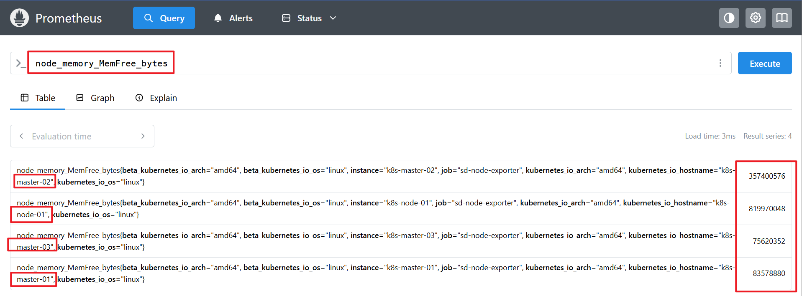

# PromQL

PromQL 是 Prometheus 内置的数据查询语言，它是 Prometheus 所有应用场景的基础，理解和掌握 PromQL 是我们使用 Prometheus 必备的技能。

>官网：https://prometheus.io/docs/prometheus/latest/querying/basics/

## 采集的数据格式

通过 /metrics 接口采集的监控样本由 2 部分构成。

- 指标。指标的命名是由 metric name 指标名和一组当前样本特征的 labelsets 组合而成，格式为 `<metric name>{<label name>=<label value>, ...}`，不同的组合就是不同的指标。标签（label）反映了当前样本的特征和维度。标签的名称只能由 ASCII 字符、数字以及下划线组成并满足正则表达式
- 指标值。

这些样本在 TSDB 中是按照时间序列组成的，所以一个完整的样本的构成中必然需要挟带时间。

#### 时间序列/向量

Prometheus 会将所有采集到的样本数据以时间序列的方式保存在内存数据库中，并且定时保存到硬盘上。

样本由以下三部分组成：

- 指标(metric)：metric name 和描述当前样本特征的 labelsets 
- 时间戳(timestamp)：一个精确到毫秒的时间戳 
- 样本值(value)： 一个 float64 的浮点型数据表示当前样本的值

每个样本在 prometheus 中存的格式如下所示

~~~bash
<--------------- metric ---------------------><-timestamp -><-value->
http_request_total{status="200", method="GET"}@1434417560938 => 94355
http_request_total{status="200", method="GET"}@1434417561287 => 94334
http_request_total{status="404", method="GET"}@1434417560938 => 38473
http_request_total{status="404", method="GET"}@1434417561287 => 38544
http_request_total{status="200", method="POST"}@1434417560938 => 4748
http_request_total{status="200", method="POST"}@1434417561287 => 4785
~~~

所有这些指标都是 Prometheus 定期从 /metrics 接口那里采集过来的。采集的间隔时间的设置由 prometheus.yaml 配置中的 scrape_interval 指定，如果scrape_interval: 15s，则意味着每 15 秒就会有一个带有新时间戳记录的新数据点。

也就说对于同一个指标来说，prometheus 会按照时间顺序存好它的一个个的值，因此我们可以将某一 个指标按时间顺序存放的多个值称之为该指标的时间序列值，或者简称为时间序列，也称之为向量。

#### 瞬时向量（Instant vector）

查出的是一组/多个时间序列值，但每一个时间序列值中只包含最新的一个样本值，瞬时向 量因此得名，这种表达式也称之为瞬时向量表达式。

用途：

-  实时查询：用于获取某个时间点的监控数据，这通常用于手动调试或故障排查。 
- 即时分析：用于实时的统计分析，如计算当前时刻各指标的平均值、最大值、最小值等。
-  数据呈现：系统仪表板中展示当前的系统状态或最新的指标值。

用 node_memory_MemFree_bytes 查询当前剩余内存就是⼀个瞬时向量，该表达式的返回值中只会包含各个时间序列中的最新的⼀个样本值。

范围向量（Range vector）

也称区间向量。查出的也是一组/多个时间序列值，但每一个时间序列包含的都不仅仅是一个样本值，而是一段时间范围内的样本数据，这些是通过将时间选择器附加到方括号中的瞬时向量（例如 [5m]5 分钟）而生成的。

用途： 

- 时间序列分析：用于计算一段时间内的性能指标，如速率、增量或者百分比变化，这对于趋势分析 和历史数据分析非常有用。 
- 趋势监控：绘制一段时间内的指标变化曲线，帮助识别潜在问题或验证优化效果。 
- 聚合计算：对一段时间内的数据进行聚合操作，如计算总和、平均值等。

用 sum_over_time(container_cpu_usage_seconds_total[1h])  查询每个容器在过去 1 小时内累计消耗的 CPU 时间总量。

#### 标量（Scalar）

标量指的就是具体的数值，其本质是一个单独的浮点数字(可以一个常数值，也可以是通过 一些函数计算出的单一数值)，用于各种计算、比较和表现独立数值的场景。它的主要作用就是在表达式 中提供具体的数值参考，从而进行各种数值运算和逻辑判断。

用途：

- 阈值对比：用于设置报警阈值，某个指标是否超过或低于某个值
- 数值计算：与瞬时向量、区间向量结合进行数值运算，例如，按某个数值进行乘法、加法运算
- 聚合结果转换：使用 scalar() 函数可以将瞬时向量转换为标量，瞬时向量通常包含一个或多个 样本，而标量只是一个单一的数值。 scalar() 函数确保返回的结果是一个单独的数值，而不是一 个向量。这在特别是在需要数值而不是时间序列结果的情况下非常有用。

>使用 scalar() 的理由 
>
>1. 确保返回单一数值： 使用 scalar() 可以确保表达式的结果是单一的数值，而不是包含多个样本的向量。尤 其在需要与固定数值比较或进行进一步数学运算时，确保结果是单一数值是有必要的。 
>2. 防止多值返回： 在某些情况下，即使期望单一数值结果，实际查询可能返回多个样本。例如，如果查询 不够具体或包含多个标签组合， scalar() 可以用于减少结果范围，确保返回一个单一的值。

## 指标值的数据类型

为了能够帮助用户理解和区分不同监控指标之间的差异，Prometheus 定义了 4 种不同的指标类型： Counter（计数器）、Gauge（仪表盘）、Histogram（直方图）、Summary（摘要）。

#### Counter 类型

只增不减的计数器。该类型的指标使用的很多，我们经常会结合聚合函数来进行一些操作，比如

1. 统计http请求的增长率

~~~bash
rate(kubelet_http_requests_total[5m])
# rate(): 计算整个时间范围内区间向量中时间序列的每秒平均增长率，
# 当前表达式含义：计算过去 5 分钟内每秒的 HTTP 请求速率。
# 如果在过去 5 分钟内请求数增加了 300 次，那么 rate() 函数的结果将是 1，表示每秒 1 次请求。
~~~

2. 统计访问排名前3的http请求

~~~bash
topk(3, kubelet_http_requests_total)
~~~

#### Gauge 类型

Gauge类型代表⼀个可以任意变化的指标数据，值可以随时增高或减少，如带宽速率、 CPU负载、内存利用率、nginx 活动连接数等，通过 Gauge 指标，用户可以直接查看系统的当前状态。

对于 Gauge 类型的监控指标，通过 PromQL 内置函数 `delta()` 可以获取样本在一段时间范围内的变化情况。

例如:如果在过去 1 小时内， kubelet_http_requests_total的值从 1000 增加到 1200，那么 delta() 计算的 变化量将是 200（即 1200 - 1000）。

~~~bash
kubelet_http_requests_total[5m]
~~~

例如，计算 CPU 温度在两个小时内的差异，如果2 小时前的值是 55°C，现在的值是 60°C，则结果为 60°C - 55°C = 5°C

~~~bash
delta(cpu_temp_celsius{instance="node01"}[2h])
~~~

注意：要检查 cpu 温度需要硬件支持才行

~~~bash
# 1、物理机上（虚拟机不支持）
1.1 首先你的硬件要集成了温度传感器
大部分现代CPU和主板集成了温度传感器，支持读取温度数据。
1.2 BIOS/UEFI设置：
确保BIOS或UEFI中没有禁用硬件传感器。
1.3 软件支持
确保操作系统中安装了支持硬件传感器的驱动程序（如Linux中的lm-sensors）。
lm_sensors，简介如下
lm_sensors是一款linux的硬件监控的软件，可以帮助我们来监控主板，CPU的工作电压，风扇转速、
温度等数据。这些数据我们通常在主板的 BIOS也可以看到。当我们可以在机器运行的时候通过lm_sensors
随时来监测着CPU的温度变化，可以预防和保护因为CPU过热而会烧掉。
，然后检测和配置传感器
实际上sensors命令只是读取了/sys/class/hwmon/目录下关于CPU等传感器温度参数并直观的展示给
我们，我们不安装lm_sensors模块下也可以查看CPU温度。
# 2、lm-sensors安装与使用，详解附录
# 3、kubectl -n monitor edit daemonsets.apps node-exporter
containers:
- args:
- --web.listen-address=$(HOSTIP):9100
- --path.procfs=/host/proc
- --path.sysfs=/host/sys
- --path.rootfs=/host/root
- --no-collector.hwmon # 这一行禁用hwmon采集器删掉，或者改为- --
collector.hwmon
# 则代表启用hwmon采集器来获取cpu的温度数据
- --no-collector.nfs
~~~

还可以直接使用 predict_linear() 对数据的变化趋势进行预测。例如，基于过去 1 小时 node_filesystem_free_bytes 指标的线性预测值，预测 4 小时后的磁盘可用空间。

~~~bash
predict_linear(node_filesystem_free_bytes[1h], 4 * 3600)
~~~

#### 长尾问题

指的是大部分数据集中在某个较小范围内，但仍有一部分数据分布在远离中心的尾部。这些尾部的数据 虽然数量少，但可能对整体分析产生重要影响，特别是在性能分析中。 

例如，以系统的API调用的平均响应时间为例，如果大部分 API 请求的响应时间都在 100ms 左右，但有 个别请求的响应时间达到了 5秒，这些极慢的请求会显著影响平均响应时间的统计结果，使得平均值不 能真实反映大部分请求的体验。这种现象被称为长尾问题。 

如何解决长尾问题：

- 为了规避长尾问题的影响，单纯用平均值必然不行，prometheus 引入了 Histogram 和 Summary 类型 的指标来处理和分析长尾问题

#### Histgram

Histogram 是 Prometheus 中用于统计数据分布的指标类型。它将数据划分到不同的区间（称为 桶），并记录每个桶中的数据数量。

- Buckets（桶）：在使用 Histogram 时，你可以定义多个桶来表示不同的区间。例如，对于 HTTP 请求延迟，你可以定义 {0.1, 0.5, 1, 5, 10} 秒的桶，这样可以捕捉到低延迟和高延迟请求的分布。
- 捕捉长尾：通过设置更细的桶（比如更高的延迟区间），你可以捕捉到那些延迟较长的请求，从而 分析长尾问题。

Histogram 通过将样本数据分段（buckets），统计每个段内的样本数量，使得可以清楚地看到各个范 围内的请求分布。这样可以精确地了解不同延迟范围的请求数量，从而判断出是否存在长尾问题。

~~~bash
# 这个查询的目的是计算在过去 5 分钟内，99% 的 HTTP 请求的响应时间不超过的最大值
histogram_quantile(
0.99,
sum(
rate(kubelet_http_requests_duration_seconds_bucket[5m])
) by (le)
) # 假设结果为4.95毫秒

# 分析如下
# rate(kubelet_http_requests_duration_seconds_bucket[5m]): 计算过去5分钟内每个桶的每秒请求增长的数量
# sum(rate(...)) by (le)： 对所有实例的桶按le标签进行求和，得到每个桶的总请求速率，这里有很多请求速率，到底哪一个才是符合大多数情况的指标呢？往下看
# histogram_quantile(0.99, ...)： 计算99%分位数，即99%请求的响应时间不超过的值，最终得到一个合理的请求速率
~~~

#### Summary

Summary 摘要，也是⼀组数据，统计的不是区间的个数而是统计分位数，从0%~100%，如下统计的是 0、0.25、0.5、0.75、1的数据量分别是多少。

~~~bash
# 查看node_exporter的数据
# TYPE go_gc_duration_seconds summary
go_gc_duration_seconds{quantile="0"} 2.1928e-05
go_gc_duration_seconds{quantile="0.25"} 3.225e-05
go_gc_duration_seconds{quantile="0.5"} 3.5691e-05 # 百分之50的的
go_gc_duration_seconds的持续时间，即中位数
go_gc_duration_seconds{quantile="0.75"} 3.7185e-05 # 百分之75的
go_gc_duration_seconds的持续时间
go_gc_duration_seconds{quantile="1"} 3.7719e-05
go_gc_duration_seconds_sum 0.000547027 # 耗时总计0.000547027秒
go_gc_duration_seconds_count 16 # 统计的总次数为16次
~~~

Summary 预先计算和暴露请求的百分位值（如 50%, 90%, 99% 百分位），提供实时的延迟分布情况， 从而快速指示长尾现象。

## 查询语法

常用指标

~~~bash
node_memory_MemTotal_bytes #查询node节点总内存⼤⼩
node_memory_MemFree_bytes #查询node节点剩余可⽤内存
node_memory_MemTotal_bytes{instance="master01"} #基于标签查询指定节点的总

# 查看指定磁盘的磁盘剩余空间
node_disk_io_time_seconds_total{device="sda"} #查询指定磁盘的每秒磁盘io
node_filesystem_free_bytes{device="/dev/sda1",fstype="xfs",mountpoint="/boot"} #

# 查看负载
node_load1 # 系统1分钟内负载
node_load15 # 系统15分钟内负载
node_load5 # 系统5分钟内负载
~~~

#### PromQL-过滤器

以使用标签进行过滤查询，标签过滤器支持 4 种运算符

- = 等于 
- != 不等于 
- =~ 匹配正则表达式 
- !~ 与正则表达式不匹配

标签过滤器都位于指标名称后面的 {} 内

~~~bash
# 查询节点k8s-node-01的 cpu 使用数
node_cpu_seconds_total{instance="k8s-node-01"}

# 查询所有 master 节点的 cpu 使用数
node_cpu_seconds_total{instance=~'k8s-master.*'}
~~~

还可以使用多个标签过滤器，以逗号分隔。多个标签过滤器之间是 AND 的关系

~~~bash
node_cpu_seconds_total{instance=~'k8s-master.*', mode="system"}
~~~

还用 OR 的关系

~~~bash
node_cpu_seconds_total{instance=~'k8s-node.*'} or node_cpu_seconds_total{mode="idle"}
~~~

#### PromQL-时间范围

时间范围通过数字来表示，单位可以使用以下其中之一的时间单位

- s 秒
- m 分钟
- h 小时
- d 天
- w 周
- y 年

没有加范围选择器，默认查最近的一个指标样本

~~~bash
node_cpu_seconds_total{instance="k8s-node-01", mode="idle"}
~~~

添加上[1m] 这个时间范围选择器

~~~bash
node_cpu_seconds_total{instance="k8s-node-01", mode="idle"}[1m]
~~~

通常区间向量都会应用一个函数后变成可以绘制的瞬时向量，Prometheus 中对瞬时向量和区间向量有 很多操作的函数，不过对于区间向量来说最常用的函数并不多，使用最频繁的有如下几个函数：
- `rate()`  计算在指定时间范围内的平均速率。使用范围内的所有数据点计算平均值。当你需要稳定、平滑的速率数据来进行长期趋势分析时使用 rate() 。
- `irate()` 计算在指定时间范围内的瞬时速率。使用范围内时间最近的两个数据节点来进行速率的计算。 当你需要对最近的速率变化做出快速响应时使用 irate() 。
- `offset`  查看过去。注意 offset 关键字需要紧跟在选择器( {} )后面。
~~~bash
# 查询5h前的5分钟的 CPU 空闲增长率： 
rate(node_cpu_seconds_total{instance="k8s-node-01", mode="idle"}[5m] offset 5h)
~~~

#### PromQL-运算符

还可以将瞬时向量和标量值相结合，这个很简单，就是简单的数学计算，比如：

~~~bash
node_cpu_seconds_total{instance="k8s-node-01"} * 10
~~~

除了 * 之外，

- 其他常用的算数运算符当然也支持： + 、 - 、 * 、 / 、 % 、 ^ 。
- 还有其他的比较运算符： == 、 != 、 > 、 < 、 >= 、 <=
- 逻辑运算符： and 、 or 、 unless ，不过逻辑运算符只能用于瞬时向量之间。

~~~bash
# 将内存进⾏单位从字节转⾏为兆
node_memory_MemFree_bytes/1024/1024

# 磁盘读写数据量
(node_disk_read_bytes_total{device="sda"} + node_disk_written_bytes_total{device="sda"})/1024/1024/1024
~~~

#### PromQL-聚合运算

max() 最⼤值 

min() 最⼩值 

avg() 平均值

sum() 求数据值相加的和(总数)

count() 统计返回值的条数

~~~bash
# 计算每个节点中的所有设备接收流量最大的设备的流量值
max(node_network_receive_bytes_total) by (instance)

# 计算每个节点上所有设备最近五分钟的最⼤流量
max(rate(node_network_receive_bytes_total[5m])) by (instance)

~~~

#### 其他

~~~bash
1、abs、absent
abs() #返回指标数据的值 abs(sum(prometheus_http_requests_total{handler="/metrics"}))
absent() #如果监指标有数据就返回空，如果监控项没有数据就返回1，可⽤于对监控项设置告警通知
absent(sum(prometheus_http_requests_total{handler="/metrics"}))

2、stddev、stdvar
stddev() #标准差
stddev(prometheus_http_requests_total) #5+5=10,1+9=10,1+9这⼀组的数据差异就⼤， 在系统是数
据波动较⼤，不稳定 。
stdvar() #求⽅差
stdvar(prometheus_http_requests_total)

3、topk、bottomk
topk() #样本值排名最⼤的N个数据 #取从⼤到⼩的前6个
topk(6, prometheus_http_requests_total)
bottomk() #样本值排名最⼩的N个数据 #取从⼩到⼤的前6个
bottomk(6, prometheus_http_requests_total)

4、by、without
by，在计算结果中，只保留by指定的标签的值，并移除其它所有的
sum(rate(node_network_receive_packets_total{instance=~".*"}[10m])) by (instance)
sum(rate(node_memory_MemFree_bytes[5m])) by (increase)
without，从计算结果中移除列举的instance,job标签，保留其它标签
sum(prometheus_http_requests_total) without (instance,job)
~~~

