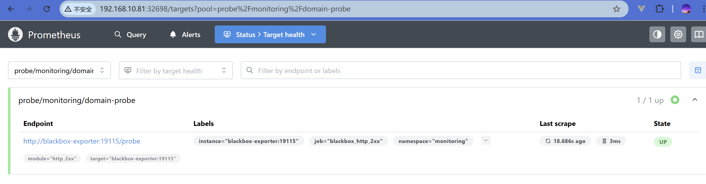

# prometheus operator

**Prometheus Operator** 是一个 Kubernetes Operator，用于简化和自动化 Prometheus 监控栈在 Kubernetes 集群中的部署、配置和管理。它扩展了 Kubernetes API，允许用户通过声明式配置来管理 Prometheus 实例和相关组件。

Prometheus Operator 把 prometheus 监控体系涉及到的所以组件及相关配置都变成自定义资源，然后由自定义的控制器来实现自动化管理。


## 工作原理

自定义的控制器 watch 自定义的资源，发生变化则采取行动。

- **Prometheus**: 创建运行prometheus server的 pod。
- **ServiceMonitor**: 自动发现和监控服务。会转换成监控的 target 然后注入到 prometheus server 的配置文件中，并且自动 reload。
- **PrometheusRule**: 定义告警规则和记录规则。会转换成报警规则然后注入到 prometheus server 的配置文件中，并且自动 reload。
- **Alertmanager**: 管理 Alertmanager 实例。
- **AlertmanagerConfig** 配置资源。会转换成配置然后注入到 alertmanager 服务的配置中，并且自动重载。
- Probe: 监控 Ingress、静态目标等。

~~~bash
┌─────────────────────────────────────────────────┐
│          Custom Resources                       │
│  Prometheus ─ ServiceMonitor ─ PrometheusRule   │
│  AlertManager ─ PodMonitor ─ Probe - etc.       │
└────────────┬────────────────────────────────────┘
             │
┌────────────▼────────────────────────────────────┐
│          Prometheus Operator                    │
│   - 监视CRDs变化                                 │
│   - 生成实际配置                                  │
│   - 管理 Pod/Service 生命周期                     │
└────────────┬────────────────────────────────────┘
             │
┌────────────▼────────────────────────────────────┐
│         Managed Components                      │
│   ┌────────────┐  ┌──────────────┐              │
│   │ Prometheus │  │ Alertmanager │              │
│   └────────────┘  └──────────────┘              │
└─────────────────────────────────────────────────┘
~~~

~~~alert type=note
Prometheus资源----ServiceMonitor资源----service资源---提供/metrics接口的endpoint <br>
Prometheus资源----prometheusRule资源
~~~


## 使用 Operator 清单安装

官网：https://github.com/prometheus-operator/prometheus-operator

想要安装完整版监控栈请移步 [kube-prometheus](https://github.com/prometheus-operator/kube-prometheus)

安装前注意版本兼容问题，我的 k8s 集群是 1.31，因此我选择安装 kube-prometheus 的版本为 release-0.16

| kube-prometheus stack                                        | Kubernetes 1.29 | Kubernetes 1.30 | Kubernetes 1.31 | Kubernetes 1.32 | Kubernetes 1.33 | Kubernetes 1.34 |
| ------------------------------------------------------------ | --------------- | --------------- | --------------- | --------------- | --------------- | --------------- |
| [`release-0.14`](https://github.com/prometheus-operator/kube-prometheus/tree/release-0.14) | ✔               | ✔               | ✔               | x               | x               | x               |
| [`release-0.15`](https://github.com/prometheus-operator/kube-prometheus/tree/release-0.15) | x               | x               | ✔               | ✔               | ✔               | x               |
| [`release-0.16`](https://github.com/prometheus-operator/kube-prometheus/tree/release-0.16) | x               | x               | ✔               | ✔               | ✔               | ✔               |
| [`main`](https://github.com/prometheus-operator/kube-prometheus/tree/main) | x               | x               | x               | ✔               | ✔               | ✔               |


下载安装包

~~~bash
# 下载
wget https://github.com/prometheus-operator/kube-prometheus/archive/refs/tags/v0.16.0.tar.gz

# 解压
tar xf kube-prometheus-0.16.0.tar.gz

# 切换目录
cd kube-prometheus-0.16.0
~~~


替换国内镜像，把如下文件中的镜像替换成国内的镜像（可能还有其他文件中的镜像需要替换，遇到了再说）

~~~bash
manifests/prometheusAdapter-deployment.yaml
manifests/kubeStateMetrics-deployment.yaml
manifests/prometheusOperator-deployment.yaml
manifests/nodeExporter-daemonset.yaml
manifests/alertmanager-alertmanager.yaml
manifests/blackboxExporter-deployment.yaml
manifests/grafana-deployment.yaml
manifests/prometheus-prometheus.yaml
~~~


部署

~~~bash
# 创建一个名为 monitoring 的命名空间，以及相关的 CRD 资源对象声明
kubectl apply --server-side -f manifests/setup


# 在原地等待这些资源上面的CRD资源处于可用状态
# 命令结果输出xxxxxxxxxxxxxxxxx condition met代表ok
kubectl wait \
--for condition=Established \
--all CustomResourceDefinition \
--namespace=monitoring

# 部署 Operator的资源清单以及各种监控对象声明
kubectl apply -f manifests/
~~~

清理

~~~bash
kubectl delete -f manifests/
kubectl delete -f manifests/setup/ # 删除前面的诸多CRD声明、包括名称空间

# 当名称空间的删除阻塞在原地时，建议等一会
~~~

prometheus 及 alertmanager 的配置都是 secret 形式，可以使用如下三种方式查看

~~~bash
1、进入pod内直接查看明文
2、在web页面中查看
3、对secret进行解码
kubectl -n monitoring get secrets prometheus-k8s \
-o json| jq -r '.data."prometheus.yaml.gz"' | base64 -d | gzip -d
~~~

修改三个 svc 的类型为 nodeport，以便外部访问

~~~bash
kubectl -n monitoring edit svc alertmanager-main
kubectl -n monitoring edit svc grafana
kubectl -n monitoring edit svc prometheus-k8s
~~~


安装完 Prometheus Operator 之后，k8s 的节点、k8s 组件都被监控起来了，也就是说大多数监控都被监控起来了、并且对接好了grafana 可以出图。

但还有可以完善的地方：

- 报警还没有做
- 除了 Kubernetes 集群中的一些资源对象、节点以及组件需要监控，有的时候我们可能还需要根据实 际的业务需求去添加自定义的监控项。
- 持久化存储卷。默认都是 emptyDir，pod 重启数据丢失。


## 自定义监控

#### 前置知识点

ServiceMonitor 和 PrometheusRule 解决了 Prometheus 配置难维护问题，开发者不再需要通过修改 ConfigMap 把配置文件更新到 Pod 内再手动触发 webhook 热更新，只需要修改这两个对象资源就可以了.

- ServiceMoinitor 对应的是生成 target 监控指标。
- PrometheusRule 对应的是产生报警规则。


#### 原理

在 Prometheus Operator 中添加一个自定义的监控项非常简单。

- 第一步。确认被监控的应用对外暴漏了一个 `/metrics` 接口（可以是服务自带、也可以是安装的 exporter 提供的，该接口的服务不一定要跑在 k8s 中，只要是 endpoint 格式即可：http://ip:port 可以访问）
- 第二步。创建一个 svc 来关联上面的 endpoint
- 第三步。创建一个 ServiceMonitor 来选中 svc


#### 示例：监控 etcd

etcd 自身就提供了 `/metrics` 接口，不用额外安装 exporter 了，但是端口监听在 `127.0.0.1`上，需要改为 `0.0.0.0`，否则无法暴漏出来，导致 Prometheus server 无法跨节点拉取监控指标。

所有安装 etcd 的节点都要修改，修改后，每个节点上的 kubelet 发现变化后会自动更新静态 pod

~~~yaml
# 修改后的样子
[root@k8s-master-01 monitor]# grep 'listen-metrics-urls' /etc/kubernetes/manifests/etcd.yaml 
    - --listen-metrics-urls=http://0.0.0.0:2381
~~~

创建 svc 代理所有 etcd pod

~~~yaml
# etcd-svc.yaml
apiVersion: v1
kind: Service
metadata:
  name: etcd-svc	
  namespace: kube-system
  labels:
    app.kubernetes.io/component: etcd
    app.kubernetes.io/name: etcd
    k8s-app: etcd
spec:
  clusterIP: None
  ports:
  - name: port	# servicemonitor 会使用到这个名字
    port: 2381
    targetPort: 2381
    protocol: TCP
  selector:
    component: etcd	  # 筛选 scheduler pod
~~~

创建 serviceMonitor

~~~yaml
# kubernetesControlPlane-serviceMonitorEtcd.yaml
apiVersion: monitoring.coreos.com/v1
kind: ServiceMonitor
metadata:
  name: etcd-k8s
  namespace: monitoring
  labels:
    k8s-app: etcd-k8s
spec:
  jobLabel: k8s-app
  endpoints:
    - port: port
      interval: 15s
  selector:
    matchLabels:
      k8s-app: etcd  # 选中svc
  namespaceSelector:
    matchNames:
      - kube-system
~~~

上述创建 svc 、servicemonitor 即可完成监控 etcd。

下面再看看如何使用一种更加通用的方式监控服务。

也可以把 etcd 当成独立于集群之外的服务，直接用 `ip:port` 来关联的，所以下面我们可以使用另一种 svc 并没有定义一个 selector 选择器来选中相关 pod，也正因为没有用标签选择器去选中 pod，所以我们需要自定义 endpoint 来找到被 svc 关联的应用。

~~~yaml
# etcd-svc.yaml
apiVersion: v1
kind: Service
metadata:
  name: etcd-k8s
  namespace: kube-system
  labels:
    k8s-app: etcd  # 这里的标签就是为serviceMonitor准备的，一会serviceMonitor就用该标签
spec:
  type: ClusterIP
  clusterIP: None
  ports:
  - name: port
    port: 2381
---
apiVersion: v1
kind: Endpoints
metadata:
  name: etcd-k8s
  namespace: kube-system
  labels:
    k8s-app: etcd   # 这里的标签必须要与svc的保持一致
subsets:
  # 指定etcd节点地址，如果是集群则继续向下添加
  - addresses:
      - ip: 192.168.10.81
        nodeName: k8s-master-01
      - ip: 192.168.10.82
        nodeName: k8s-master-02
      - ip: 192.168.10.83
        nodeName: k8s-master-03
    ports:
      - name: port
        port: 2381
~~~


## 配置报警

我们去查看 Prometheus Dashboard 的 Alert 页面下面就已经有很多报警规则。

这一系列的规则其实都来自于项目 https://github.com/kubernetes-monitoring/kubernetes-mixin， 我们都通过 Prometheus Operator 安装配置上了。

只需要使用 PrometheusRule 资源创建配置清单即可。应用后，会自动往 prometheus server pod 内的配置路径下塞一个新的报警规则

~~~yaml
rule_files:
# 这下面所有的yaml结果的文件都是报警规则
- /etc/prometheus/rules/prometheus-k8s-rulefiles-0/*.yaml 
~~~

之所以添加 PrometheusRule 资源，可以被找到并放到Prometheus server 的配置中，是因为 Prometheus server 是由 Prometheus 资源产生的，在该资源中使用了选择器来选中 PrometheusRule 资源。

~~~yaml
[root@k8s-master-01 /monitor]# kubectl -n monitoring get prometheus k8s -o yaml
apiVersion: monitoring.coreos.com/v1
kind: Prometheus
metadata:
  ..............................
  name: k8s
  namespace: monitoring
spec:
  .....
  ruleSelector: {} 
  # 这个就是用来选中PrometheusRule的规则选择器，这里设置的空，代表可以匹配所有
~~~

如果你想只匹配 prometheus=k8s 和 role=alert-rules 标签的 PrometheusRule 资源对象，则可以添加下面的配置：

~~~yaml
ruleSelector:
  matchLabels:
    prometheus: k8s
    role: alert-rules
~~~

对应着你创建的 PrometheusRule 资源就需要带上相关标签。

但是此处人家设置的是 `ruleSelector: {}` 代表可以选中所有 PrometheusRule 对象，所以我们创建 PrometheusRule 对象时不必加什么专门的标签，这是非常方便的。


#### 报警示例

需求：如下创建一个 etcd 的报警规则，不可用 etcd 数超过一半就触发报警。

做法：

1. 创建一个 PrometheusRule 资源，定义报警的指标和阈值。
2. 创建一个 alertmanager 的配置，配置报警消息发出的媒介。

其中，创建 alertmanager  的配置具体有两种方式

- 方式1：直接修改 alertmanager-secert 主配置文件。在这个文件中添加报警媒介的使用规则。
- 方式2：使用 alertmanagerConfig 资源，直接为 alertmanager 资源提供配置。不需要修改重启 alertmanager 实例。但是有一个小 BUG（会自动把标签 `namespace=monitoring` 自动加到报警消息的匹配逻辑上，如果 PrometheusRule  中没有给报警消息加上这个标签，则匹配失败）。


#### 使用方式1：实现邮件和钉钉同步发送报警消息

如下创建一个 etcd 的报警规则，不可用 etcd 数超过一半就触发报警。

~~~yaml
# prometheus-etcdRules.yaml
apiVersion: monitoring.coreos.com/v1
kind: PrometheusRule
metadata:
  name: etcd-rules
  namespace: monitoring
  # labels:  # 可选：如果需要被特定的 Prometheus 实例选择
  #   prometheus: k8s
  #   role: alert-rules
spec:
  groups:
  - name: etcd
    rules:
    - alert: EtcdClusterUnavailable
      annotations:
        summary: etcd cluster small
        description: If one more etcd peer goes down the cluster will be unavailable
      expr: |
        count(up{job="etcd"} == 0) > ceil(count(up{job="etcd"}) / 2)
      for: 1m
      # for: 3m  # 通常生产环境建议 3m 或更长
      labels:
        severity: critical
~~~

部署 钉钉 webhook

- 略

【**不建议**】直接修改一下 altermanager 的配置的原始 yaml 文件 `alertmanager-secret.yaml`

~~~yaml
# /manifest/alertmanager-secret.yaml
apiVersion: v1
kind: Secret
metadata:
  labels:
    app.kubernetes.io/component: alert-router
    app.kubernetes.io/instance: main
    app.kubernetes.io/name: alertmanager
    app.kubernetes.io/part-of: kube-prometheus
    app.kubernetes.io/version: 0.28.1
  name: alertmanager-main
  namespace: monitoring
stringData:
  alertmanager.yaml: |-
    "global":
      "resolve_timeout": "5m"
      "smtp_smarthost": "smtp.qq.com:465"
      "smtp_from": "1505797244@qq.com
      "smtp_auth_username": "1505797244@qq.com"
      "smtp_auth_password": "uliijzrcgpngiied" 
      "smtp_require_tls": false
    "receivers":
    - "name": "Default"
    - "name": "Watchdog"
    - "name": "Critical"
    - "name": "null"
    - "name": "mywebhook"
      "webhook_configs":
        - "url": "http://promoter.monitor:8080/dingtalk/webhook1/send"
          "send_resolved": true
    - "name": "email"
       "email_configs":
         - "to": "1505797244@qq.com"
           "send_resolved": true
    "route":
      "group_by":
      - "namespace"
      "group_interval": "1m"
      "group_wait": "30s"
      "repeat_interval": "1m"
      "receiver": "mywebhook"
      "routes":
      - "matchers":
        - "severity = kaxon-critical"
        "receiver": "mywebhook"
        "continue": true
      - "matchers":
        - "severity = kaxon-critical"
        "receiver": "email"
        "continue": true
type: Opaque
~~~

修改保存后，apply -f 应用，得到一个名为 `alertmanager-main` 的 secret 资源。


【**建议的方式**】上述直接直接文件的方式比较麻烦，也可以先把 `alertmanager-main` 删除，然后使用自己的文件创建这个 secret 资源，

1. 删除 altermanager 原来的主配置资源 `alertmanager-main`

~~~bash
kubecte -n monitoring delete secret alertmanager-main
~~~

2. 新建 myself.conf 文件

~~~
global:
  resolve_timeout: 5m
  smtp_smarthost: 'smtp.qq.com:465'
  smtp_from: '1505797244@qq.com'
  smtp_auth_username: '1505797244@qq.com'
  smtp_auth_password: 'uliijzrcgpngiied' 
  smtp_require_tls: false

route:
  group_interval: 1m
  group_wait: 30s
  receiver: mywebhook
  repeat_interval: 1m
  routes:
  - matchers:
    - severity = kaxon-critical
    receiver: mywebhook
    continue: true
  - matchers:
    - severity = kaxon-critical
    receiver: email
    continue: true

receivers:
- name: mywebhook
  webhook_configs:
  - url: 'http://promoter.monitor:8080/dingtalk/webhook1/send'
    send_resolved: true

- name: email
  email_configs:
  - to: '1505797244@qq.com'
    send_resolved: true
~~~

3. 创建新的 altermanager   资源 `alertmanager-main`

~~~bash
kubectl create secret generic alertmanager-main --from-file=alertmanager.yaml -n monitoring
~~~

4. 查看 secret ，如下 alertmanager-main-generated 就是 alertmanager-main 创建配置的结果。

~~~bash
[root@k8s-master-01 monitor]# kubectl -n monitoring get secret
NAME                                                TYPE     DATA   AGE
alertmanager-main                                   Opaque   1      2m50s
alertmanager-main-cluster-tls-config                Opaque   1      4h19m
alertmanager-main-generated                         Opaque   1      4h19m
alertmanager-main-tls-assets-0                      Opaque   0      4h19m
alertmanager-main-web-config                        Opaque   1      4h19m
grafana-config                                      Opaque   1      4h19m
grafana-datasources                                 Opaque   1      4h19m
prometheus-k8s                                      Opaque   1      4h19m
prometheus-k8s-thanos-prometheus-http-client-file   Opaque   1      4h19m
prometheus-k8s-tls-assets-0                         Opaque   0      4h19m
prometheus-k8s-web-config                           Opaque   1      4h19m
~~~

可以使用如下命令查看配置是否满足需求，当然也可以到 web ui 上看（`http://<node ip>:<nodeport>/#/status`）

~~~bash
[root@k8s-master-01 monitor]# kubectl get secret alertmanager-main-generated -n monitoring -o json | jq -r '.data."alertmanager.yaml.gz"' | base64 -d | gzip -d
global:
  resolve_timeout: 5m
  smtp_smarthost: 'smtp.qq.com:465'
  smtp_from: 'xxx@qq.com'
  smtp_auth_username: 'xxx@qq.com'
  smtp_auth_password: 'i....h' 
  smtp_require_tls: false

route:
  group_interval: 1m
  group_wait: 30s
  receiver: mywebhook
  repeat_interval: 1m
  routes:
  - matchers:
    - severity = kaxon-critical
    receiver: mywebhook
    continue: true
  - matchers:
    - severity = kaxon-critical
    receiver: email
    continue: true

receivers:
- name: mywebhook
  webhook_configs:
  - url: 'http://promoter.monitor:8080/dingtalk/webhook1/send'
    send_resolved: true

- name: email
  email_configs:
  - to: 'xxx@qq.com'
    send_resolved: true
~~~

然后就可以同时收到邮件消息和钉钉消息了。

**使用自定义邮件模板**

创建 alertmanager.yaml 配置文件，使用 `templates` 指定模板文件在容器内的路径。使用 eamil 的  receiver 下面使用 `html` 配置使用模板的名字为 `email.html`

~~~yaml
templates:
    - '/etc/alertmanager/config/template_email.tmpl'
global:
  resolve_timeout: 5m
  smtp_smarthost: 'smtp.qq.com:465'
  smtp_from: '1505797244@qq.com'
  smtp_auth_username: '1505797244@qq.com'
  smtp_auth_password: 'uliijzrcgpngiied' 
  smtp_require_tls: false

route:
  group_interval: 1m
  group_wait: 30s
  receiver: mywebhook
  repeat_interval: 1m
  routes:
  - matchers:
    - severity = kaxon-critical
    receiver: mywebhook
    continue: true
  - matchers:
    - severity = kaxon-critical
    receiver: email
    continue: true

receivers:
- name: mywebhook
  webhook_configs:
  - url: 'http://promoter.monitor:8080/dingtalk/webhook1/send'
    send_resolved: true

- name: email
  email_configs:
  - to: '1505797244@qq.com'
    send_resolved: true
    html: '{{ template "email.html" . }}'
~~~

创建一个模板文件 template_email.tmp，其中定义了模板的名字为  `email.html`

~~~
{{ define "email.html" }}
{{- if gt (len .Alerts.Firing) 0 -}}
    @报警<br>
    {{- range .Alerts }}
    <strong>实例:</strong> {{ .Labels.instance }}<br>
    <strong>概述:</strong> {{ .Annotations.summary }}<br>
    <strong>详情:</strong> {{ .Annotations.description }}<br>
    <strong>时间:</strong> {{ (.StartsAt.Add 28800e9).Format "2006-01-02 15:04:05" }}
    <br>
    {{- end -}}
{{- end }}
{{- if gt (len .Alerts.Resolved) 0 -}}
    @恢复<br>
    {{- range .Alerts }}
    <strong>实例:</strong> {{ .Labels.instance }}<br>
    <strong>信息:</strong> {{ .Annotations.summary }}<br>
    <strong>恢复:</strong> {{ (.StartsAt.Add 28800e9).Format "2006-01-02 15:04:05" }}
    <br>
    {{- end -}}
{{- end }}
{{ end }}

~~~

删除当前的 alertmanager-secret 资源，创建新的 alertmanager-secret

~~~bash
kubectl create secret generic alertmanager-main \
--from-file=alertmanager.yaml \
--from-file=template_email.tmpl \
-n monitoring
~~~


#### 使用方式2：实现邮件和钉钉同步发送报警消息

即使用创建 AlertmanagerConfig 资源对象的方式实现报警消息通知的配置。

~~~bash
# 在 altermanager 资源中设置标签来选中你的 AltermanagerConfig 资源
$ vim kube-prometheus/manifests/alertmanager-alertmanager.yaml
...
serviceAccountName: alertmanager-main
version: 0.27.0
alertmanagerConfigSelector: # 匹配 AlertmanagerConfig 的标签
  matchLabels:
    alertmanagerConfig: example
~~~

然后重新部署

~~~bash
kubectl apply -f kube-prometheus/manifests/alertmanager-alertmanager.yaml
~~~

然后创建 AlertmanagerConfig 资源，注意必须加上标签 alertmanagerConfig: example

下面以发邮件通知为例介绍

创建 邮件密码 secret

~~~bash
kubectl create secret generic my-email-secret --from-literal=password='ias...agh' -n monitoring
~~~

创建 AlertmanagerConfig 资源

~~~yaml
# alertmanager-config.yaml
# 配置2 邮件
apiVersion: monitoring.coreos.com/v1alpha1
kind: AlertmanagerConfig
metadata:
  name: config1
  namespace: monitoring
  labels:
    alertmanagerConfig: example  # 必须加上标签，用于 Alertmanager 选择
spec:
  route:
    receiver: email
    groupWait: 30s
    groupInterval: 1m
    repeatInterval: 1m
    continue: true
    matchers:
    - name: severity
      value: kaxon-critical
      regex: false
  
  receivers:
  - name: email
    emailConfigs:
    - to: 'xxx@qq.com'
      from: 'xxx@qq.com'
      hello: qq.com
      smarthost: 'smtp.qq.com:465'
      authUsername: 'xxx@qq.com'
      authIdentity: 'xxx@qq.com'
      authPassword:
        name: my-email-secret		# 引用 secret 
        key: password
      requireTLS: false
      sendResolved: true
      
---
# 配置1 钉钉
apiVersion: monitoring.coreos.com/v1alpha1
kind: AlertmanagerConfig
metadata:
  name: config2
  namespace: monitoring
  labels:
    alertmanagerConfig: example  # 必须加上标签，用于 Alertmanager 选择
spec:
  route:
    receiver: mywebhook
    groupWait: 30s
    groupInterval: 1m
    repeatInterval: 1m
    continue: true
    
    matchers:
    - name: severity
      value: kaxon-critical
      regex: false
     
  receivers:
  - name: mywebhook
    webhookConfigs:
    - url: "http://promoter.monitor:8080/dingtalk/webhook1/send"
      sendResolved: true 
~~~

应用后然后查看

~~~bash
[root@k8s-master-01 monitor]# kubectl apply -f alertmanager-config.yaml 
alertmanagerconfig.monitoring.coreos.com/config1 created
alertmanagerconfig.monitoring.coreos.com/config2 created
[root@k8s-master-01 monitor]# 
[root@k8s-master-01 monitor]# 
[root@k8s-master-01 monitor]# kubectl -n monitoring  get alertmanagerconfigs.monitoring.coreos.com
NAME      AGE
config1   7s
config2   7s
[root@k8s-master-01 monitor]# kubectl get secret alertmanager-main-generated -n monitoring -o json | jq -r '.data."alertmanager.yaml.gz"' | base64 -d | gzip -d
global:
  resolve_timeout: 5m
route:
  receiver: Default
  group_by:
  - namespace
  routes:
  - receiver: monitoring/config1/email
    matchers:
    - severity="kaxon-critical"
    - namespace="monitoring"
    continue: true
    group_wait: 30s
    group_interval: 1m
    repeat_interval: 1m
  - receiver: monitoring/config2/mywebhook
    matchers:
    - severity="kaxon-critical"
    - namespace="monitoring"
    continue: true
    group_wait: 30s
    group_interval: 1m
    repeat_interval: 1m
  - receiver: Watchdog
    matchers:
    - alertname = Watchdog
  - receiver: "null"
    matchers:
    - alertname = InfoInhibitor
  - receiver: Critical
    matchers:
    - severity = critical
  group_wait: 30s
  group_interval: 1m
  repeat_interval: 1m
inhibit_rules:
- target_matchers:
  - severity =~ warning|info
  source_matchers:
  - severity = critical
  equal:
  - namespace
  - alertname
- target_matchers:
  - severity = info
  source_matchers:
  - severity = warning
  equal:
  - namespace
  - alertname
- target_matchers:
  - severity = info
  source_matchers:
  - alertname = InfoInhibitor
  equal:
  - namespace
receivers:
- name: Default
- name: Watchdog
- name: Critical
- name: "null"
- name: monitoring/config1/email
  email_configs:
  - send_resolved: true
    to: xxx@qq.com
    from: xxx@qq.com
    hello: qq.com
    smarthost: smtp.qq.com:465
    auth_username: xxx@qq.com
    auth_password: xxx
    auth_identity: xxx@qq.com
    require_tls: false
- name: monitoring/config2/mywebhook
  webhook_configs:
  - send_resolved: true
    url: http://promoter.monitor:8080/dingtalk/webhook1/send
templates: []
~~~

直接部署 alertmanagerConfig 资源的话，prometheus operator 总会帮你加一个标签 `namespace="monitoring"`

~~~yaml
routes:
- receiver: monitoring/dinghook/email
  group_by:
  - severity
  match:
    mywarn: kaxon-critical
  matchers:
  - namespace="monitoring" # 就是这个标签
~~~

而 math 的与 matchers 二者的标签匹配是一个 and 的关系，就会要求你的报警规则必须同时拥有这两个标签才可以，否则不会发送给该接收器。

可以修改 promtheusRule，多加一个标签 namespace="monitoring"，邮件报警就可以收到了。

~~~yaml
# prometheus-etcdRules.yaml
apiVersion: monitoring.coreos.com/v1
kind: PrometheusRule
metadata:
  name: etcd-rules
  namespace: monitoring
spec:
  groups:
  - name: etcd
    rules:
    - alert: EtcdClusterUnavailable
      annotations:
        summary: etcd cluster small
        description: If one more etcd peer goes down the cluster will be unavailable
      expr: |
        count(up{job="etcd"} == 0) > ceil(count(up{job="etcd"}) / 2)
      for: 1m
      # for: 3m  # 通常生产环境建议 3m 或更长
      labels:
        severity: critical
        namespace: monitoring   ############# 增加这个标签
~~~

部署该 yaml，过一会后确认规则更新 ok，并且重新 firing

注意：使用该方式无法直接指定邮件使用的模板


## 服务自动发现

有了 serviceMornitor 之后，添加监控项非常方便，但是针对大量重复性的监控项，再去一个个的创建 serviceMornitor 去完成监控项的添加依然比较麻烦。

此时可以使用服务自动发现机制。基于 endpoints 的方式自动发现服务，只需要给 svc  打上指定的标签，即可实现 prometheus operator 自动发现服务，不需要再手动一个一个创建 serviceMonitor

并且这要求，prometheus 资源的 pod 内部使用的 serviceAccount 有拉取 k8s 集群所有 endpoints 的权限。

具体做法：

- 给 prometheus  server 注入一个服务发现的配置，这可以使用 prometheus 资源提供字段 `additionalScrapeConfigs` 实现
- 给 prometheus server pod 使用的 serviceAccount 增加拉取 endpoints 的权限。


### 注入服务发现配置

如下是服务自动发现的配置需要注入到 prometheus server 中。prometheus operator 中使用 secret 的方式给 pod 提供配置，当然可以直接修改这个 secret，但是比较麻烦，不推荐。

~~~yaml
# prometheus-additional.yaml
- job_name: 'myendpoints'
  kubernetes_sd_configs:
    - role: endpoints
  relabel_configs: # 指标采集之前或采集过程中去重新配置
    - source_labels: [__meta_kubernetes_service_annotation_prometheus_io_scrape]
      action: keep # 保留具有 prometheus.io/scrape=true 这个注解的Service
      regex: true
    - source_labels: [__meta_kubernetes_service_annotation_prometheus_io_path]
      action: replace
      target_label: __metrics_path__
      regex: (.+)
    - source_labels:
        [__address__, __meta_kubernetes_service_annotation_prometheus_io_port]
      action: replace
      target_label: __address__
      regex: ([^:]+)(?::\d+)?;(\d+) # RE2 正则规则，+是一次多多次，?是0次或1次，其中?:表示非匹配组(意思就是不获取匹配结果)
      replacement: $1:$2
    - source_labels: [__meta_kubernetes_service_annotation_prometheus_io_scheme]
      action: replace
      target_label: __scheme__
      regex: (https?)
    - action: labelmap
      regex: __meta_kubernetes_service_label_(.+)
      replacement: $1
    - source_labels: [__meta_kubernetes_namespace]
      action: replace
      target_label: kubernetes_namespace
    - source_labels: [__meta_kubernetes_service_name]
      action: replace
      target_label: kubernetes_service
    - source_labels: [__meta_kubernetes_pod_name]
      action: replace
      target_label: kubernetes_pod
    - source_labels: [__meta_kubernetes_node_name]
      action: replace
      target_label: kubernetes_node
~~~

推荐直接使用 prometheus 资源提供的字段 `additionalScrapeConfigs`  注入配置。注入需要把上述配置文件做成 secret，然后配置使用即可。

~~~bash
# 做成 secret 
kubectl create secret generic additional-configs --from-file=prometheus-additional.yaml -n monitoring
~~~

修改 promenteus 资源的配置清单增加字段 `additionalScrapeConfigs`  

~~~yaml
# prometheus-prometheus.yaml 
apiVersion: monitoring.coreos.com/v1
kind: Prometheus
metadata:
  ................
  name: k8s
  namespace: monitoring
spec:
  ................
  serviceAccountName: prometheus-k8s
  serviceMonitorNamespaceSelector: {}
  serviceMonitorSelector: {}
  version: 3.5.0
  # 增加如下配置
  # name 就是上面创建的 secret
  # key 就是创建 secret使用的文件名
  additionalScrapeConfigs:
    name: additional-configs
    key: prometheus-additional.yaml
~~~

重新部署，应用后几秒钟即可发现 prometheus pod 内的配置发生变化。

~~~bahs
kubectl apply -f prometheus-prometheus.yaml
~~~

>重新部署 prometheus-prometheus.yaml ，该 yaml 对应的是 prometheus 对象，prometheus 对象代表 prometheus server 服务，operator 发现该 prometheus 对象变更，会自动更新到 prometheus server 完成 reload。


### 更新 sa 权限

如下是 prometheus pod 内使用的 serviceAccount 的权限配置，发现少了 endpoints 的拉取权限，增加即可。

~~~yaml
# prometheus-clusterRole.yaml
apiVersion: rbac.authorization.k8s.io/v1
kind: ClusterRole
metadata:
  labels:
    app.kubernetes.io/component: prometheus
    app.kubernetes.io/instance: k8s
    app.kubernetes.io/name: prometheus
    app.kubernetes.io/part-of: kube-prometheus
    app.kubernetes.io/version: 3.5.0
  name: prometheus-k8s
rules:
- apiGroups:
  - ""
  resources:
  - nodes/metrics
  verbs:
  - get
- nonResourceURLs:
  - /metrics
  - /metrics/slis
  verbs:
  - get
~~~

增加权限后的 `prometheus-clusterRole.yaml`，更新后即可。

~~~yaml
apiVersion: rbac.authorization.k8s.io/v1
kind: ClusterRole
metadata:
  labels:
    app.kubernetes.io/component: prometheus
    app.kubernetes.io/instance: k8s
    app.kubernetes.io/name: prometheus
    app.kubernetes.io/part-of: kube-prometheus
    app.kubernetes.io/version: 2.54.1
  name: prometheus-k8s
rules:
  - apiGroups:
      - ''
    resources:
      - nodes
      - services
      - endpoints
      - pods
      - nodes/proxy
    verbs:
      - get
      - list
      - watch
  - apiGroups:
      - ''
    resources:
      - configmaps
      - nodes/metrics
    verbs:
      - get
  - nonResourceURLs:
      - /metrics
    verbs:
      - get
~~~

测试 redis

~~~yaml
kind: Service
apiVersion: v1
metadata:
  name: redis
  namespace: monitor
  annotations:
    prometheus.io/scrape: 'true'  # -------------------》  必须添加这一行
    prometheus.io/port: '9121'    # port
spec:
  selector:
    app: redis
  ports:
    - name: redis
      port: 6379
      targetPort: 6379
    - name: prom
      port: 9121
      targetPort: 9121  
~~~


## 数据持久化

prometheus operator 默认部署的 prometheus server 挂在卷是 emptyDir，pod 重启数据就丢失。

此外由于 Prometheus 本身对 NFS 存储没有做相关的支持，所以线上一定不要用 NFS 来做数据持久化。

规范的做法还是通过修改自定义资源 prometheus 资源来完成变更（即使 pormetheus pod 是 statefulset 启动的）

~~~bash
prometheus server的pod《------prometheus资源《---------operator控制器
~~~

修改 ` prometheus-prometheus.yaml `，使用 `storeage.volumeClaimTemplate` 完成配置本地数据卷

~~~yaml
# prometheus-prometheus.yaml 
apiVersion: monitoring.coreos.com/v1
kind: Prometheus
metadata:
  ................
  name: k8s
  namespace: monitoring
spec:
  ................
  serviceAccountName: prometheus-k8s
  serviceMonitorNamespaceSelector: {}
  serviceMonitorSelector: {}
  version: 3.5.0
  
  # 注入配置
  additionalScrapeConfigs:
    name: additional-configs
    key: prometheus-additional.yaml
  
  # 修改存储卷类型
  storage:
    volumeClaimTemplate:
      spec:
        storageClassName: local-path
        resources:
          requests:
            storage: 10Gi
~~~

更新部署

~~~bash
kubectl apply -f prometheus-prometheus.yaml
~~~

需要提前部署 sc 帮助自动创建 pv ，并和 pvc 关联。


## Blackbox exporter

黑盒监控程序，模拟用户来发起访问测试，可以朝着指定的服务发起访问请求。包括 HTTP探针、TCP探针、Dns、icmp等用于检测站点、服务的可访问性、服务的连通性、证书过期时间以及访问效率等。

Prometheus operator 自带了 Blackbox exporter，无需再手动安装部署。如果没有使用 Prometheus operator 可以参考如下手动使用 helm 的方式安装。

手动使用 helm 部署

~~~bash
helm repo add prometheus-community https://prometheus-community.github.io/helm-charts
helm repo update

# 下载&解压
helm pull prometheus-community/prometheus-blackbox-exporter
tar -zxvf prometheus-blackbox-exporter.tar.gz
~~~

修改 values.yaml 修改blackbox_exporter配置

```yaml
modules:
  http_2xx:
    prober: http
    timeout: 10s
    http:
      valid_http_versions: ["HTTP/1.1", "HTTP/2"]
      valid_status_codes: [200]
      method: GET
      headers:
        Host: prometheus.example.com
        Accept-Language: en-US
        Origin: example.com
      preferred_ip_protocol: "ip4"
      no_follow_redirects: false
  
  http_post_2xx:
    prober: http
    timeout: 10s
    http:
      valid_http_versions: ["HTTP/1.1", "HTTP/2"]
      method: POST
      headers:
        Content-Type: application/json
      body: '{"text": "hello"}'
      preferred_ip_protocol: "ip4"
  
  tcp_connect:
    prober: tcp
    timeout: 10s
  
  dns_tcp:
    prober: dns
    dns:
      transport_protocol: "udp"
      preferred_ip_protocol: "ip4"
      query_name: "kubernetes.default.svc.cluster.local"
```

部署

~~~bash
helm install blackbox-exporter -n monitor .
~~~


### 使用 Blackbox exporter

如下是 prometheus operator 拉起的 Blackbox exporter svc

~~~bash
[root@k8s-master-02 ~]# kubectl  -n monitoring get svc blackbox-exporter 
NAME                TYPE        CLUSTER-IP      EXTERNAL-IP   PORT(S)              AGE
blackbox-exporter   ClusterIP   10.98.100.169   <none>        9115/TCP,19115/TCP   24h
~~~

想要使用 Blackbox exporter，需要做如下准备工作：

- blockbox 服务要准备好，服务地址为：`blackbox-exporter.monitoring:19115`
- 模拟用户访问行为的模块要定义好，定义黑盒检测 job，注入到 prometheus 服务的配置中实现周期性的黑盒检测。

定义 job 任务必须具备三要素：

1. 源（模拟客户端的程序）：blackbox-exporter.monitoring:19115
2. 模块（模拟客户的访问协议）
3. 目标：被检测的目标服务


#### 准备模块

Blackbox exporter pod 使用了 cm 提供模块的配置信息，修改更新配置信息如下。应用 cm，然后手动重启 blackbox-exporter pod

~~~yaml
# blackboxExporter-configuration.yaml
apiVersion: v1
data:
  config.yml: |-
    "modules":
      "http_2xx":
        "prober": "http"
        "timeout": "5s"
        "http":
          "valid_http_versions": ["HTTP/1.1", "HTTP/2"]
          "valid_status_codes": [200]
          "method": "GET"
          "preferred_ip_protocol": "ip4"
      "http_post_2xx":
        "http":
          "method": "POST"
          "preferred_ip_protocol": "ip4"
        "prober": "http"
      "tcp_connect":
        "prober": "tcp"
        "timeout": "10s"
        "tcp":
          "preferred_ip_protocol": "ip4"

      "dns":  # DNS 检测模块
        "prober": "dns"
        "dns":
          "transport_protocol": "udp"
          "preferred_ip_protocol": "ip4"
          "query_name": "kubernetes.default.svc.cluster.local" # 利用这个域名来检查dns服务器

      "icmp":  # ping 检测服务器的存活
        "prober": "icmp"
        "timeout": "10s"

kind: ConfigMap
metadata:
  labels:
    app.kubernetes.io/component: exporter
    app.kubernetes.io/name: blackbox-exporter
    app.kubernetes.io/part-of: kube-prometheus
    app.kubernetes.io/version: 0.25.0
  name: blackbox-exporter-configuration
  namespace: monitoring
~~~


#### 定义黑盒检测 job

如果你是手动部署的 prometheus 那直接编写 job 即可。

如果使用 prometheus operator，无需手动编写 job，可以定制相关 Probe 资源，自动生成的 prometheus配置信息中的 job 配置。


**HTTP 监控 **

~~~yaml
# probeHttp.yaml
apiVersion: monitoring.coreos.com/v1
kind: Probe
metadata:
  name: domain-probe
  namespace: monitoring
spec:
  jobName: blackbox_http_2xx # 任务名称
  prober: # 指定blackbox的地址
    url: blackbox-exporter:19115
  module: http_2xx # 配置文件中的检测模块
  targets: # 目标
    # ingress <Object>
    staticConfig: # 如果配置了 ingress，静态配置优先
      static:
        - https://baidu.com
      relabelingConfigs:
        - sourceLabels: [__address__]
          targetLabel: __param_target
        - sourceLabels: [__param_target]
          targetLabel: instance
~~~

应用

~~~bash
[root@k8s-master-01 monitor]# kubectl apply -f probeHttp.yaml 
probe.monitoring.coreos.com/domain-probe created
[root@k8s-master-01 monitor]# 
[root@k8s-master-01 monitor]# 
[root@k8s-master-01 monitor]# kubectl -n monitoring get probes.monitoring.coreos.com 
NAME           AGE
domain-probe   14s
~~~

应用后几秒钟，即可在 web 页面中找到对一个的 target




**ping 监测配置**

~~~yaml
apiVersion: monitoring.coreos.com/v1
kind: Probe
metadata:
  name: ping
  namespace: monitoring
spec:
  jobName: ping # 生成到prometheus配置文件中的job任务名称
  prober: # 指定blackbox的地址，注意端口是19115
    url: blackbox-exporter.monitoring:19115
  module: icmp # 引用配置文件中的检测模块
  targets: # 目标
    # ingress <Object>  # 也可以配置监控ingress
    staticConfig: # 如果同时配置了 ingress、staticConfig，那么后者优先级更高
      static:
        - www.baidu.com  # 检测的目标地址，当然可以是ip了，本质就是ping一下
      relabelingConfigs:
        - sourceLabels: [__address__]
          targetLabel: __param_target
        - sourceLabels: [__param_target]
          targetLabel: instance
~~~


**SSL 证书过期时间监测**

~~~yaml
# probeSSLCheck.yaml
apiVersion: monitoring.coreos.com/v1
kind: Probe
metadata:
  name: blockbox-ssl-check
  namespace: monitoring
spec:
  jobName: blockbox_ssl_check # 任务名称
  prober: # 指定blackbox的地址
    url: blackbox-exporter.monitoring:19115
  #module: http_2xx # 配置文件中的检测模块
  module: http_2xx
  targets: # 目标
    staticConfig: 
      static:
        - https://baidu.com
~~~

- 注意，这个 yaml 文件中不需要有 `relabelingConfigs` 配置。


#### 黑盒检测报警

在 prometheus server 增加报警规则的配置，使用 `PrometheusRule` 资源注入。

如下 ssl 证书过期的黑盒检测报警规则。

~~~yaml
# sslCheckRules.yaml
apiVersion: monitoring.coreos.com/v1
kind: PrometheusRule
metadata:
  name: ssl-check-rules
  namespace: monitoring
spec:
  groups:
    - name: sslcheck
      rules:
        - alert: Ssl Cert Will Expire in 7 days
          annotations:
            summary: '域名证书即将过期 (instance {{ $labels.instance }})'
            description: "域名证书 7 天后过期 \n  VALUE = {{ $value }}\n  LABELS: {{ $labels }}"
          expr: |
             probe_ssl_earliest_cert_expiry{job="blockbox_ssl_check"} - time() < 86400 * 700 # 故意让其触发
             #probe_ssl_earliest_cert_expiry{job="blockbox_ssl_check"} - time() < 86400 * 7
          for: 1m
          labels:
            namespace: monitoring
            severity: kaxon-critical  # 设置一个独一无二的标签
~~~


#### 补充
如果你需要手动编写 job 参考如下示例。
- HTTP 监控（监控外部域名）

~~~yaml
- job_name: 'blackbox_http_2xx'
  metrics_path: /probe
  params:
    module: [http_2xx]
  static_configs:
    - targets:
      #- http://prometheus.io    # Target to probe with http.
      #- https://prometheus.io   # Target to probe with https.
      - https://www.baidu.com
  relabel_configs:
    - source_labels: [__address__]
      target_label: __param_target
    - source_labels: [__param_target]
      target_label: instance
    - target_label: __address__
      replacement: prometheus-blackbox-exporter.monitor:9115
~~~

- ping 监测配置。在内网可以通过ping (icmp)检测服务器的存活，以前面的最基本的module配置为例，在Prometheus的配置文件中配置使用ping module：
  

~~~yaml
- job_name: 'blackbox_ping_all'
  scrape_interval: 1m
  metrics_path: /probe
  params:
    module: [ping]
  static_configs:
    - targets:
      - 64.115.3.100
      labels:
        instance: test
  relabel_configs:
    - source_labels: [__address__]
      target_label: __param_target
    - target_label: __address__
      replacement: prometheus-blackbox-exporter.monitor:9115
~~~


  - DNS 监控

~~~yaml
- job_name: "blackbox-k8s-service-dns"
  scrape_interval: 30s
  scrape_timeout: 10s
  metrics_path: /probe
  params:
    module: [dns_tcp]
  static_configs:
    - targets:
      - kube-dns.kube-system:53
  relabel_configs:
    - source_labels: [__address__]
      target_label: __param_target
    - source_labels: [__param_target]
      target_label: instance
    - target_label: __address__
      replacement: prometheus-blackbox-exporter.monitor:9115
~~~


- ICMP监测


~~~yaml
- job_name: node_status
    metrics_path: /probe
    params:
      module: [icmp]
    static_configs:
      - targets: ['10.165.94.31']
        labels:
          instance: node_status
          group: 'node'
    relabel_configs:
      - source_labels: [__address__]
        target_label: __param_target
      - target_label: __address__
        replacement: prometheus-blackbox-exporter.monitor:9115 # blackbox-exporter Sevice 地址端口
~~~


- TCP监测


~~~yaml
- job_name: 'prometheus_port_status'
    metrics_path: /probe
    params:
      module: [tcp_connect]
    static_configs:
      - targets: ['172.19.155.133:8765']
        labels:
          instance: 'port_status'
          group: 'tcp'
    relabel_configs:
      - source_labels: [__address__]
        target_label: __param_target
      - source_labels: [__param_target]
        target_label: instance
      - target_label: __address__
        replacement: prometheus-blackbox-exporter.monitor:9115 # blackbox-exporter Sevice 地址端口
~~~


- SSL 证书过期时间监测

~~~yaml
rule_files:
  - ssl_expiry.rules
scrape_configs:
  - job_name: 'blackbox'
    metrics_path: /probe
    params:
      module: [http_2xx]  # Look for a HTTP 200 response.
    static_configs:
      - targets:
        - example.com  # Target to probe
    relabel_configs:
      - source_labels: [__address__]
        target_label: __param_target
      - source_labels: [__param_target]
        target_label: instance
      - target_label: __address__
        replacement: prometheus-blackbox-exporter.monitor:9115 # blackbox-exporter Sevice 地址端口
~~~


一些告警规则示例

~~~yaml
cat >> prometheus/rules/blackbox_exporter.yml <<"EOF"
groups:
- name: Blackbox
  rules:
  - alert: 黑盒子探测失败告警
    expr: probe_success == 0
    for: 1m
    labels:
      severity: critical
    annotations:
      summary: "黑盒子探测失败{{ $labels.instance }}"
      description: "黑盒子检测失败，当前值：{{ $value }}"
  - alert: 请求慢告警
    expr: avg_over_time(probe_duration_seconds[1m]) > 1
    for: 1m
    labels:
      severity: warning
    annotations:
      summary: "请求慢{{ $labels.instance }}"
      description: "请求时间超过1秒，值为：{{ $value }}"
  - alert: http状态码检测失败
    expr: probe_http_status_code <= 199 OR probe_http_status_code >= 400
    for: 1m
    labels:
      severity: critical
    annotations:
      summary: "http状态码检测失败{{ $labels.instance }}"
      description: "HTTP状态码非 200-399，当前状态码为：{{ $value }}"
  - alert: ssl证书即将到期
    expr: probe_ssl_earliest_cert_expiry - time() < 86400 * 30
    for: 1m
    labels:
      severity: warning
    annotations:
      summary: "证书即将到期{{ $labels.instance }}"
      description: "SSL 证书在 30 天后到期，值：{{ $value }}"

  - alert: ssl证书即将到期
    expr: probe_ssl_earliest_cert_expiry - time() < 86400 * 3
    for: 1m
    labels:
      severity: critical
    annotations:
      summary: "证书即将到期{{ $labels.instance }}"
      description: "SSL 证书在 3 天后到期，值：{{ $value }}"

  - alert: ssl证书已过期
    expr: probe_ssl_earliest_cert_expiry - time() <= 0
    for: 1m
    labels:
      severity: critical
    annotations:
      summary: "证书已过期{{ $labels.instance }}"
      description: "SSL 证书已经过期，请确认是否在使用"
EOF
~~~


  