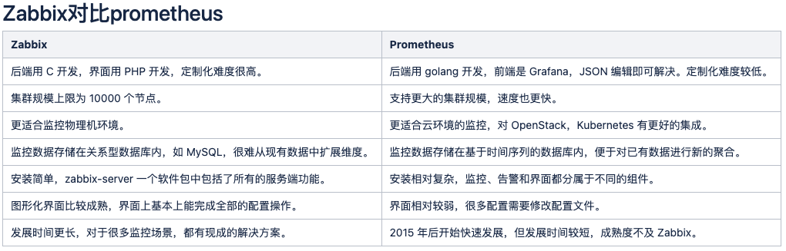
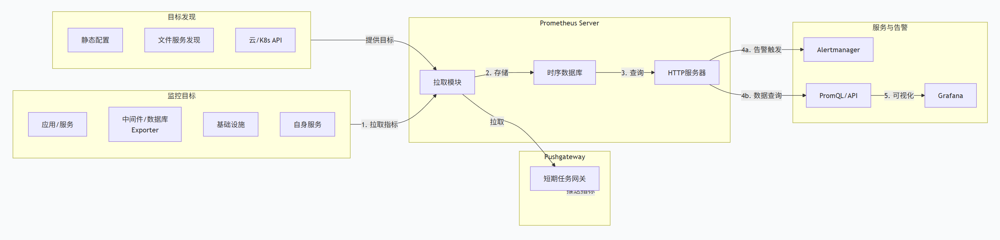

# Prometheus

## 前置知识

#### 监控分为两大类
- 白盒监控。了解系统内部细节，主要为预防，防患于未然。
- 黑盒监控。不关心细节，只关心是否 OK。侧重于眼前的问题，尽早发现（早于用户）、第一时间处理。

通过白盒监控能够提前预知业务瓶颈，通过黑盒监控能够第一时间发现业务故障并通过告警通告运维人员采取紧急恢复，从而将业务影响降到最低。

#### 监控的目的
- 长期趋势分析，预测未来的扩容。
- 查历史监控，故障根因分析。
- 对照分析，明确不同版本的运行情况。
- 告警通知，超过阈值则报警，提前处理问题，防患于未然。
- 系统状态时时了然于胸。

通过业务监控系统，全面掌握业务环境的运行状态。

#### 监控方案

- zabbix
- prometheus（物理机、应用的运行状态、k8s）

## Prometheus 架构

Prometheus 是一个开源的系统监控和警报工具包，其架构设计以**拉取模型**和**多维数据模型**为核心。下图清晰地展示了其核心组件和数据流。

#### 三段式架构

上游的组件负责采集数据（监控指标），中间的组件负责保存数据，下游负责展示数据。

#### Prometheus Server

Prometheus Server（核心服务器）这是 Prometheus 架构的心脏，主要负责数据的收集、存储和查询。

- **Retrieval（拉取组件）**：根据配置（静态文件或服务发现），主动从监控目标（Target）拉取（Scrape） 指标数据（HTTP 协议）。
- **TSDB（时序数据库）**：将拉取到的时序数据高效地存储在本地的自定义时序数据库中。数据按时间序列组织，每个数据点包含时间戳和值。
- **HTTP Server**：提供内置的 Web UI（表达式浏览器）和 HTTP API，用于执行 PromQL 查询、查看状态或集成 Grafana 等工具。

#### 导出器

Exporters（导出器）是 Prometheus 扩展监控能力的桥梁。

- **作用**：将第三方系统（如MySQL, Linux主机，Nginx，硬件设备）的原始监控数据，转换成 Prometheus 能够识别的标准格式（HTTP + 纯文本Metrics）。
- **类型**：
  - **官方/社区提供**：如 `node_exporter`（主机指标）， `mysqld_exporter`， `blackbox_exporter`（网络探测）。
  - **自定义开发**：应用程序可以通过客户端库（如Go， Java， Python）直接暴露 Prometheus 格式的指标。

#### 服务发现

Service Discovery（服务发现）动态发现需要监控的目标，是现代动态环境（如Kubernetes，云）的关键。

- **作用**：自动发现并列出监控目标列表，无需手动修改配置文件。
- **支持来源**：Kubernetes， Consul， EC2， Azure， 文件等。

#### 推送网关

Pushgateway（推送网关）是一种特殊的中间组件，用于适配短暂的、生命周期不固定的任务。

- **作用**：这些任务（如批处理作业、Cron Job）无法在存活时被拉取，可以在退出前将指标**推送**到 Pushgateway 暂存。随后，Prometheus Server 再从 Pushgateway 拉取这些数据。
- **注意**：它不是持久化存储，通常只用于短期任务。

#### 客户端工具

Client Libraries（客户端库）用于在应用程序中直接集成 Prometheus 监控，方便暴露自定义的业务指标。

- **支持语言**：Go， Java， Python， Ruby 等。
- **提供类型**：Counter（计数器）， Gauge（仪表盘）， Histogram（直方图）， Summary（摘要）。

#### 告警器

Alertmanager（告警器）负责处理由 Server 产生的警报，进行去重、分组、静默、路由和通知。

- **工作流程**：Prometheus Server 根据配置的**告警规则**（Alert Rule）触发警报，并将其**推送**给 Alertmanager 集群。Alertmanager 将警报通过电子邮件、Slack、PagerDuty、Webhook 等渠道发送给相关人员。

#### 核心工作流程（数据流）

结合上面的架构图，其核心数据流如下：

1. **配置与发现**：Prometheus Server 加载配置，通过 **Service Discovery** 或静态配置获取监控目标（Targets）列表。
2. **拉取指标**：Server 中的 **Retrieval** 模块定期（如15秒）向这些 Targets 发起 HTTP 请求，拉取 Metrics 数据。
3. **存储数据**：拉取到的数据被压缩并存入本地的 **TSDB**。
4. **规则评估**：Server 定期根据配置的**记录规则**（预计算常用查询）和**告警规则**对数据进行计算。
5. **告警触发**：如果满足告警条件，Server 将警报发送给 **Alertmanager**。
6. **告警处理**：Alertmanager 对警报进行一系列处理，最后发送通知。
7. **数据查询与展示**：用户通过 **PromQL** 在 Web UI、Grafana 或通过 HTTP API 查询数据。对于短期任务，数据通过 **Pushgateway** 中转。

