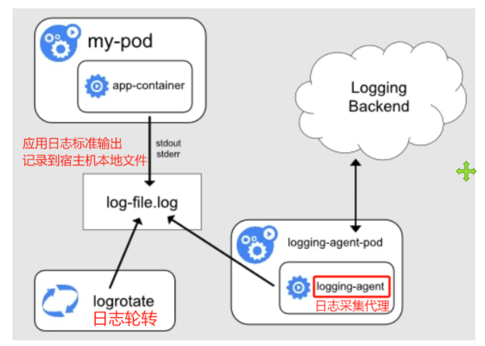
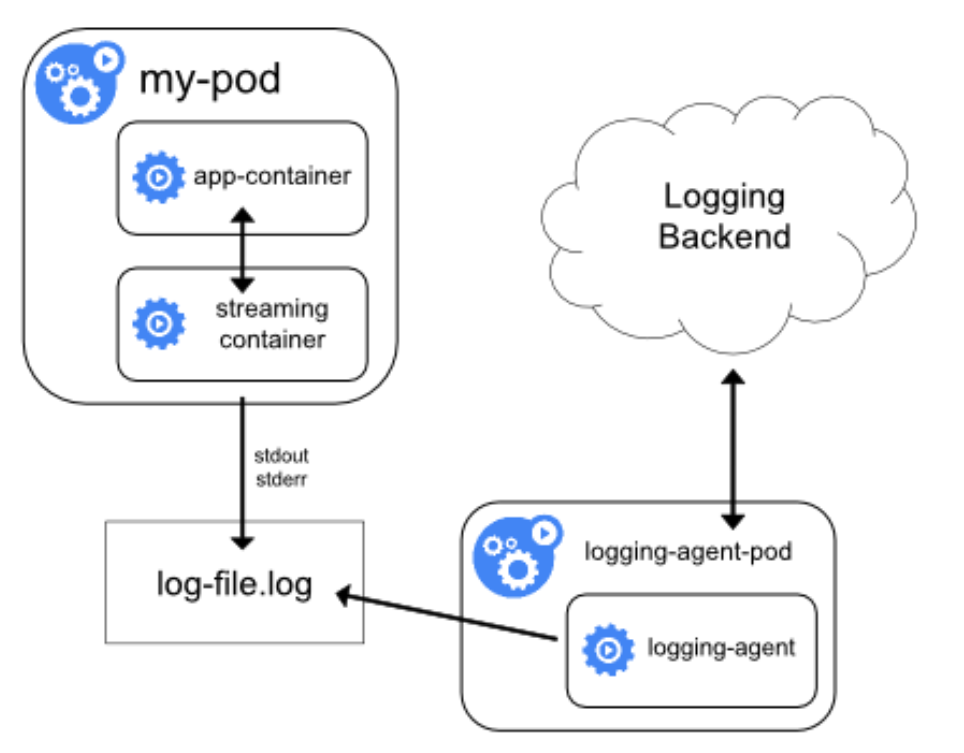

# 日志系统

日志系统就是一个负责把软件以及系统的运行日志都统一采集到一个平台中的系统。

有了这个统一日志系统之后，我们观测与分析日志来判定问题的根因就有了一个统一平台。


**储备知识**

如果 pod 内的容器跑的应用程序是直接把日志扔到标准输出，特点有二：

- 该日志会映射到宿主机的文件

~~~bash
/var/log/pods/default_mynginx-8495...e08b94/
# 对应有软连接文件：
/var/log/containers/mynginx-8495db6b9f-7c9ww_default_nginx-test-329bd7xxxeb82.log 
~~~

- 如果 pod 内容器应用示把日志直接扔到了标准输出，则可以 kubectl logs 查看。

如果 pod 内的容器跑的应用程序是把日志写入了容器内的某个文件中：

- 没有一个统一的文件路径
- 不能用 kubectl logs 来查看


## k8s 环境的日志方案

### 方案1：在节点上运行一个 agent 来收集日志

前提：pod 内的应用会将日志输出的标准输出，如此日志才会记录到宿主机本地文件中，节点日志采集代理才能正常工作。

每个节点上运行一个日志收集的 agent 来采集日志数据，会把宿主机的目录/ var/log/containers 以 hostpath 形式挂载给 daemonset 的pod，日志 agent 会读取里面所有日志然后发往日志后端。

优点：简单方便。在节点上运行一个日志收集的 agent 这种方式是最常见的一种方法，因为它只需要在每个节点上运行一个代理程序，并不需要对节点上运行的应用程序进行更改，对应用程序没有任何侵入性。

缺点：适用场景有局限。仅仅适用于收集会将日志输出到 stdout 和 stderr 的应用程序日志。因为只有如此，才会记录到宿主机的本地文件中，节点日志采集代理才能采集到。




### 方案2：用 sidecar 容器来把日志扔到标准输出

在 pod 内侵入/嵌入一个 sidecar 容器，与产生日志的业务容器共享存储卷（存日志的卷），然后 sidecar 容器读取容器内日志文件的内容后丢给标准输出，其后的步骤就与上一小节的一样了。

具体部署

- 日志采集agent：daemonset+hostPath
- 没有把日志输出到标准输入的 pod： 内部注入一个 sidecar 容器。

优点：解决了容器应用输出到容器内的某个日志文件中的场景。

缺点：浪费空间。业务容器将日志输出到容器内的日志文件中，sidecar又将该日志取出来扔到标准输出，而扔到标准输出的日志会被存到宿主机某个文件中，于是同一份日志存了两次，浪费了一倍的空间。



### 方案2 的升级版

为了解决额外浪费一倍空间的问题，可以去掉 logging-agent，而是直接将 logging-agent 以 sidecar 形式集成到 pod 内，即使用 sidecar 运行日志采集 agent，该方案虽然更灵活，但是缺点也明显：

- 需要增加单独的配置，用于 logger-agent 这个 sidecar 容器

- 无法使用 kubectl logs 命令来查看日志，因为他们不受 kubelet 控制。

如下 sidecar 容器直接为一个日志采集 agent （如 fluentd ）。

~~~yaml
apiVersion: v1
kind: Pod
metadata:
  name: counter
spec:
  containers:
  - name: count
    image: busybox
    args:
    - /bin/sh
    - -c
    - |
      i=0;
      while true;
      do
        echo "$i: $(date)" >> /var/log/1.log;
        echo "$(date) INFO $i" >> /var/log/2.log;
        i=$((i+1));
        sleep 1;
      done
    volumeMounts:
    - name: varlog
      mountPath: /var/log
  - name: count-agent
    image: k8s.gcr.io/fluentd-gcp:1.30
    env:
    - name: FLUENTD_ARGS
      value: -c /etc/fluentd-config/fluentd.conf
    volumeMounts:
    - name: varlog
      mountPath: /var/log
    - name: config-volume
      mountPath: /etc/fluentd-config
  volumes:
  - name: varlog
    emptyDir: {}
  - name: config-volume
    configMap:
      name: fluentd-config
~~~


### 方案3：直接从应用程序收集日志

应用程序代码层面实现，直接在应用程序中就可以将日志推送给日志后端，这种方案最轻量级。

优点：最轻量级，架构最精简，性能损耗最小。

缺点：需要改动源代码，也超出了，也超出了 Kubernetes 本身的范围。


## 日志平台架构方案

主流的 ELK (Elasticsearch, `Logstash`, Kibana) 目前已经转变为 EFK (Elasticsearch, `Fluentd`, Kibana) 比较重，对于容器云的日志方案业内也普遍推荐采用Fluentd，EFK也是官方现在比较推荐的一种方案。


Filebeats、Logstash、Elasticsearch 和 Kibana 是属于同一家公司的开源项目，官方文档如下：https://www.elastic.co/guide/index.html

Fluentd 则是另一家公司的开源项目，官方文档：https://docs.fluentd.org


ELK 采集数据搭配

~~~
FIlebeats采集日志-------》Logstach处理
~~~

EFK 采集数据搭配

~~~
Fluentd擅长采集容器日志------kafka-----Logstach处理
~~~

补充：

- **Logstash** 在数据处理方面更为出色，适合复杂的日志处理和转换任务。
- **Fluentd** 在日志高效收集和传输方面更为出色，特别适合云原生环境和高并发场景，自身也有处理日志的功能，但是不如 Logstash强大。

EFK+kafka+logstash

应对场景：集群规模大，fluentd 实例数多，多个 fluentd 同时给 ES 发送数，ES 可能会因为高并发压力过大而被打死。

虽然 Fluentd 本身有强大的数据收集和简单处理能力，但在一些复杂的数据处理场景中，需要用到 Logstash 提供的高级数据处理、格式化的强大功能。即使用 Logstash 可以显著增强 EFK 堆栈的能力和灵活性。

~~~
+-------------+       +---------+       +-------+       +---------+       +---------------+       +-------+
| Log Sources |  ->   | Fluentd |  ->   | Kafka |  ->   | Logstash|  ->   | Elasticsearch |  ->   | Kibana|
+-------------+       +---------+       +-------+       +---------+       +---------------+       +-------+
    收集               预处理和转发     消息缓冲和传输      复杂处理和转发        存储和索引和搜索         查询和可视化
~~~


EFK 中 Logstash 的典型工作流程

```bash
# 日志来源 (Log Sources):
- 各种日志来源，包括应用程序、服务器、容器（如 Kubernetes 集群中的 Pod 日志）、网络设备等。

# Fluentd:
- **采集**: Fluentd 从各种来源收集日志数据。
- **初步处理**: Fluentd 可以对数据进行简单的处理、过滤、格式化等。
- **转发到 Kafka**: Fluentd 将处理后的日志数据推送到 Kafka 主题中。Kafka 在这里起到日志缓冲和传输的作用，确保日志数据能够可靠地传递到下游系统。

# Kafka:
- **消息缓冲**: Kafka 作为中间缓冲层，可以高效地处理和存储大量的日志数据流。
- **消息传输**: Kafka 将日志数据持久化到主题中，并提供高效的数据分发机制，允许多个消费者订阅和消费这些数据。

# Logstash:
- **从 Kafka 接收数据**: Logstash 配置 Kafka 输入插件，从指定的 Kafka 主题中消费日志数据。
- **复杂处理**: Logstash 对数据进行更复杂的处理任务，如字段提取、格式转换、数据增强等。
- **输出到 Elasticsearch**: 处理后的数据被发送到 Elasticsearch 进行存储和索引。

# Elasticsearch:
- **存储和索引**: Elasticsearch 接收来自 Logstash 的处理后的日志数据，并对其进行存储和索引，提供高效的搜索和分析能力。
- **集群扩展**: 支持分布式和高可用性，可以处理大规模的数据存储需求。

# Kibana:
- **查询与搜索**: Kibana 允许用户基于 Elasticsearch 中的数据进行复杂的查询和搜索。
- **数据可视化**: Kibana 提供丰富的可视化工具，帮助用户从不同角度分析日志数据。
- **仪表板**: 用户可以创建和定制仪表板，实时监控关键日志指标和事件。
```


