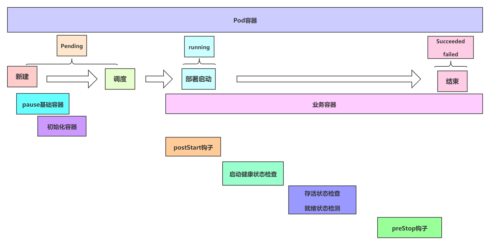

# pod

Pod 是在 K8s 集群中运行部署应用或服务的最小单元，众多组件和资源大多都是围着 pod 转。

每个 pod 内包含一个或多个容器，其中，至少有一个 pause 容器（也称 infra 容器），然后可以有一个或多个业务容器，除此之外，还可以有零个或多个 init 容器。

#### 为何要用Pod

- Pod 是对容器的封装，屏蔽底层不同容器的差异化
- Pod特性：同一个pod内的多个容器共享网络、共享存储卷

## pod 分类

主要分两大类：普通 POD、静态 POD。其中，普通 POD 又可以细分为：裸 POD (自主式 pod)、控制器资源管理的 POD。

- 裸POD/自主式 Pod，自愈能力不完善，资源清单里指定的 kind 为 `Pod`，与任何控制器资源都无关。Pod 内的容器挂掉了，会依据 `restartPolicy`（三种策略都可以配置使用）来进行重启，但是如果 Pod 本身被删掉，或者说 Pod 所在的节点挂掉了，导致本副本不可用了，不会在一个新节点上拉起 Pod。
- 控制器资源管理的Pod，自愈能完善。某个 pod 被删掉或者说所在的物理节点挂掉了，导致副本数变少，控制器会发起调谐过程，在一个新节点上拉起 Pod。这种 pod 的 `restartPolicy` 只能配置为 `Always`。
- 静态 pod：直接通过配置文件或 HTTP 的方式交给 kubelet 创建的 pod，不走 API Server。只在当前节点运行，不会被调度到其他节点，并且挂掉了就直接重启。

## Pod 的完整创建流程

1、创建 pod，并调度到合适节点

2、创建 pause 基础容器，提供共享名称空间

3、串行业务容器容器初始化 init  容器

4、启动业务容器，启动那一刻会同时运行主容器上定义的 `Poststart` 钩子事件

5、`startupProbe ` 健康状态监测，判断容器是否启动成功

6、持续检测 `livenessProbe`、`readnessProbe`

7、结束时，在容器结束之前会先执行 `Prestop ` 钩子事件，然后才终止容器

8、kubelet 会帮当前节点的 pod 信息上报给 API Server 将 Pod 信息存储到 etcd 系统中。

9、在 etcd 确认写入操作完成，API Server 将确认信息发送到相关的 kubelet。

## pod 状态

pending，正处于调度阶段。pending 阶段通过之后，调度完成了，接下来就是某个节点上的 kubelet 的工作。

Init:Error，kubelet 创建 init 容器失败

Containering， 正在创建：拉镜像、关联存储卷

completed，pod 内的容器正常运行完毕了

unkown，状态不知道，pod 所在的节点有问题（节点notready了：网络出问题、kubelet挂掉、节点宕机）

evicted，驱逐，因为某个物理节点资源不足（不可压缩资源：磁盘、内存）而驱逐该 pod

OOMkilled，k8s 级别的 OOM。针对某个 Pod，该 pod 的容器对内存的使用达到 limits 的限定。

Terminating，pod 正在被终止（pod被终止需要做两件事：杀掉容器的进程、清理etcd中数据）

## Pod 重启策略应用

静态 pod：不允许设置 `restartPolicy`，由所在节点上的 kubelet 直接管理，挂掉自动重启。

裸Pod：可以设置三种策略Always、OnFailure、Never

控制器管理的 pod：

- `ReplicaSet`、`Deployment`、`DaemonSet`：此类控制器希望 Pod 一直运行下去，它们的重启策略只能是 `"Always"`。
- Job一次性任务控制器：Job 的重启策略只能是 `"OnFailure"` 或者 `"Never"`

## init 容器

init 容器在 `containers` 定义的业务容器启动之前先启动，完成初始化。init 容器就会只执行一次，而且多个 init 容器是串行运行。

裸 pod 更新内部任意容器镜像，都不会触发 pod 重启，init 容器也不hi再执行。

控制器资源管理的 pod，只要更新配置清单，就会触发重启 pod，就会再次执行 init 容器。

init 容器运行失败。会依据 pod 的重启策略进行重启。

init 容器通常无需设置探针，探测通常设置在 containers 业务容器中。

>init container应用场景
>
>	1、在启动前检测依赖的上下游服务端口是否就绪
>	2、做启动前的初始化配置，例如数据库初始化
>	3、启动前将pod信息注册到配置中心等场景

## 钩子函数

两个钩子函数的发起调用者是 kubectl，如果配置就钩子函数就会被执行，如果没有配置则不执行。并且，可以同时设置 `PostStart` 钩子和 `PreStop` 钩子。

#### PostStart

与业务容器是同时起来的，是异步运行，没有先后，在 pod 运行初期被执行。作用式在容器运行之初完成一些操作，如果该钩子函数运行失败，容器器会被杀死，并根据 `RestartPolicy` 决定是否重启。

~~~alert type=note
如果一些初始化工作一定要在业务容器运行前运行，那就用 initcontainers 来定制，如果这些初始化工作没有要求必须在业务容器运行前运行，仅仅在容器启动之初做一下就可以使用 PostStart
~~~

#### PreStop

一定是容器终止之前执行，主要用于资源清理、优雅关闭应用程序、通知其他系统等。

当 Pod 开始终止时，Kubernetes 会执行 `preStop` 钩子。钩子有一个超时时间（默认为 30 秒）。如果钩子在超时时间内没有成功完成，Kubernetes 会终止 Pod，而不再继续等待钩子完成。

如果钩子运行失败，也会强制删除 pod

## 删除 pod 发生两件事

1. 去目标节点终止进程
2. 清理掉该资源在 etcd 中数据

如下命令强制删除的式 etcd 中的数据，没有强杀进程。

~~~bash
kubectl --force --grace-period=0   delete pod <pod-name>
~~~

~~~alert type=note
如果 pod 一直处于 Terminating 状态，可能是目标节点上的 kubelet 挂掉了。
~~~

## 存活检测和就绪检测

在业务容器启动后可以做两类检测 **liveness probe（存活性探测） 和 readness probe（就绪性探测）**。

探针是由 kubelet 对容器执行的定期诊断。要执行诊断，kubelet 调用由容器实现的Handler。其存活性探测的方法有以下三种：

- **ExecAction：**在容器内执行指定命令。如果命令退出时返回码为 0 则认为诊断成功。
- **TCPSocketAction：**对指定端口上的容器的 IP 地址进行 TCP 检查。如果端口打开，则诊断被认为是成功的。
- **HTTPGetAction：**对指定的端口和路径上的容器的 IP 地址执行 HTTP Get 请求。如果响应的状态码大于等于200 且小于 400，则诊断被认为是成功的。

Kubelet 可以选择是否执行在容器上运行的两种探针执行和做出反应：

- **`livenessProbe`：**指示容器是否正在运行。如果存活探测失败，则 kubelet 会杀死容器，并且容器将受到其 [重启策略](https://kubernetes.io/docs/concepts/workloads/pods/pod-lifecycle/#restart-policy) 的影响。如果容器不提供存活探针，则默认状态为 `Success`。
- **`readinessProbe`：**指示容器是否准备好服务请求。如果就绪探测失败，端点控制器（Endpoint）将从与 Pod 匹配的所有 Service 的端点中删除该 Pod 的 IP 地址。初始延迟之前的就绪状态默认为 `Failure`。如果容器不提供就绪探针，则默认状态为 `Success`。