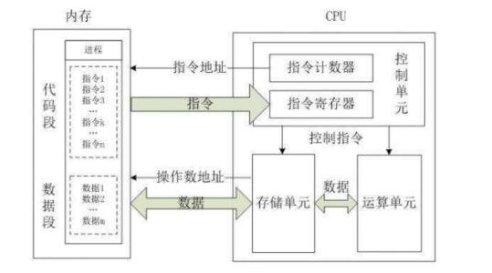
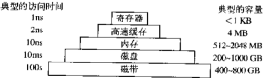

# 计算机基础

计算机又称电脑，顾名思义，就是通电的大脑。人类对计算机的终极期望就是希望计算机通电之后像人脑一样，服务人类，最终解放人类。计算机的目的就是解放人力，让计算机服务人类，帮人类干活。


## 计算机硬件五大组成部分（**冯·诺伊曼架构**）

计算机发明的目的是为了充当人类的奴隶，是基于人来设计的。因此计算机的组成部分都可以类比人体的功能或器官。

**控制器**

控制器是计算机的控制系统，指挥控制计算机其他所有组件。相当于人类的大脑。

**运算器**

运算器就是做数学运算和逻辑运算的。相当于人类的大脑。

>补充：**控制器 + 运算器 == CPU**


**存储器**

存储器的功能是存储数据。存储器主要有两种：内存、外存。寄存器又称I/O设备，指的是存储器既需要读数据又会输出数据的特性。其中，内存的存取速度要远远快于外存。

- 内存：基于电工作，优点：存取速度快；缺点：断电数据丢失，只能临时存储数据。相当于人类的大脑。
- 外存：基于磁工作，缺点：存取速度慢；有点：断电数据不丢失，可以永久保存数据。相当于日记本。


**输入设备**

- 键盘、鼠标等

  

**输出设备**

- 显示器、打印机等


## 计算机硬件和软件的关系

计算机包含两大部分，分别是硬件和软件。其中，硬件是基础，软件是上层建筑。

软件或者说应用程序想要运行在硬件上，需要众多硬件的配合。其中有三个密切配合的硬件：**CPU**、**内存**、**硬盘**。一个程序启动和运行的流程可以按照下面的流程简单理解：

1. 安装程序，就是把软件的源代码文件拷贝在**硬盘**中。
2. 启动程序，**CPU**把程序代码从**硬盘**加载到**内存**（加载到内存是因为内存的读写速度要远大于硬盘）。
3. 执行程序，**CPU**从**内存**读取程序然后运行。


## 操作系统是特殊的软件

操作系统本质也是软件。计算机硬件是死的，如果想要计算机为人类干活，就必须通过软件指挥计算机。

操作系统的功能就是帮我们把复杂的硬件控制封装成简单的接口，对于开发应用程序来说只需要调用这些接口即可。所以说操作系统是软件与硬件之间的一个桥梁，是协调、管理、控制计算机硬件与应用软件资源的控制程序。


## CPU工作流程

计算机五大组成部分的基本工作流程就是：输入单元=>主存储器=>CPU=>主存储器=>输出单元

而CPU会从内存中取指令->解码->执行，然后再取指->解码->执行下一条指令，周而复始，直至整个程序被执行完成。
**所以总结CPU的大致工作流程就是：取指一>解码一>执行**




## CPU分类和指令集

```python
x86架构64位
	- x86是针对cpu的型号或者说架构的一种统称。
	- 64位指的是CPU一次性能从内存中取出64位二进制指令
 
cpu具有向下兼容性：
- 64的cpu既能运行32位的程序也能运行64位的程序
- 32位的程序可以在32位的cpu上运行也可以在64位的cpu上运行
- 64位的程序只能在64位的cpu上运行。


# cpu指令集
## 精简指令集
　　精简指令集（Reduced Instruction Set Computing，RISC）：这种CPU的设计中，微指令集较为精简，每个指令的运行时间都很短，完成的动作也很单纯，指令的执行效能较佳；但是若要做复杂的事情，就要由多个指令来完成。
　　SPARC架构的计算机常用于学术领域的大型工作站中，包括银行金融体系的主服务器也都有这类的计算机架构；
　　PowerPC架构的应用，如Sony出产的Play Station 3（PS3）使用的就是该架构的Cell处理器。
　　ARM是世界上使用范围最广的CPU了，常用的各厂商的手机、PDA、导航系统、网络设备等，几乎都用该架构的CPU。

## 复杂指令集
　　复杂指令集（Complex Instruction Set Computer，CISC）与RISC不同，在CISC的微指令集中，每个小指令可以执行一些较低阶的硬件操作，指令数目多而且复杂，每条指令的长度并不相同。因此指令执行较为复杂所以每条指令花费的时间较长，但每条个别指令可以处理的工作较为丰富。常见的CISC微指令集CPU主要有AMD、Intel、VIA等的x86架构的CPU。
    
# 总结：
    CPU按照指令集可以分为精简指令集CPU和复杂指令集CPU两种，区别在于前者的指令集精简，每个指令的运行时间都很短，完成的动作也很单纯，指令的执行效能较佳；但是若要做复杂的事情，就要由多个指令来完成。后者的指令集每个小指令可以执行一些较低阶的硬件操作，指令数目多而且复杂，每条指令的长度并不相同。因为指令执行较为复杂所以每条指令花费的时间较长，但每条个别指令可以处理的工作较为丰富。
```


## 内核态与用户态

```python
代表cpu的两种工作状态
	1、内核态：运行的程序是操作系统，可以操作计算机硬件
	2、用户态：运行的程序是应用程序，不能操作计算机硬件

内核态与用户态的转换
    应用程序的运行必然涉及到计算机硬件的操作，那就必须有用户态切换到
    内核态下才能实现，所以计算机工作时在频繁发生内核态与用户态的转换
```


## 多线程与多核芯片

```python
2核4线程：
	2核代表有两个cpu，4线程指的是1个cpu有两个线程，总共有4个线程。也称之为真2核假4核心。
```


## 存储器

存储器是计算机第二重要的部分。目前速度快+容量大+价格便宜是人们所希望的。但是鱼和熊掌不可兼得，于是就产生了如下存储器结构



```python
寄存器：放在CPU上的和CPU使用相同的材料，速度极快
RAM：内存/主存，特点：断电数据丢失。
ROM：特点：只读内存，存放计算机厂商写死计算机上的一段核心程序(BIOS),用来启动操作系统。
CMOS：耗电量极低，断电数据丢失重置。比如：CMOS上的实时时钟（RTC）
硬盘：
机械硬盘:磁盘
    磁道：一圈数据，对应着一串二进制（1bit代表一个二进制位）
    1Bytes(字节) = 8bit(比特位)
    1KB = 2^10Bytes (B)
    1MB = 2^10KB = 2^10 * 2^10B
    1GB = 2^10MB = 2^10 * 2^10 * 2^10B
    1TB = 2^10GB = 2^10 * 2^10 * 2^10 * 2^10B
    1PB = 2^10TB = 2^10 * 2^10 * 2^10 * 2^10 * 2^10B
 

    扇区：
    一次性读写数据的最小单为为1个扇区， 一个扇区通过为512Bytes

    操作系统一次性读写的单位是一个block块=》8扇区的大小=4096Bytes
    
    柱面

固态硬盘
```

## IO延迟

```python
# 机械硬盘转速
7200转/min
120转/s
1/120转/s=转一圈需要花费8ms

平均寻道时间：机械手臂转到数据所在磁道需要花费的时间，受限于物理工艺水平，目前机械硬盘可以达到的是5ms
平均延迟时间：转半圈需要花费4ms，受限于硬盘的转速

IO延迟=平均寻道时间+平均延迟时间

优化程序运行效率的一个核心法则：能从内存取数据，就不要从硬盘取
```


## 操作系统的启动流程

**操作系统的启动流程**

1. 计算机通电。
2. BIOS开始运行，检测硬件：cpu、内存、硬盘等。
3. BIOS读取CMOS存储器中的参数，选择启动设备。
4. 从启动设备上读取第一个扇区的内容（MBR主引导记录512字节，前446为引导信息，后64为分区信息，最后两个为结束标志位）。
5. 根据分区信息读入bootloader启动装载模块，启动操作系统。
6. 然后操作系统询问BIOS，以获得配置信息。

>对于硬件设备，系统会检查其驱动程序是否存在。如果没有，系统则会要求用户安装设备驱动程序。一旦有了全部的设备驱动程序，操作系统就将它们调入内核。


**应用程序的启动流程**

1. 启动程序。双击应用程序或者在命令行中执行命令，背后会将应用待启动程序的绝对路径告诉操作系统。
2. 加载程序到内存。操作系统会根据程序的绝对路径找到程序在硬盘上的位置，将其代码从硬盘加载到内存。
3. 执行程序。然后控制cpu从内存中读取刚刚读入内存的应用程序的代码执行，应用程序完成启动
