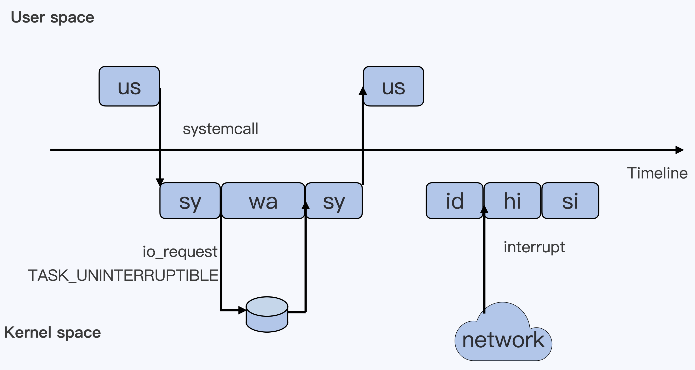

# 进程管理

程序就是静态的代码文件，进程是动态的。进程描述程序执行的过程，这个过程可以大致分为三个主要状态：运行、就绪、阻塞。

## 进程的三大状态

#### 1. 运行（Running）
- **含义**：进程正在 CPU 上执行指令（单核 CPU 同一时间只有一个进程处于运行状态）。
- **触发条件**：被调度器选中，获得 CPU 时间片。
- **退出条件**：
  - 时间片用完（被抢占）。
  - 遇到IO（文件IO、网络IO、sleep、read等）
  - 被更高优先级进程抢占。
- **Linux `STAT` 标志**：`R`（Running 或 Runnable）。

#### 2. 就绪（Ready / Runnable）
- **含义**：进程已准备好运行，但尚未被调度器分配 CPU。
- **触发条件**：
  - 进程初始化完成，等待调度。
  - 从阻塞状态恢复（如 I/O 完成）。
- **特点**：位于内核的 **就绪队列** 中，随时可被调度。
- **Linux `STAT` 标志**：在 `ps` 中仍显示为 `R`（因为 Linux 不严格区分运行和就绪状态）。

#### 3. 阻塞（Blocked / Waiting）
- **含义**：进程因等待某事件（如 I/O、信号量、锁等）而暂停执行。
- **触发条件**：
  - 发起系统调用（如读写磁盘、网络请求）。
  - 请求的资源不可用（如内存不足、锁被占用）。
- **类型**：
  - **可中断睡眠（Interruptible Sleep）**：`STAT = S`
    - 可被信号（如 `SIGKILL`）唤醒。
  - **不可中断睡眠（Uninterruptible Sleep）**：`STAT = D`
    - 通常与硬件 I/O 相关（如磁盘写入），不能被信号中断。
- **退出条件**：等待的事件完成（如数据到达、锁释放）。

#### 状态转换图

~~~
      +-------------------+  
      |     就绪 (R)      |  
      +--------+----------+  
               | ▲  
 调度器分配 CPU | | 时间片用完/抢占  
               ▼ |  
      +--------+----------+  
      |     运行 (R)       |  
      +--------+----------+  
               | ▲  
  等待事件（I/O等）| | 事件完成  
               ▼ |  
      +--------+----------+  
      |    阻塞 (S/D)     |  
      +-------------------+  
~~~

## ps 命令

`ps`（Process Status）是 Linux/Unix 系统中用于查看当前进程状态的常用命令，它可以显示进程的详细信息，如 PID（进程 ID）、CPU 占用、内存使用、运行状态等。

#### 1. 查看当前终端关联的进程

命令：`ps`

~~~bash
[root@centos ~]# ps
  PID TTY          TIME CMD
 4027 pts/0    00:00:00 bash
 4090 pts/0    00:00:00 ps
 
# 字段解释
    # PID：进程 ID
    # TTY：关联的终端
    # TIME：占用 CPU 时间
    # CMD：执行的命令
~~~

#### 2. 查看所有进程状态信息

命令：`ps aux` ，选项含义如下
-  `a` 显示所有用户的进程（包括其他用户）。
- `u` 以用户友好的格式显示（包含 CPU、内存等详细信息）。
- `x`：显示没有控制终端的进程（如守护进程）。

>补充，查看某个用户开启的进程可以使用命令：`pgrep -l -u liuxu`

~~~bash
[root@centos ~]# ps aux | head -2
USER       PID %CPU %MEM    VSZ   RSS TTY      STAT START   TIME COMMAND
root         1  0.0  0.7  92600  7820 ?        Ss   09:40   0:01 /usr/lib/systemd/systemd
root         2  0.0  0.0      0     0 ?        S    09:40   0:00 [kthreadd]
~~~

展示结果各字段说明：

- **`USER`**：进程所有者。
- **`PID`**：进程ID，pid号。
- **`%CPU`**：CPU 占用率。
- **`%MEM`** 内存占用率
- **`VSZ`**：虚拟内存大小（KB）
- **`RSS`**：实际内存大小（KB）
- **`TTY`**：关联的终端（`?` 表示无终端）
- **`START`**：进程启动时间
- **`TIME`**：进程使用 CPU 的时间
- **`COMMAND`**：进程启动的命令（被 `[]` 包裹的表示内核进程）。
- **`STAT`**：进程当前时刻的状态。很重要。主要有下面这些常见状态标识符。

| STAT 标志 | 状态说明                                                     |
| :-------- | :----------------------------------------------------------- |
| R         | 运行态和就绪态                                               |
| S         | 可中断的睡眠状态。                                           |
| D         | 不可中断的睡眠状态。一般和硬盘文件IO紧张有关。               |
| Z         | 僵尸进程（Zombie）。进程已终止已回收了重资源，但父进程未回收其PID/状态等资源。 |
| T         | 进程被信号（如 `SIGSTOP`）暂停。                             |
| `I`       | 空闲（Idle）内核线程空闲中（无任务）。                       |
| `l`       | 多线程进程                                                   |
| +         | 前台运行                                                     |
| s         | 会话领导者。比如 nginx的mater进程                            |
| <         | 高优先级进程                                                 |
| N         | 低优先级进程（`nice > 0`）                                   |

#### 3. 可中断睡眠状态和不可中断睡眠状态

可中断状态的符号是 `S` ，所谓可中断状态指的是进程运行中发生了IO行为，失去CPU执行权，进入一种等待状态，这种状态可以通过给进程发送信号来唤醒。系统中大部分进程的大多数时间都是处于 S 状态。因

不可中断的符号是 `D`，所谓不可中断指的是进程此时无法响应异步信号。此时 `kill -9` 无法结束这个进程，因此状态 D 的进程无法响应异步信号。不可中断状态存在的意义在于，内核的某些处理流程不能被打断，比如等待硬件设备的IO响应。如果一个进程在做文件读写，为了保证数据的一致性，在得到硬盘响应前，它是不能被其他进程或异步信号中断的，此时这个进程就处于不可中断状态。如果此时进程被中断了，就容易出现硬盘数据与进程数据不一样的问题。所以，不可中断状态实际上是系统对进程和硬件设备的一种保护机制。

#### 4. 实用用法

**查看父进程编号**

~~~bash
ps -elf
~~~

**按照CPU内存使用率排序**

~~~bash
ps aux --sort=-%cpu | head -10   # 按 CPU 降序（前 10）
ps aux --sort=-%mem | head -10   # 按内存降序（前 10）
~~~

## top 命令

`top` 是 Linux 系统中一个 **实时动态** 查看系统进程和资源使用情况的命令行工具，比 `ps` 更直观，适合监控系统运行状态，默认3s刷新一次。

~~~
top - 14:30:45 up 2 days,  3:15,  2 users,  load average: 0.15, 0.10, 0.05
Tasks: 120 total,   2 running, 118 sleeping,   0 stopped,   0 zombie
%Cpu(s):  2.3 us,  0.7 sy,  0.0 ni, 96.8 id,  0.2 wa,  0.0 hi,  0.0 si,  0.0 st
MiB Mem :   7856.2 total,   1024.5 free,   4096.3 used,   2735.4 buff/cache
MiB Swap:   2048.0 total,   2048.0 free,      0.0 used.   3248.2 avail Mem

  PID USER      PR  NI    VIRT    RES    SHR S  %CPU %MEM     TIME+ COMMAND
 1234 root      20   0  320000  45000   8000 S   5.0  0.6   2:30.65 nginx
 5678 mysql     20   0 1200000 300000  20000 S   3.2  3.8  10:15.23 mysqld
~~~

#### 1. top 第一行输出信息

top 命令输出的第一行信息中有一个非常重要的指标 **平均负载** `load average`，它的值有三个分别是：近1分钟内的平均负载；近5分钟的平均分在；近15分钟内的平均负载。**平均负载**指的是一段时间内系统中状态是 `R` 和 `D` 的进程的总数。因为负载大和系统运行慢是正相关的，而  `R` 进程和 `D` 进程都是加剧系统压力的进程，所以操作系统把这两个状态都算在 平均负载中了。

**三个平均负载值的趋势可以直观看出来系统运行状态的变化**。有如下几种情况：

- 三个值基本没有变化且值不大。表明系统在平稳运行。
- 三个值依次递增。表明系统过去经历了压力状态目前的负载已经下降。
- 三个值递减，近1分钟的平均负载值达到了CPU的超额状态。表明系统的负载在急剧上升，需要密切关注。

#### 2. top 第二行输出信息

top 命令输出的第二行信息是系统目前进程任务的数量，这其中包含僵尸进程。**僵尸进程是操作系统的一种优化机制，僵尸进程是每个进程结束前都要经历的一个状态。僵尸进程其实就是已经死掉的进程，已经被回收了重型资源，但是为了让它的父进程知道这个状态，保留了子进程的状态、PID等消耗资源非常小的信息。保留的目的是为了让其父进程自己管理子进程**。但是有了父进程没有管理这些死掉的子进程，于是系统中就出现了状态为 `Z` 的僵尸进程。如果系统中的僵尸进程数量不多且没有持续增长，此时对系统的影响是极小的。但是如果僵尸进程的数量在急剧持续增长，那就需要立即排查僵尸进程的父进程是哪个。必要时可以把僵尸进程的父进程干掉。

僵尸进程是不能被 `kill` 的，解决它的办法就是把其父进程干掉，**干掉僵尸进程的父进程后，僵尸进程就会被用户态的1号进程接管**（此时僵尸进程的 ppid为1）。因为用户态的1号进程有处理挂掉子进层的能力，所以在很短的时间内就会把这些被接管的僵尸进程回收掉。

#### 3. top 第三行输出信息

top命令输出的第三行信息是 CPU 的使用信息。其中：

- `us` 用户态进程占用cpu时间的百分比，不包括低优先级进程的用户态时间（值1-19）
- `sy` 内核态进程占用cpu时间的百分比
- `ni` nice 值为1-19的进程，用户态占cpu时间的百分比
- `id` 系统空闲 cpu 的百分比
- `wa` 系统等待 I/O 的 cpu 时间占比，该时间不计入进程的CPU时间
- `hi` 处理硬件中断所占用CPU的时间，该时间同样不计入进程的CPU时间
- `si` 处理软件中断的时间，该时间不计入进程的CPU时间
- `st` 表示同一宿主机上的其他虚拟机抢走的CPU时间

>补充，`nice` 是 Linux 和 Unix 系统中的一个命令，它可以用来调整进程的优先级。在 Unix-like 系统中，每一个进行CPU调度的任务（包含进程、线程）都有一个对应的 nice 值，这个值决定了其在获得 CPU 时间方面的优先级。nice 值的范围在 -20 到 19，其中 -20 表示最高优先级，而 19 刨示最低优先级。默认情况下，新创建的进程 nice 值是 0。

#### 4. CPU 使用率和平均负载

**CPU 使用率** 和 **平均负载 **是判断系统稳定的两个非常重要的指标。CPU使用率高表明CPU没有闲着，平均负载高表明系统在处理的任务多。基于这两个指标需要注意下面两种情况：

##### 1. CPU 使用率高，平局负载高（R 进程多）

此时系统的压力的压力大，因为每个 CPU 都在不停的干活，如果平均负载等于 CPU 数量，则处于满额状态。此时正常维护即可。如果平均负载远大于 CPU 数量，且在不断增加，则系统处理超额状态。此时需要密切注意系统的运行。

##### 2. CPU 使用率低，平均负载高（D 进程多）

此时平均负载高的原因是不可中断的进程数量多导致的，因为R状态的进程数量少所以 CPU 使用率低。此时需要观察硬盘的情况，大量的 D 状态进程是因为文件 IO 导致硬盘响应不过来。可能是其他程序在大量的文件 IO 导致的，也可能是硬盘本省有问题。存储变慢也会拖慢整个系统的运行速度。

#### 5. 常用快捷键

在 `top` 运行时，按以下键进行操作：

| 按键    | 功能                                |
| :------ | :---------------------------------- |
| `q`     | 退出 `top`                          |
| `h`     | 显示帮助                            |
| 数字 1  | 展开CPU使用率数据，每颗CPU单独统计  |
| `d`     | 修改 刷新时间                       |
| `Space` | 立即刷新                            |
| `1`     | 切换显示所有 CPU 核心的使用率       |
| `M`     | 按 **内存** 排序（从高到低）        |
| `P`     | 按 **CPU** 排序（默认）（从高到低） |
| `T`     | 按 **运行时间** 排序（从高到低）    |
| `N`     | 按 **PID** 排序（从高到低）         |
| `R`     | 排序结果反向展示                    |
| `k`     | 杀死进程（输入 PID 后发送信号）     |
| `r`     | 调整进程优先级（`renice`）          |
| `z`     | 彩色/黑白模式切换                   |
| `W`     | 保存当前配置到 `~/.toprc`           |

## 进程的用户态和内核态

一个进程在运行过程大概率是在用户态和内核态之间来回切换的状态。比如说，一个进程刚启动时处于在用户态，运行时需要做文件IO，此时就会向操作系统发出请求，于是进程就进入了内核态。在内核态中需要等待硬盘数据的响应，响应结束后，从内核态再切回用户态。

## PR 和 NI

`top` 命令可以看到这两个字段，这两位都表示进程的优先级。区别在于，PR 指的是进程在内核态时的优先级，NI表示进程在用户态时的优先级。对于用户来说，我们可以控制的是进程在用户态时的优先级。

- PR 值越小优先级越高，NI 值越小优先级越高。 
- PR=20 + NI
- NI 值的范围： -20～19；PR值的范围：0～39（用户可以控制的范围）

#### 设置进程的NI值

##### 1. 启动进程时设置

~~~bash
nice -n 5 <命令>		# -n 5 指定命令的优先级为5
~~~

##### 2. 设置已经运行进程的优先级

~~~bash
renice -20 <PID>
~~~

## 管理后台进程

#### 1. 后台执行程序 &

~~~bash
# aaa.sh
for i in `seq 1 1000000`;
do
    sleep 1
    echo $i >> /tmp/run.log
done

# 使用 & 后台执行程序，会返回进程pid
root@centos ~]# bash aaa.sh &
[1] 1605
~~~

#### 2. 查看当前终端的后台任务 jobs

~~~bash
# jobs 可以查看当前终端中正在后台运行或暂停（挂起）的任务。
# 输出信息中，[]内的编号就是后台程序的编号
[root@centos ~]# jobs
[1]+  运行中               bash aaa.sh &
~~~

#### 3. 把后台进程调到前台执行 fg

~~~bash
[root@centos ~]# fg %1		# %1 值得就是编号为1的任务
bash aaa.sh

~~~

#### 4. 暂停前台任务到后台 ctrl + z

~~~bash
[root@centos ~]# fg %1
bash aaa.sh
^Z
[1]+  已停止               bash aaa.sh
[root@centos ~]#

# ps 查看进程当前状态为 T
[root@centos ~]# ps aux | grep  aaa.sh
root      1605  0.1 10.4 207588 103196 pts/0   T    23:03   0:00 bash aaa.sh
~~~

#### 5. 把暂停的进程后台运行 bg

~~~bash
[root@centos ~]# jobs
[1]+  已停止               bash aaa.sh
[root@centos ~]# bg %1
[1]+ bash aaa.sh &
~~~

#### 6. 杀死后台进程

~~~bash
[root@centos ~]# jobs
[1]+  运行中               bash aaa.sh &
[root@centos ~]# kill %1
~~~

## kill 给进程发信号

Linux中的 `kill` 命令核心作用是向一个或多个进程发送异步信号。这是一个关键的进程间通信工具，而不仅仅是用来“杀死”进程的。杀死进程只是它的一种最常见行为。

它的工作原理是用户通过 `kill` 命令请求内核向目标进程传递一个信号。目标进程收到信号后，通常有三种处理方式：执行系统预定义的默认行为（如终止或暂停）、执行进程自己注册的自定义处理函数来捕获信号，或者直接忽略信号。需要注意的是，`SIGKILL` 和 `SIGSTOP` 这两个特殊信号无法被进程捕获或忽略，即操作系统立即处理目标进程。

下面是 `kill` 命令可以发出的所有信号：

~~~bash
[root@centos ~]# kill -l
 1) SIGHUP	 2) SIGINT	 3) SIGQUIT	 4) SIGILL	 5) SIGTRAP
 6) SIGABRT	 7) SIGBUS	 8) SIGFPE	 9) SIGKILL	10) SIGUSR1
11) SIGSEGV	12) SIGUSR2	13) SIGPIPE	14) SIGALRM	15) SIGTERM
16) SIGSTKFLT	17) SIGCHLD	18) SIGCONT	19) SIGSTOP	20) SIGTSTP
21) SIGTTIN	22) SIGTTOU	23) SIGURG	24) SIGXCPU	25) SIGXFSZ
26) SIGVTALRM	27) SIGPROF	28) SIGWINCH	29) SIGIO	30) SIGPWR
31) SIGSYS	34) SIGRTMIN	35) SIGRTMIN+1	36) SIGRTMIN+2	37) SIGRTMIN+3
38) SIGRTMIN+4	39) SIGRTMIN+5	40) SIGRTMIN+6	41) SIGRTMIN+7	42) SIGRTMIN+8
43) SIGRTMIN+9	44) SIGRTMIN+10	45) SIGRTMIN+11	46) SIGRTMIN+12	47) SIGRTMIN+13
48) SIGRTMIN+14	49) SIGRTMIN+15	50) SIGRTMAX-14	51) SIGRTMAX-13	52) SIGRTMAX-12
53) SIGRTMAX-11	54) SIGRTMAX-10	55) SIGRTMAX-9	56) SIGRTMAX-8	57) SIGRTMAX-7
58) SIGRTMAX-6	59) SIGRTMAX-5	60) SIGRTMAX-4	61) SIGRTMAX-3	62) SIGRTMAX-2
63) SIGRTMAX-1	64) SIGRTMAX
~~~

### 1. kill 命令基本使用

~~~bash
kill [选项] <PID...> 或 <%作业号...>

# 选项： 要发送的信号类型，可以是数字或者数字关联的代码，比如：9关联的是 SIGKILL
# PID： 进程号（Process ID），
# 作业号：jobs 命令查看作业号。

# 强制杀死 PID 为 1234 的进程
kill -9 1234
# 等同于
kill -SIGKILL 1234
~~~

### 2. kill 常用信号

| 信号编号 | 信号名      | 默认行为     | 说明                                                         |
| :------- | :---------- | :----------- | :----------------------------------------------------------- |
| **1**    | **SIGHUP**  | 终止进程     | **挂起**。通常用于通知守护进程重新读取配置文件，而无需重启进程。 |
| **2**    | **SIGINT**  | 终止进程     | **中断**。等同于在终端按下 `Ctrl + C`。                      |
| **9**    | **SIGKILL** | **终止进程** | **强制杀死**。这是一个无法被捕获或忽略的信号，会立即强制结束进程。是最后的杀手锏，可能会造成数据丢失。 |
| **15**   | **SIGTERM** | **终止进程** | **终止**。这是 `kill` 命令的**默认信号**。它礼貌地请求进程终止，允许进程进行清理工作（如保存数据）后退出。 |
| **18**   | **SIGCONT** | 继续运行     | **继续**。让一个暂停的进程继续运行。与 `SIGSTOP` 和 `SIGTSTP` 对应。 |
| **19**   | **SIGSTOP** | **暂停进程** | **暂停**。这是一个无法被捕获或忽略的信号，会立即暂停进程的执行。等同于在终端按下 `Ctrl + Z`。 |
| **20**   | **SIGTSTP** | 暂停进程     | **终端暂停**。等同于在终端按下 `Ctrl + Z`，但可以被进程捕获。 |

### 3. kill 总结
- `kill` 不等于 `kill -9` 。`kill -9` 表示不给进程任何清理现场的机会，操作系统直接杀死它，这可能导致数据损坏或资源（如临时文件、锁文件）无法释放。一般我们需要先使用 `kill -15` 尝试终止进程，因为 `SIGTERM` 这种信号允许进程做 “临死”前的准备工作。
- `kill` 本质上是给操作系统发一个异步信号，由操作系统通知目标进程。如果目标进程没有相应的响应机制，那么发出去的信号没有任何意义。但是有两个信号比较特殊，`SIGKILL` 和 `SIGSTOP` 这两个特殊信号无法被进程捕获或忽略。
- 对于僵尸状态（Z）的进程或者不可中断睡眠状态（D）的进程，他们是不接收信号的，即使用 `kill -9 ` 无法杀死。

### 4. 补充：根据进程名杀死进程
- 使用 `pkill -9 vim`， 杀死所有的 vim 进程
- 使用 `killall -9 vim`， 杀死所有的 vim 进程

## hup 信号

hub 信号，又叫 SIGHUP 信号，全称是**Signal Hang UP**。顾名思义，它的原始设计目的是在**终端挂断（Hang Up）** 时通知其控制下的进程。它有两个截然不同的用途：

1. **传统作用：终止进程** - 当终端断开时，杀掉这个终端关联的所有进程。
2. **现代用法：重载配置** - 通知守护进程（daemon）重新读取其配置文件，实现平滑重启。

### 1. hub 终止进程

这是 `hub` 信号最原始，最根本的作用。**关闭了终端窗口**、**断开了网络** 都叫关闭了终端，或者叫非正常关闭了终端，内核检测到终端挂断后会发送 `hup` 信号给 shell，shell 收到 `hup` 信号的默认行为是推出，但是在退出前它会发送 `hup` 给所有子进程，然后所有子进程的默认行为也是终止运行。最终的效果就是关闭了终端，所有子进程都终止运行。

避免进程被终止（让进程忽略 `hup` 信号）的常用方式，有下面几种：（1）使用 `nohup` 命令，（2）使用子shell，（3）使用 `screen` 命令。

#### 使用 nohup 命令

这是最直接的方法。`nohup` 的作用就是让紧随其后的命令**忽略** `SIGHUP` 信号。通常与 `&`（放入后台）一起使用。标准输出和标准错误会被重定向到当前目录的 `nohup.out` 文件。

~~~bash
nohup ping baidu.com &

# 关闭终端后 ping 进程的父进程变成1号进程，在后台运行。
~~~

#### 使用子shell + 后台运行

将一系列命令放在圆括号 `( )` 中执行，会显式地创建一个子 Shell 来运行这些命令。此时再配个 `&`，即可忽略 `hup` 信号。

~~~bash
(ping baidu.com &)

# 程序运行后，发现 ping进程的父进程是1号进程，关闭当前终端不会影响它。
# 如果不配合 & ，它的父进程依然是当前终端，关闭终端这个进程会被终止。
~~~

#### 使用 screen 命令

`screen` 是一个非常强大且经典的终端复用工具，它允许你在一个终端窗口中创建多个虚拟终端（窗口），并且即使在断开 SSH 连接后，这些终端中运行的程序也会继续执行。

##### 安装

~~~bash
yum install -y screen
~~~

##### 核心概念

- 会话 (Session)： 一个 `screen` 运行实例就是一个会话。一个会话可以包含多个窗口。
- 窗口 (Window)： 类似于浏览器标签页，一个窗口就是一个独立的虚拟终端。你可以在一个会话中创建多个窗口并在它们之间切换。
- 分离 (Detach)： `screen` 的核心功能。你可以让一个会话在后台运行，与当前终端分离，而你原本在会话中运行的程序不会中断。
- 重接 (Reattach)： 你可以重新连接到之前分离的会话，恢复当时的工作现场。

##### 创建一个会话

直接使用 `screen` 创建的是无名会话（没有名字标识的会话），推荐使用 `S` 创建有标识的会话。使用 `screen -ls` 查看当前系统有哪些 screen 会话。

~~~bash
[root@centos ~]# screen -ls
There are screens on:
        2478.pts-0.centos       (Attached)
        2467.test       (Detached)
2 Sockets in /var/run/screen/S-root.

# screen -ls 展示出来当前有两个 screen 会话
# 第一个会话创建没有使用 -S，所以使用了默认名字pts-0.centos。2478是会话id。Attached 表示当前在这个会话中
# 第二个会话创建使用了 -S Detached表示不在这个会话中。
~~~

##### 分离会话

在一个会话中执行了耗时长的任务后，想要出这个会话中安全退出，让这个会话后台运行。方法是按下快捷键：**`Ctrl + a`** 然后松开，再按 **`d`**。

##### 列出所有会话

~~~bash
screen -ls	# 或者 -list
~~~

##### 重接会话

使用 `-r` (reattach) 参数重新连接到一个分离的会话。

~~~bash
screen -r <会话名>
screen -r <会话id>
~~~

##### 结束会话

**在 screen 会话的窗口内**，输入 `exit` 或按 `Ctrl + d` 退出会话。**在外部中断，不进去screen窗口内**，可以强制结束一个会话（不推荐，可能会中断任务）。

~~~bash
screen -X -S <会话名> quit
~~~

##### 常用快捷键（重要！）

所有 `screen` 快捷键都以前缀命令 **`Ctrl + a`** (记作 `C-a`) 开始。按下 `C-a` 后松开，再按下一个功能键。

| 快捷键        | 功能描述                                       |
| :------------ | :--------------------------------------------- |
| `C-a c`       | **C**reate，创建一个新的窗口                   |
| `C-a n`       | **N**ext，切换到下一个窗口                     |
| `C-a p`       | **P**revious，切换到上一个窗口                 |
| `C-a 0`...`9` | 直接切换到第 0 到第 9 个窗口                   |
| `C-a C-a`     | 在两个最近使用的窗口间切换                     |
| `C-a "`       | 列出所有窗口，供你选择                         |
| `C-a A`       | 为当前窗口重命名                               |
| `C-a d`       | **D**etach，分离当前会话（会话在后台继续运行） |
| `C-a k`       | **K**ill，强行杀死当前窗口（会提示确认）       |
| `C-a \`       | 终止整个 `screen` 会话（杀死所有窗口）         |
| `C-a ?`       | 显示所有快捷键的帮助信息                       |

### 2. hub 平滑重启

对于守护进程而言，它们早就脱离了终端，根本不会收到由终端挂断产生的 `SIGHUP`。因此，这个信号对它们是“空闲”的。于是，许多守护进程的程序员就约定俗成，**重新定义了 `SIGHUP` 的信号处理函数**，使其行为变为“重载配置”，而不是退出。

想要实现对一个守护进程发送 `hup` ，让在加载配置平滑重启的前提是，这个程序在开发中已经实现了这部分逻辑。比如 NGINX 就实现了这个特性，对 nginx 的 master 进程发送 hup 信号，可以让所有的 worker 进程使用最新的配置平滑重启。所谓平滑重启指的是在不影响用户使用的情况下，更新一遍服务。

