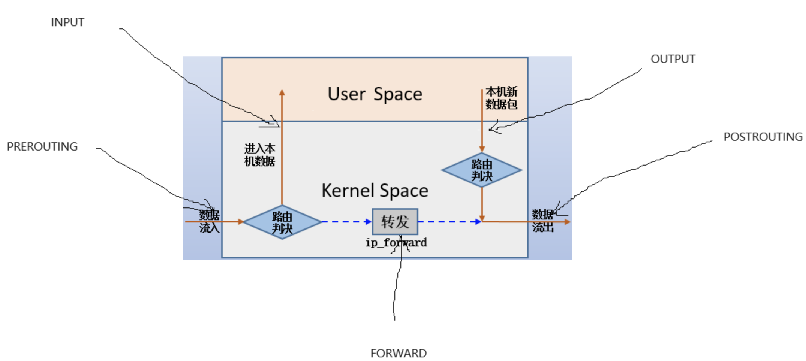
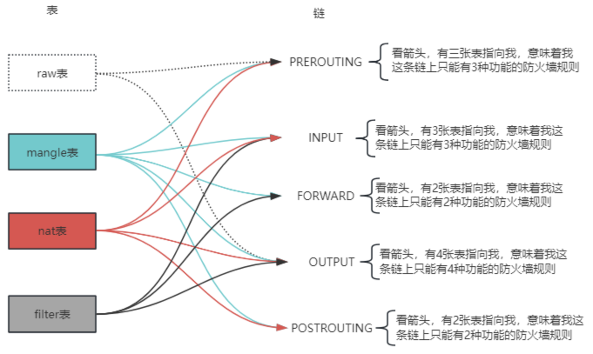
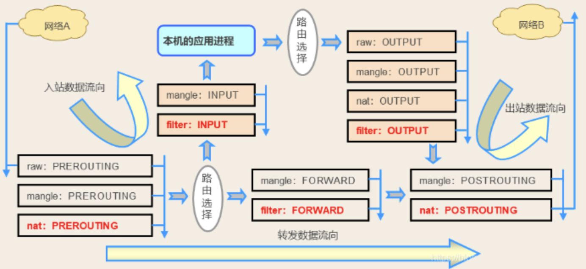
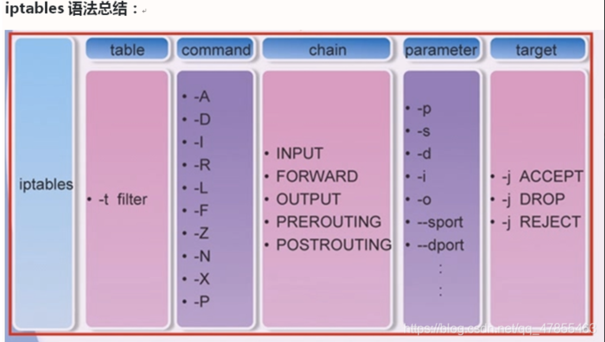
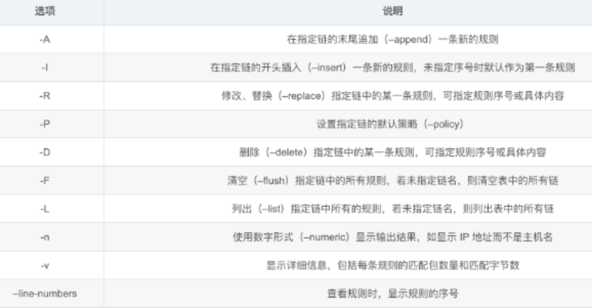
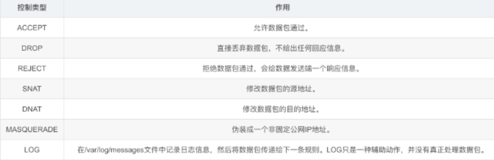

# 防火墙

首先，最重要的一点是：**无论是 iptables 还是 firewalld，它们都不是真正的防火墙，而是用于管理 Netfilter 规则的用户态工具。**

- **Netfilter**：是 Linux 内核中的一个框架，提供了数据包过滤、网络地址转换（NAT）和数据包修改等功能的实现。它是真正的“防火墙”，工作在内核空间。
- **iptables / firewalld**：是用于与 Netfilter 交互、添加、修改或删除规则的命令行工具或服务，工作在用户空间。


## iptables

`iptables` 是 Centos7 以前使用的防火墙服务，它由两部分组成：第一个是操作 netfilter 的命令 `iptables`，另一个是 `iptables` 服务。命令 `iptables` 可以用来添加防火墙规则，但都是临时添加的。想要规则持久化保存，需要配合使用 `iptabls` 服务，它是一个后台服务，在系统启动时从 `/etc/sysconfig/iptables` 文件加载防火墙规则，在系统关闭是前保存当前防火墙到这个文件中。

- `iptables` 命令，操作内核防火墙 netfilter 规则，但都是临时的。
- `iptables` 服务，防火墙规则的持久化。


### 五链四表

iptables 通过一系列规则来管理数据包。这些规则被组织成**表（Tables）** 和**链（Chains）**。

- **五链（Chains）**： 代表规则生效的时间点：
  - `INPUT`： 处理**发往本机**的数据包。
  - `OUTPUT`： 处理**从本机发出**的数据包。
  - `FORWARD`： 处理**经过本机路由**的数据包（当本机作为路由器时）。
  - `PREROUTING` / `POSTROUTING`： 用于 NAT（网络地址转换）。
- **四表（Tables）**： 代表规则的功能类型：
  - `filter`： 用于过滤数据包（是否允许通过），是默认的表。
  - `nat`： 用于网络地址转换（修改源/目标 IP 或端口）。
  - `mangle`： 用于修改数据包内容（如 TTL、TOS 等）。
  - `raw`：代表阻止追踪



五链指的是数据流入 Linux 系统，5种流向，防火墙规则就添加在沿途的链上。对于进入用户内核态的数据，数据流向是：`PREROUTING  -> INOUT -> OUTPUT -> POSTROUTING`。对于使用本级作转发的数据，流向是：`PREROUTING -> FORWARD ->POSTROUTING`。




数据包流入到流出，就好比快递包裹送进快递站，然后由快递站处理后发出。5条链路就好比是快递站里面设置了5个检查关卡（具体走那个关卡要看数据包自己的走向），4个表就好比一个个负责专门检验指标的检察员工，它们按照固定的先后顺序挨个对数据包作检查（顺序：`raw` > `mangle` > `nat` > `filter`）。




### iptables添加防火墙规则

#### **命令格式**

~~~bash
iptables [-t 表名] 管理选项 [链名] [匹配条件] [-j 控制类型]

# 使用 -t 指定表名，不指定默认是 filter 表
# 不指定链名，默认是表内的所有链
# 除非设置链的默认策略，否则必须指定匹配条件
# 选项、链名、控制类型使用大些字母，其余是小写字母。
~~~



#### 常用选项



#### 常用控制类型



### 示例

~~~bash
# 先清空iptables规则
iptables -t raw -F
iptables -t mangle -F
iptables -t nat -F
iptables -t filter -F


# INPUT 整体禁用
iptables -t filter -P INPUT DROP 
 
# 允许192.168.71.18访问22端口
iptables -t filter -A INPUT -p tcp --source 192.168.71.18 --dport 22 -j ACCEPT


# 开放 80 端口（HTTP）
sudo iptables -A INPUT -p tcp --dport 80 -j ACCEPT

# 查看规则
iptables -t filter -L -n  # -L-n可以简写为-nL，但注意-n必须在前面
 
 
# 删除一条规则
iptables -t filter -nL --line-numbers # 先查看到规则号
iptables -t filter -D INPUT <规则号>
~~~

### 优缺点

- **优点**：
  - 直接、灵活，可以对规则进行极其精细的控制。
  - 几乎所有 Linux 发行版都预装，通用性强。
  - 资源占用极低。
- **缺点**：
  - 规则是**静态的**，修改规则后需要重新加载所有规则，对运行中的服务有短暂影响。
  - 语法相对复杂，对新手不友好。
  - 规则管理麻烦，需要手动保存才能持久化。


## firewalld

Centos7 以后使用的默认防火墙工具，旨在解决 iptables 的某些缺点。它也有由两部分组成：一个命令 `firewall-cmd` 管理防火墙规则的命令，一个 `firewalld` 服务作规则的持久化处理。

**动态特性**：这是 firewalld 最大的优势。它允许**动态更新规则**而无需重启整个防火墙。你可以添加、删除规则，而不会中断现有的连接。这是因为规则是在运行时通过 D-Bus 接口加载的，而不是直接替换所有规则。


### 服务端管理

~~~bash
systemctl status firewalld
systemctl stop firewalld
systemctl start firewalld
systemctl disable firewalld
~~~


### 核心概念：Zones 和 Services

1. **Zone (区域)**：定义了信任级别。根据网络环境（如家庭、公共场所、内部网络）选择不同区域，每个区域有预设的规则。
   - **常用 Zones**:
     - `public`: **默认区域**。适用于不信任的公共网络，限制最严。
     - `trusted`: 信任所有连接，几乎无限制。
     - `home`: 用于家庭网络，信任其他计算机。
     - `internal`: 用于内部网络，通常信任大部分连接。
     - `work`: 用于工作场所网络。
     - `dmz`: 用于非军事区（对外公开服务的隔离网络）。
2. **Service (服务)**：是一组预定义的规则，包含了端口号、协议、甚至模块等，使得管理更加方便（例如 `http`, `https`, `ssh`, `samba`）。


### 常用命令示例

#### 管理区域和接口

```bash
# 将接口 ens160 分配给 internal 区域
sudo firewall-cmd --zone=internal --change-interface=ens160

# 查询接口 ens160 所属的区域
sudo firewall-cmd --get-zone-of-interface=ens160
```

#### 开放服务或端口（最常用）

**重要：** 默认情况下，使用 `--add-service` 或 `--add-port` 修改的是**运行时（Runtime）** 配置，重启后会失效。如果测试无误，一定要用 `--permanent` 参数永久保存，或使用 `--runtime-to-permanent` 命令。

**方法一：通过服务名（推荐）**

```bash
# 临时开放 HTTP 服务 (端口 80)
sudo firewall-cmd --add-service=http

# 永久开放 HTTPS 服务 (端口 443)
sudo firewall-cmd  --add-service=https --permanent

# 重新加载配置以使永久规则生效
sudo firewall-cmd --reload
```

**方法二：通过端口号（用于没有预定义服务的程序）**

```bash
# 临时开放 TCP 端口 8080
sudo firewall-cmd --add-port=8080/tcp

# 永久开放 UDP 端口 10000-10100 范围
sudo firewall-cmd --add-port=10000-10100/udp --permanent
sudo firewall-cmd --reload
```

#### 移除服务或端口

```bash
# 移除临时开放的 HTTP 服务
sudo firewall-cmd --remove-service=http

# 永久移除 TCP 端口 8080
sudo firewall-cmd --remove-port=8080/tcp --permanent
sudo firewall-cmd --reload
```

#### 高级功能：端口转发

例如，将到达本机 80 端口的流量转发到 IP 为 `192.168.1.100` 的服务器的 8080 端口。

```bash
# 1. 启用伪装（Masquerade），通常用于 NAT
sudo firewall-cmd --add-masquerade --permanent

# 2. 添加端口转发规则
sudo firewall-cmd --add-forward-port=port=80:proto=tcp:toport=8080:toaddr=192.168.1.100 --permanent

# 3. 重新加载
sudo firewall-cmd --reload
```

#### 富规则 (Rich Rules)

用于更复杂、更精细的控制，如允许特定 IP、拒绝特定端口等。

```bash
# 允许来自 192.168.1.50 的所有流量
sudo firewall-cmd --add-rich-rule='rule family="ipv4" source address="192.168.1.50" accept'

# 拒绝来自 10.1.1.0/24 网段对端口 22 (SSH) 的访问
sudo firewall-cmd --add-rich-rule='rule family="ipv4" source address="10.1.1.0/24" port port=22 protocol=tcp reject'
```


### 命令总结

| 目的         | 命令                                                   | 备注                                 |
| :----------- | :----------------------------------------------------- | :----------------------------------- |
| **查看状态** | `sudo firewall-cmd --state`                            |                                      |
| **查看详情** | `sudo firewall-cmd --list-all`                         | 查看当前区域规则                     |
| **开放服务** | `sudo firewall-cmd --add-service=<服务名>`             | 临时生效                             |
| **开放服务** | `sudo firewall-cmd --add-service=<服务名> --permanent` | 永久生效，需 `--reload`              |
| **开放端口** | `sudo firewall-cmd --add-port=<端口/协议>`             | 临时生效                             |
| **保存配置** | `sudo firewall-cmd --runtime-to-permanent`             | 或将 `--permanent` 与 `--add-*` 连用 |
| **应用配置** | `sudo firewall-cmd --reload`                           | 不中断连接                           |
| **移除规则** | `sudo firewall-cmd --remove-port=<端口/协议>`          | 记得加 `--permanent` 或转永久        |

记住黄金法则：**修改规则后，如果想永久生效，一定要使用 `--permanent` 并 `--reload`，或者使用 `--runtime-to-permanent`。** 先使用临时规则测试是好习惯。