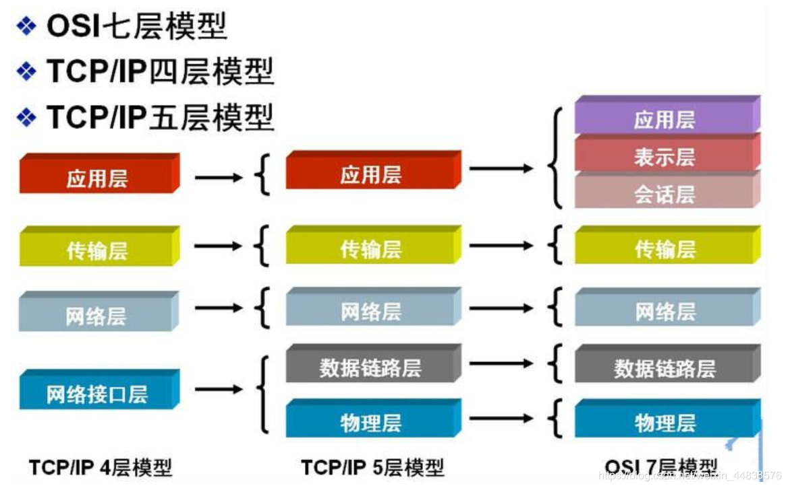
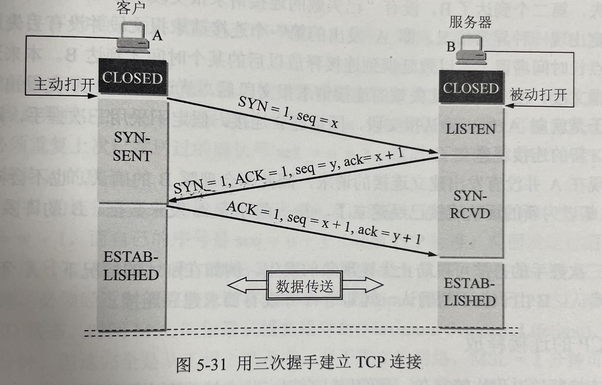
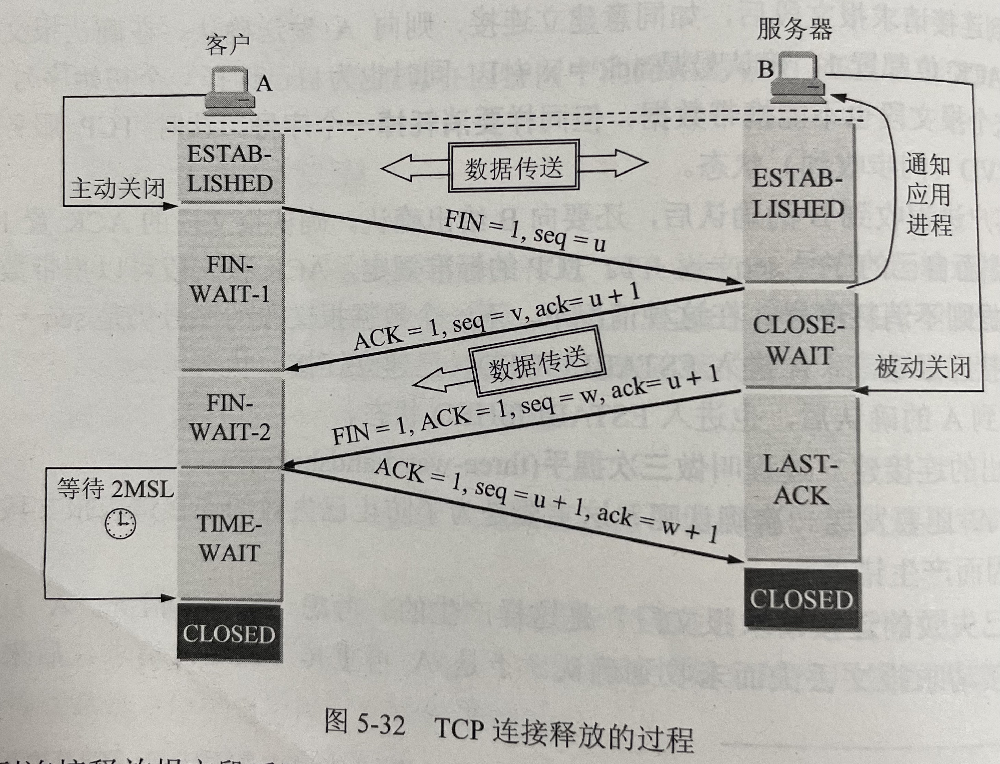
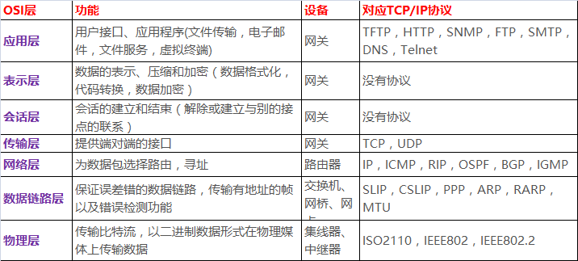

# 网络协议基础

## CS架构&BS架构

互联通信软件有两种模式：CS架构和BS架构，其中：

- CS 指的是 Client-Server，一个客户端软件和一个服务端软件
- BS 指的是 Browser-Server，一个浏览器和一个服务端软件

~~~
客户端软件send                 服务端软件recv
操作系统                       操作系统
计算机硬件 <====物理介质=====>  计算机硬件
~~~


## 什么是网络

**网络 = 物理链接介质 + 互联网通信协议**

网络存在的意义是为了解决跨地域数据传输的困难, 也就是解决通信的困难。互联网的本质就是一系列的网络协议。互联网协议的功能：定义计算机如何接入internet，以及接入internet的计算机通信的标准。


## 网络体系结构

把计算机网络的各层及其协议的集合，称为网络的体系结构。

互联网通信协议根据历史的发展分别有：OSI七层协议、TCP/IP四层协议、TCP/IP五层协议



OSI七层协议是国际标准化组织ISO提出的，但由于市场原因和该协议本身的缺点（协议实现过一复杂，层次划分不太合理等）导致起初市场上大规模使用的并不是该协议，而是因特网。所以有这样一个现象：得到最广泛应用的不是法律上的国际标准OSI，而是非国际标准TCP/IP。这样TCP/IP成为了事实上的国际标准。


OSI七层协议体系结构的概念清楚，理论也比较完整，但它既复杂又不实用。TCP/IP体系结构则不同，它现在已经得到了非常广泛的应用。TCP/IP是一个四层的体系结构。因为最下面的网络接口层基本上和一般的通信链路在功能上没有多大区别，对于计算机网络来说，这一层并没有特别新的具体内容。因此在在学习计算机网络的原理是往往采取折中的办法，即综合OSI和TCP/IP的优点，采用一种只有五层协议的体系结构，这样既简洁又能将概念阐述清楚。


TCP/IP代表传输控制协议/网际协议，指的是一系列协组。所谓协议，九四规定数据的组织格式（格式：头部部分 + 数据部分）。


## 物理层

物理层由来：上面提到，孤立的计算机之间要想一起玩，就必须接入internet，言外之意就是计算机之间必须完成组网。

物理层功能：主要是基于电器特性发送高低电压(电信号)，高电压对应数字1，低电压对应数字0

```python
# 一组物理层数据称之为：位
# 单纯的电信号毫无意义，必须对其进行分组
```


## 数据链路层

数据链路层由来：单纯的电信号0和1没有任何意义，必须规定电信号多少位一组，一组是什么意思。

数据链路层的功能：定义了电信号的分组方式

数据链路层：遵循**以太网协议**（ethernet）

```python
# 以太网协议的基本内容

规定1：一组数据称之为一个数据帧
规定2：数据帧分成两部分：头 + 数据
- 头包含：源地址与目标地址，该地址是mac地址
- 数据包含：包含的是网络层发过来的整体的内容

规定3：但凡接入互联网的主机必须有一块网卡，每块网卡在出厂时都烧制好一个全世界独一无二的地址，该地址称之为mac地址

head包含：(固定18个字节)
发送者／源地址，6个字节
接收者／目标地址，6个字节
数据类型，6个字节
data包含：(最短46字节，最长1500字节)

数据包的具体内容
head长度＋data长度＝最短64字节，最长1518字节，超过最大限制就分片发送

head中包含的源和目标地址由来：ethernet规定接入internet的设备都必须具备网卡，发送端和接收端的地址便是指网卡的地址，即mac地址
mac地址：每块网卡出厂时都被烧制上一个世界唯一的mac地址，长度为48位2进制，通常由12位16进制数表示（前六位是厂商编号，后六位是流水线号）
```

有了mac地址，同一个网络内的两台主机就可以通信了（一台主机通过**arp协议**获取另外一台主机的mac地址）。ethernet采用最原始的方式，**广播的方式进行通信**。


## 网络层

网络层由来：有了ethernet、mac地址、广播的发送方式，世界上的计算机在一个网络内就可以彼此通信了，但是全世界的电脑数量是海量的，如果在一个网络内通过广播的方式，那效率是非常低效的。因此必须划分局域网，将网路拆分成多个子网。那必须找出一种方法来区分哪些计算机属于同一个广播域，哪些不是，如果是就采用广播的方式发送；如果不是，则采用其他方式通信。

网络层功能：引入一套新的地址用来区分不同的广播域／子网，这套地址即网络地址（IP地址）。

网络层：遵循 **IP协议**

>扩展：每一个广播域但凡要接通外部，一定要有一个网关帮内部的计算机转发包到公网。网关与外界通信走的是路由协议。


### IP协议

- 规定网络地址的协议叫ip协议，它定义的地址称之为ip地址，广泛采用的v4版本即ipv4，它规定网络地址由32位2进制数表示
- 范围0.0.0.0-255.255.255.255
- 一个ip地址通常写成四段十进制数，例：172.16.10.1


**ip地址分成两部分**

- 网络部分：标识子网
- 主机部分：标识主机

注意：单纯的ip地址段只是标识了ip地址的种类，从网络部分或主机部分都无法辨识一个ip所处的子网，需要结合子网掩码来判断。

例：172.16.10.1与172.16.10.2并不能确定二者处于同一子网

**子网掩码**

所谓”子网掩码”，就是表示子网络特征的一个参数。它在形式上等同于IP地址，也是一个32位二进制数字，它的网络部分全部为1，主机部分全部为0。比如，IP地址172.16.10.1，如果已知网络部分是前24位，主机部分是后8位，那么子网络掩码就是11111111.11111111.11111111.00000000，写成十进制就是255.255.255.0。

~~~
# ip地址和子网眼掩码的书写方式一般有两种，
第一种：分别书写，如：ip地址172.16.10.2、子网掩码255.255.255.0
第二种：写在一块，如 172.16.10.2/24			(24标是前14位都是1，等同于 255.255.255.0)
~~~


### 计算两个ip地址是否在一个网络

知道”子网掩码”，我们就能判断，任意两个IP地址是否处在同一个子网络。

将IP地址和子网掩码都换算成二进制，然后进行与运算，结果就是网络地址。网络地址相同则在一个局域网内。

```python
# 判断两个IP地址是否处于一个自网络内：
将两个IP地址与子网掩码分别进行AND运算（两个数位都为1，运算结果为1，否则为0），然后比较结果是否相同。
如果是的话，就表明它们在同一个子网络中，否则就不是。
# 应用：
已知IP地址172.16.10.1和172.16.10.2的子网掩码都是255.255.255.0，请问它们是否在同一个子网络？
两者与子网掩码分别进行AND运算，

10101100.00010000.00001010.00000001		 IP地址 172.16.10.1
11111111.11111111.11111111.00000000		 子网掩码 255.255.255.0
10101100.00010000.00001010.00000000    AND运算得到的网络地址结果 172.16.10.0


10101100.00010000.00001010.00000010		 IP地址 172.16.10.2
11111111.11111111.11111111.00000000		 子网掩码 255.255.255.0
10101100.00010000.00001010.00000000    AND运算得到的网络地址结果 172.16.10.0

结果都是172.16.10.0，因此它们在同一个子网络。
```

总结一下，**IP协议的作用主要有两个：`为每一台计算机分配IP地址` 和 `确定哪些地址在同一个子网络`**

规定1：一组数据称之为一个数据包
规定2：数据帧分成两部分: 头 + 数据
    头包含：源地址与目标地址，该地址是IP地址
    数据包含的：传输层发过来的整体的内容

### ip数据包

```python
# ip数据包也分为head和data部分，ip数据包直接放入以太网包的data部分
head：长度为20到60字节, head种包含源地址与目标地址，该地址是IP地址
data：最长为65,515字节，data包含的传输层发过来的整体的内容
而以太网数据包的”数据”部分，最长只有1500字节。因此，如果IP数据包超过了1500字节，它就需要分割成几个以太网数据包，分开发送
```


### ARP协议

arp协议由来：计算机通信基本是广播的方式，所有上层的包到最后都要封装上以太网头，然后通过以太网协议发送，在谈及以太网协议时候，我们了解到通信是基于mac的广播方式实现，计算机在发包时，获取自身的mac是容易的，**如何获取目标主机的mac，就需要通过arp协议**。

arp协议功能：获取目标主机的mac地址

协议工作方式：每台主机ip都是已知的


### 数据传输流程总结1

1.  网络层拿到上层传过来的数据，将数据打包，加一个ip头。这个ip头至少包含两部分（我的ip和对方主机的ip，ip包含子网掩码）。
2. 将打包好ip头的数据传给下一层的数据链路层前会做一个判断，判断对方主机的ip和我自己的ip是不是在一个局域网内。
3.  判断的方式：ip和子网掩码做一个逻辑与的位运算。计算后的结果相等则表示两台主机在一个局域网内，否则不在一个局域网内。
4. 当两台主机在一个局域网内，此时会自动触发arp协议执行。通过广播的方式发一个arp包，就会获取局域网内的对方主机的mac地址。**ARP协议是建立在各个主机之间信任的基础之上的，收到消息后发现arp包里面是自己的ip就会将mac地址响应给发送arp协议的主机，如果包里面的ip不是自己就将包丢掉**。
5. 拿到对方主机mac地址后，此时就到了数据链路层，将网络层传过来的数据整体打包，加一个以太网的头。这个头主要包含两个数据，自己的mac地址和对方主机的mac地址。通过广播的方式将数据发出去。
6. 然后经过物理层将数据转为二进制，通过网线传输出去，此时就会经过二层交换机，二层交换机可以将数据包解开到数据链路层，发现里面对方主机的mac地址，然后就知道将数据包交给哪台主机了(mac地址记忆功能，不需要再广播)。
7.  回到第3步，如果计算后发现两台主机不在一个局域网内，此时也会自动触发arp协议的执行，通过arp协议的数据包将获取当前局域网网关的mac地址。
8.  数据下交给数据链路层，打上一个以太网的头，分别是自己的mac地址和当前局域网网关的mac地址。内层ip包里面的头是自己的ip地址和对方主机的ip地址。
9. 上面封装好以太网头的数据交给物理层转二进制，再经过二层交换机，再经过网关交到公网的路由系统。路由相当于一个三层交换机，可以解压到网络层，发现里面对方主机的ip地址。
10. 路由根据对方主机的ip地址可以映射找到一个子网(另一个局域网)，将数据交给对方子网的网关。对方的网关自动触发arp协议根据对方主机的ip地址找到是哪个mac地址的主机，最终将数据交到对方主机。
11. 此时，对方局域网的网关通过路由的mac地址和网关的映射关系就知道了发数据过来的子网网关的mac地址，对方主机也知道了发数据过来的主机的ip地址。这就分别实现了数据链路层的交流通信和网络层的交流通信。

**补充**：

```python
补充1：arp协议只在一个局域网内通过ip解析获取mac地址，不会跨局域网根据ip地址获取主机mac地址。
补充2：局域网内每个主机的ip地址各不相同，这才实现了arp协议根据ip地址解析成mac地址的可能。
补充3：ip地址本质是网络地址加主机地址。通过ip地址可以唯一确定一个机器，因为局域网内每个主机的mac地址不同就会分配不同的ip地址。
```


## 传输层

传输层的由来：网络层的ip帮我们区分子网，以太网层的mac帮我们找到主机。但是我们写网络通信软件最主要的是找到目标计算机上的某个软件，上面的mac+ip还不能实现这个需求。这就需要再提出一个端口的概念。端口即应用程序与网卡关联的编号。

**传输层功能：建立端口到端口的通信**

```python
补充：端口范围0-65535，0-1023为系统占用端口
客户端软件的端口号是由操作系统动态分配的。一个机器上的端口号不能冲突。
服务端软件的端口号是绑定的，不能变的。
```

传输层遵循的协议有两个：**TCP协议和UDP协议**，基于端口工作

```python
mac + ip 标识唯一一个主机
ip + port 标识唯一一台主机上的一个基于网络通信的软件
```

tcp头里面放的是源端口和目标端口，udp头也一样。

```python
# tcp协议
可靠传输，TCP数据包没有长度限制，理论上可以无限长，但是为了保证网络的效率，通常TCP数据包的长度不会超过IP数据包的长度，以确保单个TCP数据包不必再分割。
# 至此：数据包装结果
以太网头 --> ip头 --> tcp头 --> 数据   

# udp协议
不可靠传输，”报头”部分一共只有8个字节，总长度不超过65,535字节，正好放进一个IP数据包。
# 至此：数据包装结果
以太网头 --> ip头 --> udp头 --> 数据
```

### TCP协议

tcp协议又称好人协议，只要收到请求，就会发出一个确认信息。这也是从安全性的角度出发产生的一个'漏洞'。

**tcp报文**


tcp协议又称可靠协议：**tcp的请求确认机制是保证数据安全的原因，但这是以牺牲数据传输效率为代价的。**


### 三次握手简述流程

```
<1> 客户端作为主动方，首先向服务端发一个建立连接的请求。
<2> 服务端接收到请求后，回复同意。
<3> 然后服务端也要向客户端发一个请求建立连接。
<4> 客户端收到请求后，回复同意
```

>注意：<2>和<3>是**两个连续从服务端发出的消息，可以合并为一个回复并请求。整个过程就是三次握手建立TCP连接**


### 三次握手详细流程分析

1. 握手连接前的状态，TCP客户端A和TCP服务端B都处于关闭状态(CLOSED)。注意：A主动打开连接，B被动打开链接。
2. 服务端B先启动，准备接收客户端的连接请求，然后服务端就进入监听状态(LISTEN)，等待客户端的连接请求。
3. 客户端A启动，向服务端B发出连接请求报文段，此时A进入SYN-SENT状态。
4. 服务端B收到连接请求后，如同意建立连接，则向A发送确认。同时也发送一个报文请求段，注意此时服务端不能携带数据。 服务端进入SYN-RCVD状态。
5. 客户端A收到服务端B的确认后，还要向服务端B给出确认。TCP规定此时报文段可以携带数据。但如果不携带数据时不会消耗一个序 号，在这种情况下，下一个数据报文段的序号仍是seq=x+1。这时，TCP连接已经建立，A进入ESTABLISHED状态。
6. 等B收到A的确认后，也进入ESTABLISHED状态。



```python
# 上面给出的建立连接的过程叫做三次握手（three-way handshake）。
# 客户端A最后一次还要再发送一次确认是有必要的，这主要是为了防止已失效的连接请求报文段突然又传送到了B，因而产生错误。

# 正常情况下：
服务端会大多数时间处在LISTEN状态，有正常客户端进来时，会瞬间经历SYN-RCVD状态快速到ESTABLISHED，等数据发送结束后又进入LISTEN状态。
客户端在SYN-SENT状态的时间非常短，多数处于入ESTABLISHED状态，断开与服务端连接后不再是ESTABLISHED状态。

# 非正常客户端：SYN-洪水攻击,模拟大量假的客户端向服务端发请求，占用服务端的资源，正常的客户端就进不去。
服务端大量处于：SYN-RCVD状态可能处于洪水攻击，也可能处于大并发状态。
当触发洪水攻击时，服务端也不会一直处于SYN-RCVD状态，但会浪费大量的时间在此处。
```

>**补充：SYN-洪水攻击**
>
>```python
>非法分子模拟大量假的客户端给服务端发一个消息就跑了，然后服务端浪费大量时间在SYN-RCVD等待状态，严重占用正常客户端的访问。
>```
>
>**补充：半连接池**
>
>```python
>tcp协议有一个半连接池的概念，又称backlog。它的本质是一个队列，队列的大小一般为5-10个
>它的目的是为了让服务端起到缓冲的作用。当客户端的请求过多时，请求先到半连接池等待服务端的挨个处理。
>一边处理请求，一般新的请求再依次进入半连接池。
># 半连接池无法解决SYN-洪水攻击。
>```


### 四次挥手简述流程

```
<1> 客户端柱或服务端都可以主动断开连接，假定客户端主动申请断开连接
<2> 服务端接收到请求后，回复同意。
<3> 然后服务端要再向客户端发一个请求断开连接。
<4> 客户端收到请求后，回复同意
```

>注意：<2>和<3>**不能合并为一个挥手，因为服务端收到断开连接请求后可能还有数据未发送给客户端，需要把数据发送完毕后才能向客户端申请断开连接，整个过程就是四次挥手断开连接。**


### 四次挥手详细流程分析



**挥手流程分析**：

1. 数据传输后，通信的双方都可以主动释放连接。现在A和B都处于ESTABLISHED状态。
2. A停止发送数据，主动关闭TCP连接。这时A进入终止状态1状态（FIN-WAIT-1），等待B的确认。注意，TCP规定FIN报文即 使不携带数据，也要消耗一个序号。即此时的u是上一次字节序号加1。
3. B收到连接释放报文段后即发出确认。然后B进入关闭等待状态（CLOSE-WAIT）。这时TCP连接处于半关闭状态（half-close），即A已经没有数据要发了，但若B发送数据，A仍要接收。也就是说从B到A这个方向的连接没有关闭，这个状态要持续到B给A发送完所有数据后。
4. A收到来自B的确认后，进入终止等待2状态（FIN-WAIT-2），等待B发出连接释放报文段。
5.  若B发完数据，就会发释放连接FIN报文段。B还必须重复上次发过的确认好ack=u+1。这时B进入最后确认状态（LAST-ACK），等待A的确认。
6.  A收到B的连接释放报文段后，必须对此发出确认。然后进入时间等待状态（TIME-WAIT）。
7. B收到A的确认信息后，按照步骤进入关闭状态（CLOSED）。
8. 注意, 此时TCP连接还没有释放掉。A必须经过时间等待计时器（TIME-WAIT timer）设置的时间2MSL后, A才进入CLOSED状态。

```python
# 补充，A必须在TIME-WAIT状态下等待2MSL。目的有两个：
- 第一是保证A先进入CLOSED状态；
- 第二是为了防止已失效的连接请求报文段突然又传送到了B，因而产生错误。

# B只要收到了A发出来的确认，就进入CLOSED状态。A必须等待2MSL。这就表明，B结束TCP连接的时间要比A早一些，这是提前结束连接的代价。
# 现实中，一般服务器要处理多个客户端用户，所以服务端一般处理完一个客户端的请求就会主动终止TCP连接，服务端多事4次挥手的发起者。
# 当服务端大量处于TIME-WAIT状态，意味着服务端正在经历高并发。
```

### UDP协议

udp协议特点：

- UDP是无连接的，即发数据之前不需要建立连接，同理发送数据结束也没有连接可释放，这极大减少了开销和发送数据之前的时延。
- UDP不保证数据的可靠交付，只负责将数据尽可能快的发出去。


## 应用层

应用层由来：用户使用的都是应用程序，均工作于应用层，互联网是开发的，大家都可以开发自己的应用程序，数据多种多样，必须规定好数据的组织形式 。

应用层功能：规定应用程序的数据格式。

应用层常见的协议：HTTP、FTP等


**每层都有自己的协议**




**DNS协议**

DNS是域名解析服务器。也可以是域名解析系统，是用来绑定ip和域名的关系，它基于udp协议。

```python
13台根dns：
A.root-servers.net198.41.0.4美国
B.root-servers.net192.228.79.201美国（另支持IPv6）
C.root-servers.net192.33.4.12法国
D.root-servers.net128.8.10.90美国
E.root-servers.net192.203.230.10美国
F.root-servers.net192.5.5.241美国（另支持IPv6）
G.root-servers.net192.112.36.4美国
H.root-servers.net128.63.2.53美国（另支持IPv6）
I.root-servers.net192.36.148.17瑞典
J.root-servers.net192.58.128.30美国
K.root-servers.net193.0.14.129英国（另支持IPv6）
L.root-servers.net198.32.64.12美国
M.root-servers.net202.12.27.33日本（另支持IPv6）
```


## 网络通信流程总结

基于网络通信的软件有两种：BS架构、CS架构。不同之处在于BS架构没有客户端软件，它依赖浏览器（特殊的客户端）。在网络通信流程方面的不同之处在于，BS架构的软件在客户端（浏览器网址输入栏）多一个DNS域名解析过程。在浏览器的网址输入栏上输入一个网址，按回车键到获取页面响应信息发生了：

```python
<1> 本机的DNS域名解析系统启动，获取域名对应的ip地址交给浏览器。
<2> TCP/IP封包过程，主要将浏览器输入栏中的虚拟路径和其他信息作为基本数据依次打包。
<3> 通过网络传输到对方主机，依次解包，对方主机应用层软件获取这个虚拟路径对应的资源，原路返回响应给客户端。
<4> 本地主机接收到响应信息，依次解包，获取请求的资源。
<5> 至此完成一次网络通信交流流程。
```

比如，我们访问：https://kaxonliu.github.io/books/linux/basic/index.html

- 首先DNS协议启动工作，获取域名对应的ip
- 应用层将网页数据打包一个https协议的协议头，将这个包交给传输层。
- 传输层基于TCP协议，将应用层下交的数据再打包一个tcp头，这个头包含自己浏览器的端口和对方主机的端口。再将数据交给网络层。
- 网络层拿到数据后，再打包一个ip头，包含自己主机的ip和对方主机的ip。将包裹下交给数据链路层。
- 数据链路层拿到数据后，发现两个ip地址的网络地址不同，判断是外网的ip，就会在整个包裹上再打包一个以太网头。这个以太网头主要是自己主机的mac地址和当前局域网网关的mac地址。
- 物理层拿到数据后，转为二进制01数据，通过网络传输送到对方局域网的网关（这中间经过交互机、路由系统等），根据ip地址找到主机(arp协议)，再根据端口号找到软件，再根据url路径找到资源。
- 然后对方主机返回响应数据，按原路返回资源。我方接受到响应资源后就完成了一次网络通信。