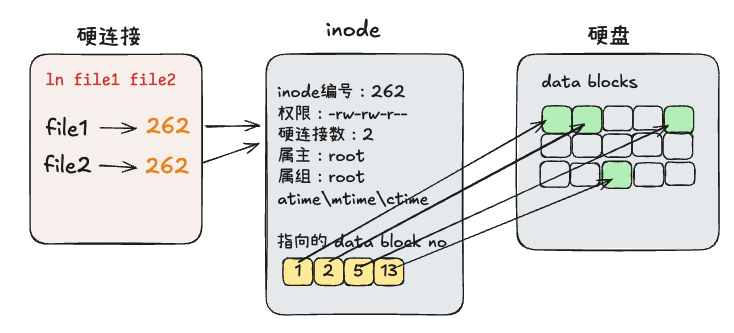
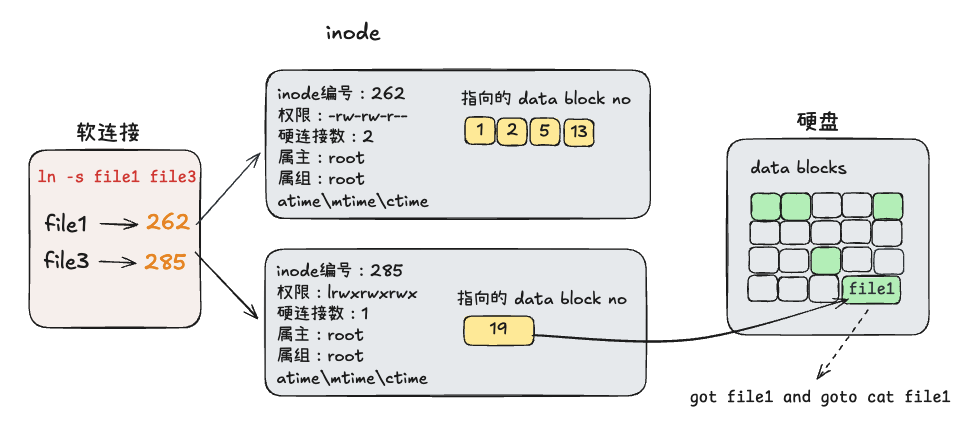

# 文件系统

Linux 文件系统是 Linux 操作系统中用于组织、存储和管理文件和目录的架构。说白了，**文件系统就是一个组织管理硬盘的程序**。硬盘一般会分区，分区就是把一整块硬盘划分为多个子空间，其中每个子空间上都安装一个文件系统。文件系统的类型主要有三种：`ext4`、`xfs`、`btrfs`。目前主流使用的是 `xfs`。

>`xfs`相较 `ext4` 的优势：
>- `ext4` 属于传统文件系统，`xfs` 属于现代高性能文件系统
>- `ext4` 支持的单文件和单文件系统的容量小于 `xfs`
>- `xfs` 在文件读写方面的性能明显优于 `ext4`

文件系统是操作系统的一部分，负责硬盘的使用管理。对用户来说，我们看到的就是对文件/文件夹的操作。Linux 上文件夹本质上也是一种文件。所以文件系统把硬盘的使用简单化，对用户上层用户来说操作的就是文件。**文件对象包括两部分数据：文件内容和文件元数据**。

**查看文件系统类型** `df -T`

~~~bash
ubuntu@master:~$ df -h -T
Filesystem     Type      Size  Used Avail Use% Mounted on
tmpfs          tmpfs     196M  1.2M  195M   1% /run
efivarfs       efivarfs  256K   15K  242K   6% /sys/firmware/efi/efivars
/dev/sda1      ext4      8.7G  2.0G  6.7G  23% /
tmpfs          tmpfs     979M     0  979M   0% /dev/shm
tmpfs          tmpfs     5.0M     0  5.0M   0% /run/lock
/dev/sda16     ext4      891M   58M  771M   7% /boot
/dev/sda15     vfat       98M  6.4M   92M   7% /boot/efi
tmpfs          tmpfs     196M   12K  196M   1% /run/user/1000
~~~

## 文件内容和文件元数据

对于普通文件，文件内容指的就是文件的真实内容；元数据指的内容包括：文件名、文件大小、属主属组权限、3个时间等信息。

对于目录文件（文件夹），内容指的是文件夹下的文件名和子文件夹名等信息。元数据指的是文件夹的名字、权限等信息。

## 文件系统管理硬盘

文件系统为了硬盘的管理，定义了三种对象：超级块 super block、inode 块、数据块 data block。其中，inode块负责存储文件（包括目录文件）的元数据，数据块负责存储文件的内容，他们统一被超级块组织管理。

**每一个文件都有一个 inode 编号，一个 inode 编号对应一个 inode 块，这个 inode 块上储存该文件的元数据和文件内容所在的数据块编号。通过数据块编号就可以找到文件的真实内容。**

**每一个文件夹也都有一个 inode 编号，对应一个 inode 块，这个 inode 块上存储文件夹的元数据和文件夹内都有哪些子文件（夹）及其对应的 inode 标号。这样就可以通过递归的方式找到文件夹中子文件的 inode 编号，然后按照文件的 inode 编号查找文件的元数据和内容。**

### 实验演示

**查看文件的元数据**：`ls -l` 和 `ls -ld`

~~~bash
ubuntu@master:~$ ls -l
total 10244
drwxrwxr-x 2 ubuntu ubuntu     4096 Aug 14 14:16 data
-rw-rw-r-- 1 ubuntu ubuntu 10485760 Aug 14 14:16 num.txt
ubuntu@master:~$
ubuntu@master:~$ ls -l num.txt
-rw-rw-r-- 1 ubuntu ubuntu 10485760 Aug 14 14:16 num.txt
ubuntu@master:~$ ls -ld data/
drwxrwxr-x 2 ubuntu ubuntu 4096 Aug 14 14:16 data/
~~~

**查看文件的 inode 编号**：`ls -li`。

~~~bash
ubuntu@master:~$ ls -il
total 10244
262194 drwxrwxr-x 2 ubuntu ubuntu     4096 Aug 14 14:16 data
262162 -rw-rw-r-- 1 ubuntu ubuntu 10485760 Aug 14 14:16 num.txt
~~~

**使用 `stat` 查看文件或目录文件的元数据**。

~~~bash
ubuntu@master:~$ stat num.txt data
  File: num.txt
  Size: 10485760  	Blocks: 20480      IO Block: 4096   regular file
Device: 8,1	Inode: 262162      Links: 1
Access: (0664/-rw-rw-r--)  Uid: ( 1000/  ubuntu)   Gid: ( 1000/  ubuntu)
Access: 2025-08-14 14:16:30.671987372 +0800
Modify: 2025-08-14 14:16:30.688987615 +0800
Change: 2025-08-14 14:16:30.688987615 +0800
 Birth: 2025-08-14 14:16:30.671987372 +0800
  File: data
  Size: 4096      	Blocks: 8          IO Block: 4096   directory
Device: 8,1	Inode: 262194      Links: 2
Access: (0775/drwxrwxr-x)  Uid: ( 1000/  ubuntu)   Gid: ( 1000/  ubuntu)
Access: 2025-08-14 14:16:40.977133824 +0800
Modify: 2025-08-14 14:16:52.729297495 +0800
Change: 2025-08-14 14:16:52.729297495 +0800
 Birth: 2025-08-14 14:16:40.977133824 +0800
~~~

**查看文件的 data block 编号**。可以看到文件 num.txt 使用了 2560 个数据块。从1216512到1218559，再加上从1216000到1216511个数据块。

~~~bash
ubuntu@master:~$ filefrag -v num.txt
Filesystem type is: ef53
File size of num.txt is 10485760 (2560 blocks of 4096 bytes)
 ext:     logical_offset:        physical_offset: length:   expected: flags:
   0:        0..    2047:    1216512..   1218559:   2048:
   1:     2048..    2559:    1216000..   1216511:    512:    1218560: last,eof
num.txt: 2 extents found
~~~

**查看文件夹的数据块上存放的信息**。可以看到 data 文件夹的 inode 编号是 262194，使用 `debugfs` 查看到这个文件夹下有 abc.txt 文件，并且它的 inode 编号是 262246

~~~bash
ubuntu@master:~$ stat  data
  File: data
  Size: 4096      	Blocks: 8          IO Block: 4096   directory
Device: 8,1	Inode: 262194      Links: 2
Access: (0775/drwxrwxr-x)  Uid: ( 1000/  ubuntu)   Gid: ( 1000/  ubuntu)
Access: 2025-08-14 14:40:13.799687114 +0800
Modify: 2025-08-14 14:16:52.729297495 +0800
Change: 2025-08-14 14:16:52.729297495 +0800
 Birth: 2025-08-14 14:16:40.977133824 +0800
ubuntu@master:~$
ubuntu@master:~$ sudo debugfs /dev/sda1 -R "ls -l <262194>"

# 输出如下信息
 262194   40775 (2)   1000   1000    4096 14-Aug-2025 14:16 .
 262145   40750 (2)   1000   1000    4096 14-Aug-2025 14:16 ..
 262246  100664 (1)   1000   1000       2 14-Aug-2025 14:16 abc.txt
~~~

## 硬连接和软连接

硬连接和软连接使用命令 `ln` 创建，基本命令规则如下。没有选项为新建硬连接，选项为 `-s` 表示新建软连接。

~~~bash
ln 选项 目标文件 链接文件
~~~

### 硬连接

硬连接的两个文件他们的元数据和内容都是相同的。删除其中一个，不影响另一个。硬连接的文件他们的 inode 编号是一样的。但是硬连接不能跨分区，不能把文件夹做硬连接。

### 软连接

软连接的两个文件他们的内容是相同，但是元数据是独立的，不相同。删除目标文件，连接文件不能使用；删除连接文件，目标文件正常使用。软连接的文件他们的 inode 编号是不一样的。 软连接跨分区，可以把文件夹做软连接。

