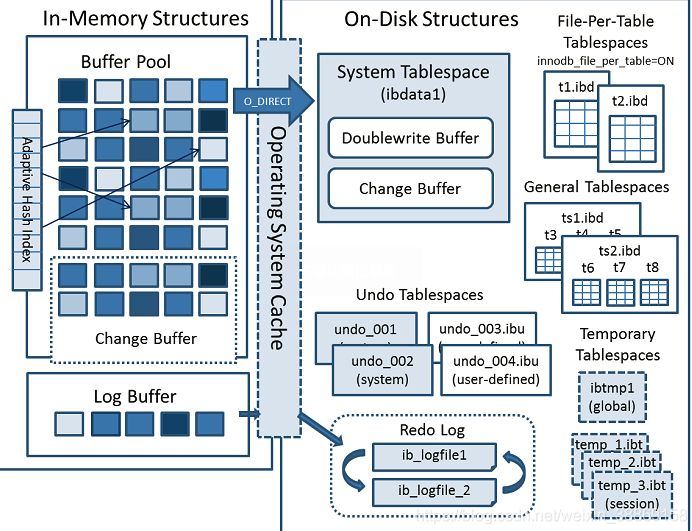
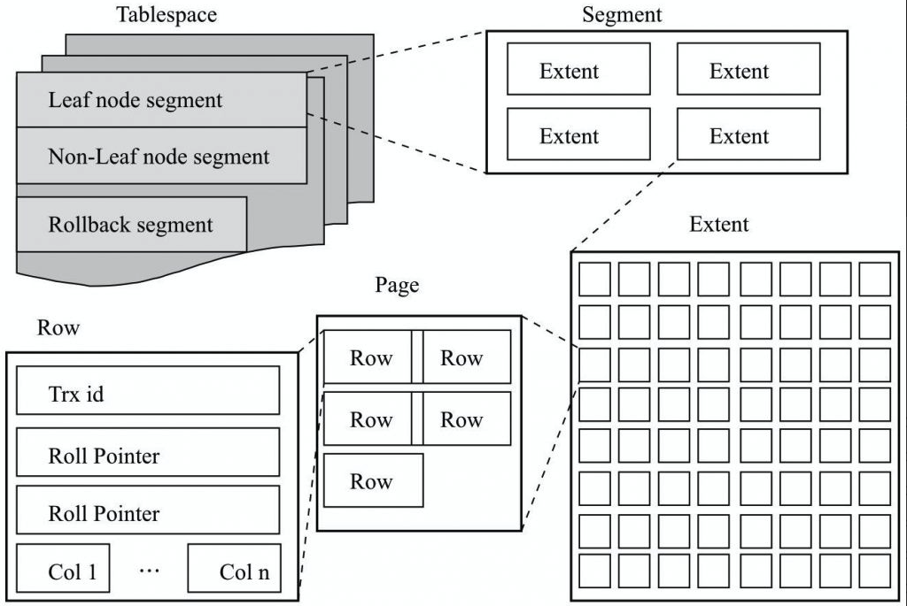

# InnoDB

MySQL支持多种存储引擎，从 MySQL5.5开始默认使用的存储引擎是 `InnoDB`。默认推荐使用 `InnoDB` 有很多好处，比如：支持事务、行级锁、外键等。

MySQL 5.6, 5.7, 8.0，这些后续版本不仅延续了 InnoDB 作为默认引擎的做法，还持续地强化和优化了 InnoDB 的性能和功能（例如全文索引、在线 DDL 操作的改进、性能schema的深度集成等）。


查看支持的存储引擎

~~~sql
mysql> show engines;
+--------------------+---------+----------------------------------------------------------------+--------------+------+------------+
| Engine             | Support | Comment                                                        | Transactions | XA   | Savepoints |
+--------------------+---------+----------------------------------------------------------------+--------------+------+------------+
| ARCHIVE            | YES     | Archive storage engine                                         | NO           | NO   | NO         |
| BLACKHOLE          | YES     | /dev/null storage engine (anything you write to it disappears) | NO           | NO   | NO         |
| MRG_MYISAM         | YES     | Collection of identical MyISAM tables                          | NO           | NO   | NO         |
| FEDERATED          | NO      | Federated MySQL storage engine                                 | NULL         | NULL | NULL       |
| MyISAM             | YES     | MyISAM storage engine                                          | NO           | NO   | NO         |
| PERFORMANCE_SCHEMA | YES     | Performance Schema                                             | NO           | NO   | NO         |
| InnoDB             | DEFAULT | Supports transactions, row-level locking, and foreign keys     | YES          | YES  | YES        |
| MEMORY             | YES     | Hash based, stored in memory, useful for temporary tables      | NO           | NO   | NO         |
| CSV                | YES     | CSV storage engine                                             | NO           | NO   | NO         |
+--------------------+---------+----------------------------------------------------------------+--------------+------+------------+
~~~

- 存储引擎 `BLACKHOLE` 具有黑洞的特性，存储的数据都会丢失。
- 存储引擎 `MEMORY` 把数据都存在内存中，断电数据丢失。
- `InnoDB` 还支持分布式事务支持（XA）和事务保存点（Savepoints）。


查看正在使用的存储引擎

~~~sql
mysql> select @@default_storage_engine;
+--------------------------+
| @@default_storage_engine |
+--------------------------+
| InnoDB                   |
+--------------------------+
1 row in set (0.00 sec)
~~~

查看使用 `innodb` 的有哪些表

~~~sql
mysql> use information_schema;
mysql> select table_schema,table_name,engine from tables where engine='innodb' limit 3;
+--------------+------------+--------+
| TABLE_SCHEMA | TABLE_NAME | ENGINE |
+--------------+------------+--------+
| db1          | t1         | InnoDB |
| db1          | t2         | InnoDB |
| db1          | t3         | InnoDB |
+--------------+------------+--------+
~~~

查看表的存储引擎

~~~sql
SHOW CREATE TABLE db1.t1\G
~~~


## 配置存储引擎

#### 1. 配置文件指定使用 innodb

~~~ini
# vim /etc/my.cnf
[mysqld]
default-storage-engine=innodb
~~~

#### 2. 创建表时指定使用 innodb

~~~mysql
CREATE TABLE t1(id INT) ENGINE=innodb;
~~~

#### 3. 临时修改

~~~sql
SET @@storage_engine=innodb

-- 查看
select @@default_storage_engine;
~~~


## 存储引擎对应的文件

MySQL 中的数据库在文件系统上是一个文件夹，表对应的是文件。不同的存储引擎创建的表，对应的文件不同。比如 `innodb` 类型的表有两个文件，`.frm` 和 `.idb`，前者用来储存表结构信息，后者用来储存表数据（包括实际数据，索引数据，undo log）。不过在 MySQL8 之后，`.frm` 文件换成了 `.sdi` 文件（JSON格式）。


## InnoDB 逻辑架构

`InnoDB` 逻辑架构主要包含三部分：内存架构、操作系统缓存、硬盘架构。




#### 内存架构

内存架构部分主要分为四部分，每个部分都是为了读写加速（包括数据的读写和日志的写）。

**缓冲池（Buffer Pool）**

缓冲池是一块用于缓存被访问过的表和索引数据的内存区域，缓冲池允许在内存中处理一些被用户频繁访问的数据，在某一些专用的服务器上，甚至有可能使用80%的物理内存作为缓冲池。缓冲池的存在主要是为了通过降低磁盘IO的次数来提升数据的访问性能。

**写缓冲（Change Buffer）**

写缓冲是为了缓存缓冲池（Buffer Pool）中不存在的二级索引(Secondary Index)页的变更操作的一种特殊的内存数据结构。这些变更通常是一些Insert、Update、Delete等DML操作引发的，如果有一些其它的读操作将这些被变更的二级索引页加进了缓冲池（Buffer Pool)，则这些变更会被马上合并至缓冲池中以保证用户可以读取到一致的数据。

**日志缓冲（Log Buffer）**

InnoDB将数据的每次写优化为了批量写，这便以降低磁盘IO的次数，为了防止一些数据尚未写入硬盘就断电了，需要记录日志。
而日志缓冲就是用来缓存一些即将要被写入磁盘日志文件（log files)中的数据。

**自适应哈希索引（Adaptive Hash Index）**

在 InnoDB 中，用户是不可以直接去创建哈希索引的，这个自适应哈希索引是InnoDB为了加速查询性能，会根据实际需要来决定是否对于一些频繁需要被访问的索引页构建哈希索引，它会利用key的前缀来构建哈希索引。这样做可以提高查询性能，因为索引采用类似B+树的结构进行存储，B+树的单key查询时间复杂度为O(log2n),但是优化为哈希索引后，单key的查询时间复杂度就为O(1)了。


#### 操作系统缓存

操作系统为了提升性能而降低磁盘 IO 的次数，在 InnoDB 的缓存体系与磁盘文件之间，加了一层操作系统的缓存/页面缓存。用户态innodb 存储引擎的进程向操作系统发起 `write` 系统调用时，在内核态完成页面缓存写入后即返回，如果想立即将页面缓存的内容立即刷入磁盘，innodb 存储引擎需要发起 `fsync` 系统调用才可以。
- `fsync`：将数据提交到硬盘中，强制硬盘同步，将一直阻塞到写入硬盘完成后返回，大量进行fsync操作就有性能瓶颈。
- `write`：将数据写到系统的页面缓存后立即返回，后面依靠系统的调度机制将缓存数据刷到磁盘中去。
- `O_DIRECT`：该选项是在 Linux 系统中的选项，使用该选项后，对文件进行直接 IO 操作，不经过文件系统缓存，直接写入磁盘。


#### 硬盘架构

`InnoDB` 在硬盘架构上主要有如下几部分：

- 表（Tables）
- 表空间
- 索引
- 双写缓冲
- Rodo log
- Undo log


## InnoDB 存储引擎执行流程

执行一条更新 SQL 语句，存储引擎执行流程会经历如下阶段和步骤，


#### 1. 准备旧数据 (InnoDB引擎层)

1. **加载数据页**：如果需要修改的数据页不在内存（Buffer Pool）中，则从表空间文件（`.ibd`）中加载它。
2. **记录Undo Log**：在修改数据页**之前**，InnoDB会先将这行数据的**旧版本**（修改前的值）拷贝到**Undo Log**中。
3. **修改数据，产生脏页**：现在可以安全地在Buffer Pool中修改数据了。这个被修改过的数据页被称为 **“脏页”（Dirty Page）**。

> 补充：
>
> - 为事务回滚和MVCC（多版本并发控制）提供支持。如果事务要回滚，或者有其他事务需要读取这行数据修改前的样子，都依赖 Undo Log。
> - 修改数据，产生脏页：数据在内存中已变，但磁盘上的数据还是旧的。如果此时MySQL崩溃，重启后这个未提交的修改会被撤销（利用Undo Log）。

<br>

#### 2. 两阶段提交 - Prepare (InnoDB引擎层)

1. **写Redo Log (Prepare)**：为了即使崩溃也能恢复这个修改，InnoDB 生成一条**Redo Log**记录。这条记录内容是“在某个数据页的某个位置做了什么修改”（物理逻辑日志）。这条日志被标记为 **`PREPARE`** 状态，并首先写入内存中的 **Log Buffer**。
2. **Redo Log刷盘**：根据配置的`innodb_flush_log_at_trx_commit`策略（通常为1，即每次提交都刷盘），将 Log Buffer 中的 Redo Log **强制刷盘（`fsync`）** 到硬盘的重做日志文件（`ib_logfile0`）中。

> **此时**：磁盘上已经有一个永久的、物理的记录，指明了如何重做这个修改，但这个修改还被标记为“准备中”，尚未提交。

<br>

#### 3. 写入Binlog (MySQL Server层)

1. **写Binlog**：MySQL 的 Server 层生成对应的 **Binlog**。Binlog 记录的是 SQL 语句的原始逻辑（例如格式为`ROW`时，会记录行的变化前和变化后的值）。
2. **Binlog刷盘**：Binlog首先写入线程自己的**Binlog Cache**，然后在事务提交时，被**强制刷盘（`fsync`）** 到硬盘的二进制日志文件（`binlog.000001`）中。这一步由`sync_binlog`参数控制，通常也设为1以保证安全。

> **这是最关键的一步**：Binlog的写入和刷盘是**两阶段提交（2PC）** 的“提交点”。一旦Binlog成功落盘，就意味着这个事务**一定可以被传播**（到从库）和**恢复**。

<br>

#### 4. 两阶段提交 - Commit (InnoDB引擎层)，2PC

1. **写Redo Log (Commit)**：在确认Binlog已成功写入后，InnoDB会再写一条Redo Log到Log Buffer，将其状态标记为 **`COMMIT`**。
2. **（可选）Redo Log刷盘**：通常，包含`COMMIT`标记的Log Buffer会很快被刷盘。在某些配置下，为了提升性能，可能会省略这一步的立即刷盘，因为即使此时崩溃，在崩溃恢复时只要发现Binlog是完整的，事务依然会被提交。
3. **事务完成**：完成以上步骤后，事务正式提交完成，客户端收到成功消息。

<br>

#### 异步步骤: 刷脏页

1. **异步刷盘**：此后台的某个时间点（由InnoDB的各种机制触发），后台线程会缓慢地将Buffer Pool中的**脏页**写入到表空间数据文件（`.ibd`文件）中。一旦脏页被写入磁盘，对应的Redo Log 记录就失去了作用，其占用的空间可以被覆盖重用。

<br>

#### WAL

因为写数据文件是**随机I/O**，速度很慢。而写日志文件是**顺序I/O**，速度极快。这种“**Write-Ahead Logging (WAL)**”策略（先写日志再写数据）极大地提升了数据库的写入性能。


## redo log 刷盘策略

Redo log 刷盘策略指的就是参数 `innodb_flush_log_at_trx_commit` 的配值。

#### =1
- **默认值，最安全**
- **每次事务提交时**，都会将Log Buffer中的Redo Log（包括`PREPARE`和`COMMIT`）执行 `write` + `fsync` 强制刷盘。
- **保证了**：只要事务提交成功，所有相关的Redo Log一定在磁盘上。崩溃绝不会丢失已提交的事务。
- **缺点**：因为每次提交都要写磁盘，IOPS开销大，性能最低。
<br>

#### =2
- 折中方案
- **每次事务提交时**，只会将 Log Buffer 中的 Redo Log 只执行 `write` 到操作系统的Page Cache中。
- **操作系统会每隔1秒**，自动对Page Cache中的数据进行刷盘（`fsync`）。
- **这意味着**：在事务提交后、OS刷盘前的这1秒内，如果MySQL或服务器崩溃，这部分在Page Cache中的Redo Log会丢失。即使事务已经提交，崩溃恢复时也无法恢复。
- **优点**：比 `=1` 性能更好。比 `=0` 更安全。
<br>

#### =0 
- 每秒一次地将Log Buffer中的Redo Log执行 `write` + `fsync` 到磁盘。
- 提交事务时**完全不会**触发任何写磁盘操作。
- **风险最高**：如果 MySQL 崩溃，最多会丢失1秒内的所有事务。

<br>

## binlog 刷盘策略

binlog 刷盘策略指的就是参数 `sync_binlog` 的配值。binlog 是 MySQL 服务层日志。

#### =0

- 默认值。事务提交后，将日志写入操作系统缓冲

#### =1

- 推荐值。将日志写入磁盘并立即执行刷新操作，不经过操作系统直接写入硬盘。


## LRU 淘汰策略


## InnoDB 存储引擎表空间

Row page extent segment tablespace




表空间由三种段构成
1、叶子节点数据段：即数据段
2、非叶子节点数据段：即索引段
3、回滚段


## 独立表空间

File-Per-Table Tablespaces，这指的是**为每个用户表单独创建 `.ibd` 文件**的特性，由参数 `innodb_file_per_table` 控制。

- **在 MySQL 5.7 及以前**：还存储所有表的**undo logs**，以及如果没有开启 `innodb_file_per_table`，所有用户表和索引的数据也会放在这里。


- **MySQL 8.0 的默认行为：** **`ON` (开启)**

  sql

  ```
  SHOW VARIABLES LIKE 'innodb_file_per_table';
  -- 输出结果应该是：innodb_file_per_table ON
  ```

  

- **这意味着：** 在 MySQL 8.0 中，**默认情况下，每个您创建的 InnoDB 表都会有自己的独立 `.ibd` 文件**，用于存储该表的数据和索引。系统表空间 `ibdata1` 不再存储用户数据。


开启的好处；

**磁盘空间回收：** 这是最重要的好处。当您删除（DROP）一个表或截断（TRUNCATE）一个表时，操作系统可以立即回收该表 `.ibd` 文件所占用的磁盘空间。

可以将不同表的热数据、冷数据分布到不同的磁盘上（使用符号链接或利用 MySQL 的 `DATA DIRECTORY` 选项），实现更灵活的 I/O 优化。

**运行时可优化：** 可以运行时导入（import）或导出（export）单个表的功能（Transportable Tablespaces）。

分离 undo log 成为可能。


## 分离Undo日志

- **`innodb_max_undo_log_size`**: 控制**每个** undo 表空间文件的**最大体积**。
- **`innodb_undo_tablespaces`**: 在 MySQL 5.7 中用于控制 undo 表空间的**数量**，**但在 MySQL 8.0 中此参数已废弃且无效**。在 MySQL 8.0.14+ 中，您应该使用 `CREATE UNDO TABLESPACE` 和 `DROP UNDO TABLESPACE` 来动态管理数量。MySQL 8.0 的默认行为是使用 **2个** 独立的、活动的 undo 表空间，每个表空间包含 **128个** 回滚段（由 `innodb_rollback_segments` 定义）。


